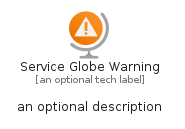
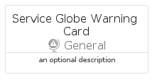
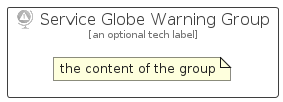

# ServiceGlobeWarning


```text
azure/Item/General/ServiceGlobeWarning
```

```text
include('azure/Item/General/ServiceGlobeWarning')
```


| Illustration | ServiceGlobeWarning | ServiceGlobeWarningCard | ServiceGlobeWarningGroup |
| :---: | :---: | :---: | :---: |
|  |  |  |  |


## Sprites
The item provides the following sriptes:

- `<$ServiceGlobeWarningXs>`
- `<$ServiceGlobeWarningSm>`
- `<$ServiceGlobeWarningMd>`
- `<$ServiceGlobeWarningLg>`


## ServiceGlobeWarning

### Load remotely
```plantuml
@startuml
' configures the library
!global $LIB_BASE_LOCATION="https://raw.githubusercontent.com/tmorin/plantuml-libs/master/distribution"

' loads the library's bootstrap
!include $LIB_BASE_LOCATION/bootstrap.puml

' loads the package bootstrap
include('azure/bootstrap')

' loads the Item which embeds the element ServiceGlobeWarning
include('azure/Item/General/ServiceGlobeWarning')

' renders the element
ServiceGlobeWarning('ServiceGlobeWarning', 'Service Globe Warning', 'an optional tech label', 'an optional description')
@enduml
```

### Load locally
```plantuml
@startuml
' configures the library
!global $INCLUSION_MODE="local"
!global $LIB_BASE_LOCATION="../../.."

' loads the library's bootstrap
!include $LIB_BASE_LOCATION/bootstrap.puml

' loads the package bootstrap
include('azure/bootstrap')

' loads the Item which embeds the element ServiceGlobeWarning
include('azure/Item/General/ServiceGlobeWarning')

' renders the element
ServiceGlobeWarning('ServiceGlobeWarning', 'Service Globe Warning', 'an optional tech label', 'an optional description')
@enduml
```

## ServiceGlobeWarningCard

### Load remotely
```plantuml
@startuml
' configures the library
!global $LIB_BASE_LOCATION="https://raw.githubusercontent.com/tmorin/plantuml-libs/master/distribution"

' loads the library's bootstrap
!include $LIB_BASE_LOCATION/bootstrap.puml

' loads the package bootstrap
include('azure/bootstrap')

' loads the Item which embeds the element ServiceGlobeWarningCard
include('azure/Item/General/ServiceGlobeWarning')

' renders the element
ServiceGlobeWarningCard('ServiceGlobeWarningCard', 'Service Globe Warning Card', 'an optional description')
@enduml
```

### Load locally
```plantuml
@startuml
' configures the library
!global $INCLUSION_MODE="local"
!global $LIB_BASE_LOCATION="../../.."

' loads the library's bootstrap
!include $LIB_BASE_LOCATION/bootstrap.puml

' loads the package bootstrap
include('azure/bootstrap')

' loads the Item which embeds the element ServiceGlobeWarningCard
include('azure/Item/General/ServiceGlobeWarning')

' renders the element
ServiceGlobeWarningCard('ServiceGlobeWarningCard', 'Service Globe Warning Card', 'an optional description')
@enduml
```

## ServiceGlobeWarningGroup

### Load remotely
```plantuml
@startuml
' configures the library
!global $LIB_BASE_LOCATION="https://raw.githubusercontent.com/tmorin/plantuml-libs/master/distribution"

' loads the library's bootstrap
!include $LIB_BASE_LOCATION/bootstrap.puml

' loads the package bootstrap
include('azure/bootstrap')

' loads the Item which embeds the element ServiceGlobeWarningGroup
include('azure/Item/General/ServiceGlobeWarning')

' renders the element
ServiceGlobeWarningGroup('ServiceGlobeWarningGroup', 'Service Globe Warning Group', 'an optional tech label') {
    note as note
        the content of the group
    end note
}
@enduml
```

### Load locally
```plantuml
@startuml
' configures the library
!global $INCLUSION_MODE="local"
!global $LIB_BASE_LOCATION="../../.."

' loads the library's bootstrap
!include $LIB_BASE_LOCATION/bootstrap.puml

' loads the package bootstrap
include('azure/bootstrap')

' loads the Item which embeds the element ServiceGlobeWarningGroup
include('azure/Item/General/ServiceGlobeWarning')

' renders the element
ServiceGlobeWarningGroup('ServiceGlobeWarningGroup', 'Service Globe Warning Group', 'an optional tech label') {
    note as note
        the content of the group
    end note
}
@enduml
```

