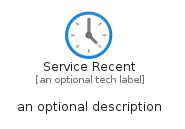
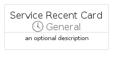
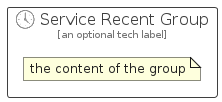

# ServiceRecent


```text
azure/Item/General/ServiceRecent
```

```text
include('azure/Item/General/ServiceRecent')
```


| Illustration | ServiceRecent | ServiceRecentCard | ServiceRecentGroup |
| :---: | :---: | :---: | :---: |
|  |  |  |  |


## Sprites
The item provides the following sriptes:

- `<$ServiceRecentXs>`
- `<$ServiceRecentSm>`
- `<$ServiceRecentMd>`
- `<$ServiceRecentLg>`


## ServiceRecent

### Load remotely
```plantuml
@startuml
' configures the library
!global $LIB_BASE_LOCATION="https://raw.githubusercontent.com/tmorin/plantuml-libs/master/distribution"

' loads the library's bootstrap
!include $LIB_BASE_LOCATION/bootstrap.puml

' loads the package bootstrap
include('azure/bootstrap')

' loads the Item which embeds the element ServiceRecent
include('azure/Item/General/ServiceRecent')

' renders the element
ServiceRecent('ServiceRecent', 'Service Recent', 'an optional tech label', 'an optional description')
@enduml
```

### Load locally
```plantuml
@startuml
' configures the library
!global $INCLUSION_MODE="local"
!global $LIB_BASE_LOCATION="../../.."

' loads the library's bootstrap
!include $LIB_BASE_LOCATION/bootstrap.puml

' loads the package bootstrap
include('azure/bootstrap')

' loads the Item which embeds the element ServiceRecent
include('azure/Item/General/ServiceRecent')

' renders the element
ServiceRecent('ServiceRecent', 'Service Recent', 'an optional tech label', 'an optional description')
@enduml
```

## ServiceRecentCard

### Load remotely
```plantuml
@startuml
' configures the library
!global $LIB_BASE_LOCATION="https://raw.githubusercontent.com/tmorin/plantuml-libs/master/distribution"

' loads the library's bootstrap
!include $LIB_BASE_LOCATION/bootstrap.puml

' loads the package bootstrap
include('azure/bootstrap')

' loads the Item which embeds the element ServiceRecentCard
include('azure/Item/General/ServiceRecent')

' renders the element
ServiceRecentCard('ServiceRecentCard', 'Service Recent Card', 'an optional description')
@enduml
```

### Load locally
```plantuml
@startuml
' configures the library
!global $INCLUSION_MODE="local"
!global $LIB_BASE_LOCATION="../../.."

' loads the library's bootstrap
!include $LIB_BASE_LOCATION/bootstrap.puml

' loads the package bootstrap
include('azure/bootstrap')

' loads the Item which embeds the element ServiceRecentCard
include('azure/Item/General/ServiceRecent')

' renders the element
ServiceRecentCard('ServiceRecentCard', 'Service Recent Card', 'an optional description')
@enduml
```

## ServiceRecentGroup

### Load remotely
```plantuml
@startuml
' configures the library
!global $LIB_BASE_LOCATION="https://raw.githubusercontent.com/tmorin/plantuml-libs/master/distribution"

' loads the library's bootstrap
!include $LIB_BASE_LOCATION/bootstrap.puml

' loads the package bootstrap
include('azure/bootstrap')

' loads the Item which embeds the element ServiceRecentGroup
include('azure/Item/General/ServiceRecent')

' renders the element
ServiceRecentGroup('ServiceRecentGroup', 'Service Recent Group', 'an optional tech label') {
    note as note
        the content of the group
    end note
}
@enduml
```

### Load locally
```plantuml
@startuml
' configures the library
!global $INCLUSION_MODE="local"
!global $LIB_BASE_LOCATION="../../.."

' loads the library's bootstrap
!include $LIB_BASE_LOCATION/bootstrap.puml

' loads the package bootstrap
include('azure/bootstrap')

' loads the Item which embeds the element ServiceRecentGroup
include('azure/Item/General/ServiceRecent')

' renders the element
ServiceRecentGroup('ServiceRecentGroup', 'Service Recent Group', 'an optional tech label') {
    note as note
        the content of the group
    end note
}
@enduml
```

