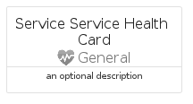
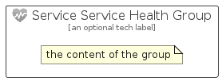

# ServiceServiceHealth


```text
azure/Item/General/ServiceServiceHealth
```

```text
include('azure/Item/General/ServiceServiceHealth')
```


| Illustration | ServiceServiceHealth | ServiceServiceHealthCard | ServiceServiceHealthGroup |
| :---: | :---: | :---: | :---: |
|  |  |  |  |


## Sprites
The item provides the following sriptes:

- `<$ServiceServiceHealthXs>`
- `<$ServiceServiceHealthSm>`
- `<$ServiceServiceHealthMd>`
- `<$ServiceServiceHealthLg>`


## ServiceServiceHealth

### Load remotely
```plantuml
@startuml
' configures the library
!global $LIB_BASE_LOCATION="https://raw.githubusercontent.com/tmorin/plantuml-libs/master/distribution"

' loads the library's bootstrap
!include $LIB_BASE_LOCATION/bootstrap.puml

' loads the package bootstrap
include('azure/bootstrap')

' loads the Item which embeds the element ServiceServiceHealth
include('azure/Item/General/ServiceServiceHealth')

' renders the element
ServiceServiceHealth('ServiceServiceHealth', 'Service Service Health', 'an optional tech label', 'an optional description')
@enduml
```

### Load locally
```plantuml
@startuml
' configures the library
!global $INCLUSION_MODE="local"
!global $LIB_BASE_LOCATION="../../.."

' loads the library's bootstrap
!include $LIB_BASE_LOCATION/bootstrap.puml

' loads the package bootstrap
include('azure/bootstrap')

' loads the Item which embeds the element ServiceServiceHealth
include('azure/Item/General/ServiceServiceHealth')

' renders the element
ServiceServiceHealth('ServiceServiceHealth', 'Service Service Health', 'an optional tech label', 'an optional description')
@enduml
```

## ServiceServiceHealthCard

### Load remotely
```plantuml
@startuml
' configures the library
!global $LIB_BASE_LOCATION="https://raw.githubusercontent.com/tmorin/plantuml-libs/master/distribution"

' loads the library's bootstrap
!include $LIB_BASE_LOCATION/bootstrap.puml

' loads the package bootstrap
include('azure/bootstrap')

' loads the Item which embeds the element ServiceServiceHealthCard
include('azure/Item/General/ServiceServiceHealth')

' renders the element
ServiceServiceHealthCard('ServiceServiceHealthCard', 'Service Service Health Card', 'an optional description')
@enduml
```

### Load locally
```plantuml
@startuml
' configures the library
!global $INCLUSION_MODE="local"
!global $LIB_BASE_LOCATION="../../.."

' loads the library's bootstrap
!include $LIB_BASE_LOCATION/bootstrap.puml

' loads the package bootstrap
include('azure/bootstrap')

' loads the Item which embeds the element ServiceServiceHealthCard
include('azure/Item/General/ServiceServiceHealth')

' renders the element
ServiceServiceHealthCard('ServiceServiceHealthCard', 'Service Service Health Card', 'an optional description')
@enduml
```

## ServiceServiceHealthGroup

### Load remotely
```plantuml
@startuml
' configures the library
!global $LIB_BASE_LOCATION="https://raw.githubusercontent.com/tmorin/plantuml-libs/master/distribution"

' loads the library's bootstrap
!include $LIB_BASE_LOCATION/bootstrap.puml

' loads the package bootstrap
include('azure/bootstrap')

' loads the Item which embeds the element ServiceServiceHealthGroup
include('azure/Item/General/ServiceServiceHealth')

' renders the element
ServiceServiceHealthGroup('ServiceServiceHealthGroup', 'Service Service Health Group', 'an optional tech label') {
    note as note
        the content of the group
    end note
}
@enduml
```

### Load locally
```plantuml
@startuml
' configures the library
!global $INCLUSION_MODE="local"
!global $LIB_BASE_LOCATION="../../.."

' loads the library's bootstrap
!include $LIB_BASE_LOCATION/bootstrap.puml

' loads the package bootstrap
include('azure/bootstrap')

' loads the Item which embeds the element ServiceServiceHealthGroup
include('azure/Item/General/ServiceServiceHealth')

' renders the element
ServiceServiceHealthGroup('ServiceServiceHealthGroup', 'Service Service Health Group', 'an optional tech label') {
    note as note
        the content of the group
    end note
}
@enduml
```

