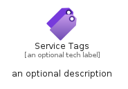
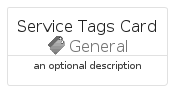
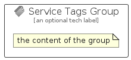

# ServiceTags


```text
azure/Item/General/ServiceTags
```

```text
include('azure/Item/General/ServiceTags')
```


| Illustration | ServiceTags | ServiceTagsCard | ServiceTagsGroup |
| :---: | :---: | :---: | :---: |
|  |  |  |  |


## Sprites
The item provides the following sriptes:

- `<$ServiceTagsXs>`
- `<$ServiceTagsSm>`
- `<$ServiceTagsMd>`
- `<$ServiceTagsLg>`


## ServiceTags

### Load remotely
```plantuml
@startuml
' configures the library
!global $LIB_BASE_LOCATION="https://raw.githubusercontent.com/tmorin/plantuml-libs/master/distribution"

' loads the library's bootstrap
!include $LIB_BASE_LOCATION/bootstrap.puml

' loads the package bootstrap
include('azure/bootstrap')

' loads the Item which embeds the element ServiceTags
include('azure/Item/General/ServiceTags')

' renders the element
ServiceTags('ServiceTags', 'Service Tags', 'an optional tech label', 'an optional description')
@enduml
```

### Load locally
```plantuml
@startuml
' configures the library
!global $INCLUSION_MODE="local"
!global $LIB_BASE_LOCATION="../../.."

' loads the library's bootstrap
!include $LIB_BASE_LOCATION/bootstrap.puml

' loads the package bootstrap
include('azure/bootstrap')

' loads the Item which embeds the element ServiceTags
include('azure/Item/General/ServiceTags')

' renders the element
ServiceTags('ServiceTags', 'Service Tags', 'an optional tech label', 'an optional description')
@enduml
```

## ServiceTagsCard

### Load remotely
```plantuml
@startuml
' configures the library
!global $LIB_BASE_LOCATION="https://raw.githubusercontent.com/tmorin/plantuml-libs/master/distribution"

' loads the library's bootstrap
!include $LIB_BASE_LOCATION/bootstrap.puml

' loads the package bootstrap
include('azure/bootstrap')

' loads the Item which embeds the element ServiceTagsCard
include('azure/Item/General/ServiceTags')

' renders the element
ServiceTagsCard('ServiceTagsCard', 'Service Tags Card', 'an optional description')
@enduml
```

### Load locally
```plantuml
@startuml
' configures the library
!global $INCLUSION_MODE="local"
!global $LIB_BASE_LOCATION="../../.."

' loads the library's bootstrap
!include $LIB_BASE_LOCATION/bootstrap.puml

' loads the package bootstrap
include('azure/bootstrap')

' loads the Item which embeds the element ServiceTagsCard
include('azure/Item/General/ServiceTags')

' renders the element
ServiceTagsCard('ServiceTagsCard', 'Service Tags Card', 'an optional description')
@enduml
```

## ServiceTagsGroup

### Load remotely
```plantuml
@startuml
' configures the library
!global $LIB_BASE_LOCATION="https://raw.githubusercontent.com/tmorin/plantuml-libs/master/distribution"

' loads the library's bootstrap
!include $LIB_BASE_LOCATION/bootstrap.puml

' loads the package bootstrap
include('azure/bootstrap')

' loads the Item which embeds the element ServiceTagsGroup
include('azure/Item/General/ServiceTags')

' renders the element
ServiceTagsGroup('ServiceTagsGroup', 'Service Tags Group', 'an optional tech label') {
    note as note
        the content of the group
    end note
}
@enduml
```

### Load locally
```plantuml
@startuml
' configures the library
!global $INCLUSION_MODE="local"
!global $LIB_BASE_LOCATION="../../.."

' loads the library's bootstrap
!include $LIB_BASE_LOCATION/bootstrap.puml

' loads the package bootstrap
include('azure/bootstrap')

' loads the Item which embeds the element ServiceTagsGroup
include('azure/Item/General/ServiceTags')

' renders the element
ServiceTagsGroup('ServiceTagsGroup', 'Service Tags Group', 'an optional tech label') {
    note as note
        the content of the group
    end note
}
@enduml
```

