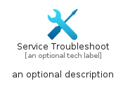
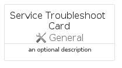
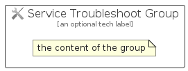

# ServiceTroubleshoot


```text
azure/Item/General/ServiceTroubleshoot
```

```text
include('azure/Item/General/ServiceTroubleshoot')
```


| Illustration | ServiceTroubleshoot | ServiceTroubleshootCard | ServiceTroubleshootGroup |
| :---: | :---: | :---: | :---: |
|  |  |  |  |


## Sprites
The item provides the following sriptes:

- `<$ServiceTroubleshootXs>`
- `<$ServiceTroubleshootSm>`
- `<$ServiceTroubleshootMd>`
- `<$ServiceTroubleshootLg>`


## ServiceTroubleshoot

### Load remotely
```plantuml
@startuml
' configures the library
!global $LIB_BASE_LOCATION="https://raw.githubusercontent.com/tmorin/plantuml-libs/master/distribution"

' loads the library's bootstrap
!include $LIB_BASE_LOCATION/bootstrap.puml

' loads the package bootstrap
include('azure/bootstrap')

' loads the Item which embeds the element ServiceTroubleshoot
include('azure/Item/General/ServiceTroubleshoot')

' renders the element
ServiceTroubleshoot('ServiceTroubleshoot', 'Service Troubleshoot', 'an optional tech label', 'an optional description')
@enduml
```

### Load locally
```plantuml
@startuml
' configures the library
!global $INCLUSION_MODE="local"
!global $LIB_BASE_LOCATION="../../.."

' loads the library's bootstrap
!include $LIB_BASE_LOCATION/bootstrap.puml

' loads the package bootstrap
include('azure/bootstrap')

' loads the Item which embeds the element ServiceTroubleshoot
include('azure/Item/General/ServiceTroubleshoot')

' renders the element
ServiceTroubleshoot('ServiceTroubleshoot', 'Service Troubleshoot', 'an optional tech label', 'an optional description')
@enduml
```

## ServiceTroubleshootCard

### Load remotely
```plantuml
@startuml
' configures the library
!global $LIB_BASE_LOCATION="https://raw.githubusercontent.com/tmorin/plantuml-libs/master/distribution"

' loads the library's bootstrap
!include $LIB_BASE_LOCATION/bootstrap.puml

' loads the package bootstrap
include('azure/bootstrap')

' loads the Item which embeds the element ServiceTroubleshootCard
include('azure/Item/General/ServiceTroubleshoot')

' renders the element
ServiceTroubleshootCard('ServiceTroubleshootCard', 'Service Troubleshoot Card', 'an optional description')
@enduml
```

### Load locally
```plantuml
@startuml
' configures the library
!global $INCLUSION_MODE="local"
!global $LIB_BASE_LOCATION="../../.."

' loads the library's bootstrap
!include $LIB_BASE_LOCATION/bootstrap.puml

' loads the package bootstrap
include('azure/bootstrap')

' loads the Item which embeds the element ServiceTroubleshootCard
include('azure/Item/General/ServiceTroubleshoot')

' renders the element
ServiceTroubleshootCard('ServiceTroubleshootCard', 'Service Troubleshoot Card', 'an optional description')
@enduml
```

## ServiceTroubleshootGroup

### Load remotely
```plantuml
@startuml
' configures the library
!global $LIB_BASE_LOCATION="https://raw.githubusercontent.com/tmorin/plantuml-libs/master/distribution"

' loads the library's bootstrap
!include $LIB_BASE_LOCATION/bootstrap.puml

' loads the package bootstrap
include('azure/bootstrap')

' loads the Item which embeds the element ServiceTroubleshootGroup
include('azure/Item/General/ServiceTroubleshoot')

' renders the element
ServiceTroubleshootGroup('ServiceTroubleshootGroup', 'Service Troubleshoot Group', 'an optional tech label') {
    note as note
        the content of the group
    end note
}
@enduml
```

### Load locally
```plantuml
@startuml
' configures the library
!global $INCLUSION_MODE="local"
!global $LIB_BASE_LOCATION="../../.."

' loads the library's bootstrap
!include $LIB_BASE_LOCATION/bootstrap.puml

' loads the package bootstrap
include('azure/bootstrap')

' loads the Item which embeds the element ServiceTroubleshootGroup
include('azure/Item/General/ServiceTroubleshoot')

' renders the element
ServiceTroubleshootGroup('ServiceTroubleshootGroup', 'Service Troubleshoot Group', 'an optional tech label') {
    note as note
        the content of the group
    end note
}
@enduml
```

