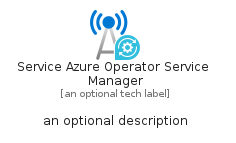
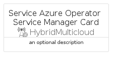
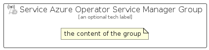

# ServiceAzureOperatorServiceManager


```text
azure/Item/HybridMulticloud/ServiceAzureOperatorServiceManager
```

```text
include('azure/Item/HybridMulticloud/ServiceAzureOperatorServiceManager')
```


| Illustration | ServiceAzureOperatorServiceManager | ServiceAzureOperatorServiceManagerCard | ServiceAzureOperatorServiceManagerGroup |
| :---: | :---: | :---: | :---: |
|  |  |  |  |


## Sprites
The item provides the following sriptes:

- `<$ServiceAzureOperatorServiceManagerXs>`
- `<$ServiceAzureOperatorServiceManagerSm>`
- `<$ServiceAzureOperatorServiceManagerMd>`
- `<$ServiceAzureOperatorServiceManagerLg>`


## ServiceAzureOperatorServiceManager

### Load remotely
```plantuml
@startuml
' configures the library
!global $LIB_BASE_LOCATION="https://raw.githubusercontent.com/tmorin/plantuml-libs/master/distribution"

' loads the library's bootstrap
!include $LIB_BASE_LOCATION/bootstrap.puml

' loads the package bootstrap
include('azure/bootstrap')

' loads the Item which embeds the element ServiceAzureOperatorServiceManager
include('azure/Item/HybridMulticloud/ServiceAzureOperatorServiceManager')

' renders the element
ServiceAzureOperatorServiceManager('ServiceAzureOperatorServiceManager', 'Service Azure Operator Service Manager', 'an optional tech label', 'an optional description')
@enduml
```

### Load locally
```plantuml
@startuml
' configures the library
!global $INCLUSION_MODE="local"
!global $LIB_BASE_LOCATION="../../.."

' loads the library's bootstrap
!include $LIB_BASE_LOCATION/bootstrap.puml

' loads the package bootstrap
include('azure/bootstrap')

' loads the Item which embeds the element ServiceAzureOperatorServiceManager
include('azure/Item/HybridMulticloud/ServiceAzureOperatorServiceManager')

' renders the element
ServiceAzureOperatorServiceManager('ServiceAzureOperatorServiceManager', 'Service Azure Operator Service Manager', 'an optional tech label', 'an optional description')
@enduml
```

## ServiceAzureOperatorServiceManagerCard

### Load remotely
```plantuml
@startuml
' configures the library
!global $LIB_BASE_LOCATION="https://raw.githubusercontent.com/tmorin/plantuml-libs/master/distribution"

' loads the library's bootstrap
!include $LIB_BASE_LOCATION/bootstrap.puml

' loads the package bootstrap
include('azure/bootstrap')

' loads the Item which embeds the element ServiceAzureOperatorServiceManagerCard
include('azure/Item/HybridMulticloud/ServiceAzureOperatorServiceManager')

' renders the element
ServiceAzureOperatorServiceManagerCard('ServiceAzureOperatorServiceManagerCard', 'Service Azure Operator Service Manager Card', 'an optional description')
@enduml
```

### Load locally
```plantuml
@startuml
' configures the library
!global $INCLUSION_MODE="local"
!global $LIB_BASE_LOCATION="../../.."

' loads the library's bootstrap
!include $LIB_BASE_LOCATION/bootstrap.puml

' loads the package bootstrap
include('azure/bootstrap')

' loads the Item which embeds the element ServiceAzureOperatorServiceManagerCard
include('azure/Item/HybridMulticloud/ServiceAzureOperatorServiceManager')

' renders the element
ServiceAzureOperatorServiceManagerCard('ServiceAzureOperatorServiceManagerCard', 'Service Azure Operator Service Manager Card', 'an optional description')
@enduml
```

## ServiceAzureOperatorServiceManagerGroup

### Load remotely
```plantuml
@startuml
' configures the library
!global $LIB_BASE_LOCATION="https://raw.githubusercontent.com/tmorin/plantuml-libs/master/distribution"

' loads the library's bootstrap
!include $LIB_BASE_LOCATION/bootstrap.puml

' loads the package bootstrap
include('azure/bootstrap')

' loads the Item which embeds the element ServiceAzureOperatorServiceManagerGroup
include('azure/Item/HybridMulticloud/ServiceAzureOperatorServiceManager')

' renders the element
ServiceAzureOperatorServiceManagerGroup('ServiceAzureOperatorServiceManagerGroup', 'Service Azure Operator Service Manager Group', 'an optional tech label') {
    note as note
        the content of the group
    end note
}
@enduml
```

### Load locally
```plantuml
@startuml
' configures the library
!global $INCLUSION_MODE="local"
!global $LIB_BASE_LOCATION="../../.."

' loads the library's bootstrap
!include $LIB_BASE_LOCATION/bootstrap.puml

' loads the package bootstrap
include('azure/bootstrap')

' loads the Item which embeds the element ServiceAzureOperatorServiceManagerGroup
include('azure/Item/HybridMulticloud/ServiceAzureOperatorServiceManager')

' renders the element
ServiceAzureOperatorServiceManagerGroup('ServiceAzureOperatorServiceManagerGroup', 'Service Azure Operator Service Manager Group', 'an optional tech label') {
    note as note
        the content of the group
    end note
}
@enduml
```

