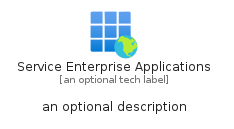
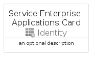
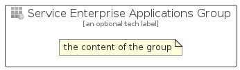

# ServiceEnterpriseApplications


```text
azure/Item/Identity/ServiceEnterpriseApplications
```

```text
include('azure/Item/Identity/ServiceEnterpriseApplications')
```


| Illustration | ServiceEnterpriseApplications | ServiceEnterpriseApplicationsCard | ServiceEnterpriseApplicationsGroup |
| :---: | :---: | :---: | :---: |
|  |  |  |  |


## Sprites
The item provides the following sriptes:

- `<$ServiceEnterpriseApplicationsXs>`
- `<$ServiceEnterpriseApplicationsSm>`
- `<$ServiceEnterpriseApplicationsMd>`
- `<$ServiceEnterpriseApplicationsLg>`


## ServiceEnterpriseApplications

### Load remotely
```plantuml
@startuml
' configures the library
!global $LIB_BASE_LOCATION="https://raw.githubusercontent.com/tmorin/plantuml-libs/master/distribution"

' loads the library's bootstrap
!include $LIB_BASE_LOCATION/bootstrap.puml

' loads the package bootstrap
include('azure/bootstrap')

' loads the Item which embeds the element ServiceEnterpriseApplications
include('azure/Item/Identity/ServiceEnterpriseApplications')

' renders the element
ServiceEnterpriseApplications('ServiceEnterpriseApplications', 'Service Enterprise Applications', 'an optional tech label', 'an optional description')
@enduml
```

### Load locally
```plantuml
@startuml
' configures the library
!global $INCLUSION_MODE="local"
!global $LIB_BASE_LOCATION="../../.."

' loads the library's bootstrap
!include $LIB_BASE_LOCATION/bootstrap.puml

' loads the package bootstrap
include('azure/bootstrap')

' loads the Item which embeds the element ServiceEnterpriseApplications
include('azure/Item/Identity/ServiceEnterpriseApplications')

' renders the element
ServiceEnterpriseApplications('ServiceEnterpriseApplications', 'Service Enterprise Applications', 'an optional tech label', 'an optional description')
@enduml
```

## ServiceEnterpriseApplicationsCard

### Load remotely
```plantuml
@startuml
' configures the library
!global $LIB_BASE_LOCATION="https://raw.githubusercontent.com/tmorin/plantuml-libs/master/distribution"

' loads the library's bootstrap
!include $LIB_BASE_LOCATION/bootstrap.puml

' loads the package bootstrap
include('azure/bootstrap')

' loads the Item which embeds the element ServiceEnterpriseApplicationsCard
include('azure/Item/Identity/ServiceEnterpriseApplications')

' renders the element
ServiceEnterpriseApplicationsCard('ServiceEnterpriseApplicationsCard', 'Service Enterprise Applications Card', 'an optional description')
@enduml
```

### Load locally
```plantuml
@startuml
' configures the library
!global $INCLUSION_MODE="local"
!global $LIB_BASE_LOCATION="../../.."

' loads the library's bootstrap
!include $LIB_BASE_LOCATION/bootstrap.puml

' loads the package bootstrap
include('azure/bootstrap')

' loads the Item which embeds the element ServiceEnterpriseApplicationsCard
include('azure/Item/Identity/ServiceEnterpriseApplications')

' renders the element
ServiceEnterpriseApplicationsCard('ServiceEnterpriseApplicationsCard', 'Service Enterprise Applications Card', 'an optional description')
@enduml
```

## ServiceEnterpriseApplicationsGroup

### Load remotely
```plantuml
@startuml
' configures the library
!global $LIB_BASE_LOCATION="https://raw.githubusercontent.com/tmorin/plantuml-libs/master/distribution"

' loads the library's bootstrap
!include $LIB_BASE_LOCATION/bootstrap.puml

' loads the package bootstrap
include('azure/bootstrap')

' loads the Item which embeds the element ServiceEnterpriseApplicationsGroup
include('azure/Item/Identity/ServiceEnterpriseApplications')

' renders the element
ServiceEnterpriseApplicationsGroup('ServiceEnterpriseApplicationsGroup', 'Service Enterprise Applications Group', 'an optional tech label') {
    note as note
        the content of the group
    end note
}
@enduml
```

### Load locally
```plantuml
@startuml
' configures the library
!global $INCLUSION_MODE="local"
!global $LIB_BASE_LOCATION="../../.."

' loads the library's bootstrap
!include $LIB_BASE_LOCATION/bootstrap.puml

' loads the package bootstrap
include('azure/bootstrap')

' loads the Item which embeds the element ServiceEnterpriseApplicationsGroup
include('azure/Item/Identity/ServiceEnterpriseApplications')

' renders the element
ServiceEnterpriseApplicationsGroup('ServiceEnterpriseApplicationsGroup', 'Service Enterprise Applications Group', 'an optional tech label') {
    note as note
        the content of the group
    end note
}
@enduml
```

