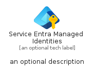
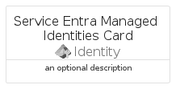
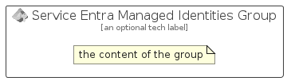

# ServiceEntraManagedIdentities


```text
azure/Item/Identity/ServiceEntraManagedIdentities
```

```text
include('azure/Item/Identity/ServiceEntraManagedIdentities')
```


| Illustration | ServiceEntraManagedIdentities | ServiceEntraManagedIdentitiesCard | ServiceEntraManagedIdentitiesGroup |
| :---: | :---: | :---: | :---: |
|  |  |  |  |


## Sprites
The item provides the following sriptes:

- `<$ServiceEntraManagedIdentitiesXs>`
- `<$ServiceEntraManagedIdentitiesSm>`
- `<$ServiceEntraManagedIdentitiesMd>`
- `<$ServiceEntraManagedIdentitiesLg>`


## ServiceEntraManagedIdentities

### Load remotely
```plantuml
@startuml
' configures the library
!global $LIB_BASE_LOCATION="https://raw.githubusercontent.com/tmorin/plantuml-libs/master/distribution"

' loads the library's bootstrap
!include $LIB_BASE_LOCATION/bootstrap.puml

' loads the package bootstrap
include('azure/bootstrap')

' loads the Item which embeds the element ServiceEntraManagedIdentities
include('azure/Item/Identity/ServiceEntraManagedIdentities')

' renders the element
ServiceEntraManagedIdentities('ServiceEntraManagedIdentities', 'Service Entra Managed Identities', 'an optional tech label', 'an optional description')
@enduml
```

### Load locally
```plantuml
@startuml
' configures the library
!global $INCLUSION_MODE="local"
!global $LIB_BASE_LOCATION="../../.."

' loads the library's bootstrap
!include $LIB_BASE_LOCATION/bootstrap.puml

' loads the package bootstrap
include('azure/bootstrap')

' loads the Item which embeds the element ServiceEntraManagedIdentities
include('azure/Item/Identity/ServiceEntraManagedIdentities')

' renders the element
ServiceEntraManagedIdentities('ServiceEntraManagedIdentities', 'Service Entra Managed Identities', 'an optional tech label', 'an optional description')
@enduml
```

## ServiceEntraManagedIdentitiesCard

### Load remotely
```plantuml
@startuml
' configures the library
!global $LIB_BASE_LOCATION="https://raw.githubusercontent.com/tmorin/plantuml-libs/master/distribution"

' loads the library's bootstrap
!include $LIB_BASE_LOCATION/bootstrap.puml

' loads the package bootstrap
include('azure/bootstrap')

' loads the Item which embeds the element ServiceEntraManagedIdentitiesCard
include('azure/Item/Identity/ServiceEntraManagedIdentities')

' renders the element
ServiceEntraManagedIdentitiesCard('ServiceEntraManagedIdentitiesCard', 'Service Entra Managed Identities Card', 'an optional description')
@enduml
```

### Load locally
```plantuml
@startuml
' configures the library
!global $INCLUSION_MODE="local"
!global $LIB_BASE_LOCATION="../../.."

' loads the library's bootstrap
!include $LIB_BASE_LOCATION/bootstrap.puml

' loads the package bootstrap
include('azure/bootstrap')

' loads the Item which embeds the element ServiceEntraManagedIdentitiesCard
include('azure/Item/Identity/ServiceEntraManagedIdentities')

' renders the element
ServiceEntraManagedIdentitiesCard('ServiceEntraManagedIdentitiesCard', 'Service Entra Managed Identities Card', 'an optional description')
@enduml
```

## ServiceEntraManagedIdentitiesGroup

### Load remotely
```plantuml
@startuml
' configures the library
!global $LIB_BASE_LOCATION="https://raw.githubusercontent.com/tmorin/plantuml-libs/master/distribution"

' loads the library's bootstrap
!include $LIB_BASE_LOCATION/bootstrap.puml

' loads the package bootstrap
include('azure/bootstrap')

' loads the Item which embeds the element ServiceEntraManagedIdentitiesGroup
include('azure/Item/Identity/ServiceEntraManagedIdentities')

' renders the element
ServiceEntraManagedIdentitiesGroup('ServiceEntraManagedIdentitiesGroup', 'Service Entra Managed Identities Group', 'an optional tech label') {
    note as note
        the content of the group
    end note
}
@enduml
```

### Load locally
```plantuml
@startuml
' configures the library
!global $INCLUSION_MODE="local"
!global $LIB_BASE_LOCATION="../../.."

' loads the library's bootstrap
!include $LIB_BASE_LOCATION/bootstrap.puml

' loads the package bootstrap
include('azure/bootstrap')

' loads the Item which embeds the element ServiceEntraManagedIdentitiesGroup
include('azure/Item/Identity/ServiceEntraManagedIdentities')

' renders the element
ServiceEntraManagedIdentitiesGroup('ServiceEntraManagedIdentitiesGroup', 'Service Entra Managed Identities Group', 'an optional tech label') {
    note as note
        the content of the group
    end note
}
@enduml
```

