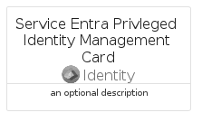
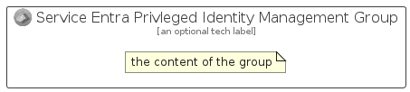

# ServiceEntraPrivlegedIdentityManagement


```text
azure/Item/Identity/ServiceEntraPrivlegedIdentityManagement
```

```text
include('azure/Item/Identity/ServiceEntraPrivlegedIdentityManagement')
```


| Illustration | ServiceEntraPrivlegedIdentityManagement | ServiceEntraPrivlegedIdentityManagementCard | ServiceEntraPrivlegedIdentityManagementGroup |
| :---: | :---: | :---: | :---: |
|  |  |  |  |


## Sprites
The item provides the following sriptes:

- `<$ServiceEntraPrivlegedIdentityManagementXs>`
- `<$ServiceEntraPrivlegedIdentityManagementSm>`
- `<$ServiceEntraPrivlegedIdentityManagementMd>`
- `<$ServiceEntraPrivlegedIdentityManagementLg>`


## ServiceEntraPrivlegedIdentityManagement

### Load remotely
```plantuml
@startuml
' configures the library
!global $LIB_BASE_LOCATION="https://raw.githubusercontent.com/tmorin/plantuml-libs/master/distribution"

' loads the library's bootstrap
!include $LIB_BASE_LOCATION/bootstrap.puml

' loads the package bootstrap
include('azure/bootstrap')

' loads the Item which embeds the element ServiceEntraPrivlegedIdentityManagement
include('azure/Item/Identity/ServiceEntraPrivlegedIdentityManagement')

' renders the element
ServiceEntraPrivlegedIdentityManagement('ServiceEntraPrivlegedIdentityManagement', 'Service Entra Privleged Identity Management', 'an optional tech label', 'an optional description')
@enduml
```

### Load locally
```plantuml
@startuml
' configures the library
!global $INCLUSION_MODE="local"
!global $LIB_BASE_LOCATION="../../.."

' loads the library's bootstrap
!include $LIB_BASE_LOCATION/bootstrap.puml

' loads the package bootstrap
include('azure/bootstrap')

' loads the Item which embeds the element ServiceEntraPrivlegedIdentityManagement
include('azure/Item/Identity/ServiceEntraPrivlegedIdentityManagement')

' renders the element
ServiceEntraPrivlegedIdentityManagement('ServiceEntraPrivlegedIdentityManagement', 'Service Entra Privleged Identity Management', 'an optional tech label', 'an optional description')
@enduml
```

## ServiceEntraPrivlegedIdentityManagementCard

### Load remotely
```plantuml
@startuml
' configures the library
!global $LIB_BASE_LOCATION="https://raw.githubusercontent.com/tmorin/plantuml-libs/master/distribution"

' loads the library's bootstrap
!include $LIB_BASE_LOCATION/bootstrap.puml

' loads the package bootstrap
include('azure/bootstrap')

' loads the Item which embeds the element ServiceEntraPrivlegedIdentityManagementCard
include('azure/Item/Identity/ServiceEntraPrivlegedIdentityManagement')

' renders the element
ServiceEntraPrivlegedIdentityManagementCard('ServiceEntraPrivlegedIdentityManagementCard', 'Service Entra Privleged Identity Management Card', 'an optional description')
@enduml
```

### Load locally
```plantuml
@startuml
' configures the library
!global $INCLUSION_MODE="local"
!global $LIB_BASE_LOCATION="../../.."

' loads the library's bootstrap
!include $LIB_BASE_LOCATION/bootstrap.puml

' loads the package bootstrap
include('azure/bootstrap')

' loads the Item which embeds the element ServiceEntraPrivlegedIdentityManagementCard
include('azure/Item/Identity/ServiceEntraPrivlegedIdentityManagement')

' renders the element
ServiceEntraPrivlegedIdentityManagementCard('ServiceEntraPrivlegedIdentityManagementCard', 'Service Entra Privleged Identity Management Card', 'an optional description')
@enduml
```

## ServiceEntraPrivlegedIdentityManagementGroup

### Load remotely
```plantuml
@startuml
' configures the library
!global $LIB_BASE_LOCATION="https://raw.githubusercontent.com/tmorin/plantuml-libs/master/distribution"

' loads the library's bootstrap
!include $LIB_BASE_LOCATION/bootstrap.puml

' loads the package bootstrap
include('azure/bootstrap')

' loads the Item which embeds the element ServiceEntraPrivlegedIdentityManagementGroup
include('azure/Item/Identity/ServiceEntraPrivlegedIdentityManagement')

' renders the element
ServiceEntraPrivlegedIdentityManagementGroup('ServiceEntraPrivlegedIdentityManagementGroup', 'Service Entra Privleged Identity Management Group', 'an optional tech label') {
    note as note
        the content of the group
    end note
}
@enduml
```

### Load locally
```plantuml
@startuml
' configures the library
!global $INCLUSION_MODE="local"
!global $LIB_BASE_LOCATION="../../.."

' loads the library's bootstrap
!include $LIB_BASE_LOCATION/bootstrap.puml

' loads the package bootstrap
include('azure/bootstrap')

' loads the Item which embeds the element ServiceEntraPrivlegedIdentityManagementGroup
include('azure/Item/Identity/ServiceEntraPrivlegedIdentityManagement')

' renders the element
ServiceEntraPrivlegedIdentityManagementGroup('ServiceEntraPrivlegedIdentityManagementGroup', 'Service Entra Privleged Identity Management Group', 'an optional tech label') {
    note as note
        the content of the group
    end note
}
@enduml
```

