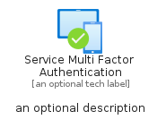
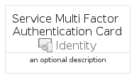
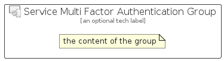

# ServiceMultiFactorAuthentication


```text
azure/Item/Identity/ServiceMultiFactorAuthentication
```

```text
include('azure/Item/Identity/ServiceMultiFactorAuthentication')
```


| Illustration | ServiceMultiFactorAuthentication | ServiceMultiFactorAuthenticationCard | ServiceMultiFactorAuthenticationGroup |
| :---: | :---: | :---: | :---: |
|  |  |  |  |


## Sprites
The item provides the following sriptes:

- `<$ServiceMultiFactorAuthenticationXs>`
- `<$ServiceMultiFactorAuthenticationSm>`
- `<$ServiceMultiFactorAuthenticationMd>`
- `<$ServiceMultiFactorAuthenticationLg>`


## ServiceMultiFactorAuthentication

### Load remotely
```plantuml
@startuml
' configures the library
!global $LIB_BASE_LOCATION="https://raw.githubusercontent.com/tmorin/plantuml-libs/master/distribution"

' loads the library's bootstrap
!include $LIB_BASE_LOCATION/bootstrap.puml

' loads the package bootstrap
include('azure/bootstrap')

' loads the Item which embeds the element ServiceMultiFactorAuthentication
include('azure/Item/Identity/ServiceMultiFactorAuthentication')

' renders the element
ServiceMultiFactorAuthentication('ServiceMultiFactorAuthentication', 'Service Multi Factor Authentication', 'an optional tech label', 'an optional description')
@enduml
```

### Load locally
```plantuml
@startuml
' configures the library
!global $INCLUSION_MODE="local"
!global $LIB_BASE_LOCATION="../../.."

' loads the library's bootstrap
!include $LIB_BASE_LOCATION/bootstrap.puml

' loads the package bootstrap
include('azure/bootstrap')

' loads the Item which embeds the element ServiceMultiFactorAuthentication
include('azure/Item/Identity/ServiceMultiFactorAuthentication')

' renders the element
ServiceMultiFactorAuthentication('ServiceMultiFactorAuthentication', 'Service Multi Factor Authentication', 'an optional tech label', 'an optional description')
@enduml
```

## ServiceMultiFactorAuthenticationCard

### Load remotely
```plantuml
@startuml
' configures the library
!global $LIB_BASE_LOCATION="https://raw.githubusercontent.com/tmorin/plantuml-libs/master/distribution"

' loads the library's bootstrap
!include $LIB_BASE_LOCATION/bootstrap.puml

' loads the package bootstrap
include('azure/bootstrap')

' loads the Item which embeds the element ServiceMultiFactorAuthenticationCard
include('azure/Item/Identity/ServiceMultiFactorAuthentication')

' renders the element
ServiceMultiFactorAuthenticationCard('ServiceMultiFactorAuthenticationCard', 'Service Multi Factor Authentication Card', 'an optional description')
@enduml
```

### Load locally
```plantuml
@startuml
' configures the library
!global $INCLUSION_MODE="local"
!global $LIB_BASE_LOCATION="../../.."

' loads the library's bootstrap
!include $LIB_BASE_LOCATION/bootstrap.puml

' loads the package bootstrap
include('azure/bootstrap')

' loads the Item which embeds the element ServiceMultiFactorAuthenticationCard
include('azure/Item/Identity/ServiceMultiFactorAuthentication')

' renders the element
ServiceMultiFactorAuthenticationCard('ServiceMultiFactorAuthenticationCard', 'Service Multi Factor Authentication Card', 'an optional description')
@enduml
```

## ServiceMultiFactorAuthenticationGroup

### Load remotely
```plantuml
@startuml
' configures the library
!global $LIB_BASE_LOCATION="https://raw.githubusercontent.com/tmorin/plantuml-libs/master/distribution"

' loads the library's bootstrap
!include $LIB_BASE_LOCATION/bootstrap.puml

' loads the package bootstrap
include('azure/bootstrap')

' loads the Item which embeds the element ServiceMultiFactorAuthenticationGroup
include('azure/Item/Identity/ServiceMultiFactorAuthentication')

' renders the element
ServiceMultiFactorAuthenticationGroup('ServiceMultiFactorAuthenticationGroup', 'Service Multi Factor Authentication Group', 'an optional tech label') {
    note as note
        the content of the group
    end note
}
@enduml
```

### Load locally
```plantuml
@startuml
' configures the library
!global $INCLUSION_MODE="local"
!global $LIB_BASE_LOCATION="../../.."

' loads the library's bootstrap
!include $LIB_BASE_LOCATION/bootstrap.puml

' loads the package bootstrap
include('azure/bootstrap')

' loads the Item which embeds the element ServiceMultiFactorAuthenticationGroup
include('azure/Item/Identity/ServiceMultiFactorAuthentication')

' renders the element
ServiceMultiFactorAuthenticationGroup('ServiceMultiFactorAuthenticationGroup', 'Service Multi Factor Authentication Group', 'an optional tech label') {
    note as note
        the content of the group
    end note
}
@enduml
```

