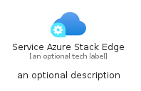
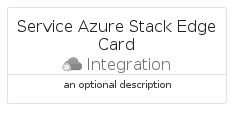
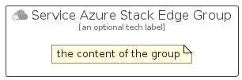

# ServiceAzureStackEdge


```text
azure/Item/Integration/ServiceAzureStackEdge
```

```text
include('azure/Item/Integration/ServiceAzureStackEdge')
```


| Illustration | ServiceAzureStackEdge | ServiceAzureStackEdgeCard | ServiceAzureStackEdgeGroup |
| :---: | :---: | :---: | :---: |
|  |  |  |  |


## Sprites
The item provides the following sriptes:

- `<$ServiceAzureStackEdgeXs>`
- `<$ServiceAzureStackEdgeSm>`
- `<$ServiceAzureStackEdgeMd>`
- `<$ServiceAzureStackEdgeLg>`


## ServiceAzureStackEdge

### Load remotely
```plantuml
@startuml
' configures the library
!global $LIB_BASE_LOCATION="https://raw.githubusercontent.com/tmorin/plantuml-libs/master/distribution"

' loads the library's bootstrap
!include $LIB_BASE_LOCATION/bootstrap.puml

' loads the package bootstrap
include('azure/bootstrap')

' loads the Item which embeds the element ServiceAzureStackEdge
include('azure/Item/Integration/ServiceAzureStackEdge')

' renders the element
ServiceAzureStackEdge('ServiceAzureStackEdge', 'Service Azure Stack Edge', 'an optional tech label', 'an optional description')
@enduml
```

### Load locally
```plantuml
@startuml
' configures the library
!global $INCLUSION_MODE="local"
!global $LIB_BASE_LOCATION="../../.."

' loads the library's bootstrap
!include $LIB_BASE_LOCATION/bootstrap.puml

' loads the package bootstrap
include('azure/bootstrap')

' loads the Item which embeds the element ServiceAzureStackEdge
include('azure/Item/Integration/ServiceAzureStackEdge')

' renders the element
ServiceAzureStackEdge('ServiceAzureStackEdge', 'Service Azure Stack Edge', 'an optional tech label', 'an optional description')
@enduml
```

## ServiceAzureStackEdgeCard

### Load remotely
```plantuml
@startuml
' configures the library
!global $LIB_BASE_LOCATION="https://raw.githubusercontent.com/tmorin/plantuml-libs/master/distribution"

' loads the library's bootstrap
!include $LIB_BASE_LOCATION/bootstrap.puml

' loads the package bootstrap
include('azure/bootstrap')

' loads the Item which embeds the element ServiceAzureStackEdgeCard
include('azure/Item/Integration/ServiceAzureStackEdge')

' renders the element
ServiceAzureStackEdgeCard('ServiceAzureStackEdgeCard', 'Service Azure Stack Edge Card', 'an optional description')
@enduml
```

### Load locally
```plantuml
@startuml
' configures the library
!global $INCLUSION_MODE="local"
!global $LIB_BASE_LOCATION="../../.."

' loads the library's bootstrap
!include $LIB_BASE_LOCATION/bootstrap.puml

' loads the package bootstrap
include('azure/bootstrap')

' loads the Item which embeds the element ServiceAzureStackEdgeCard
include('azure/Item/Integration/ServiceAzureStackEdge')

' renders the element
ServiceAzureStackEdgeCard('ServiceAzureStackEdgeCard', 'Service Azure Stack Edge Card', 'an optional description')
@enduml
```

## ServiceAzureStackEdgeGroup

### Load remotely
```plantuml
@startuml
' configures the library
!global $LIB_BASE_LOCATION="https://raw.githubusercontent.com/tmorin/plantuml-libs/master/distribution"

' loads the library's bootstrap
!include $LIB_BASE_LOCATION/bootstrap.puml

' loads the package bootstrap
include('azure/bootstrap')

' loads the Item which embeds the element ServiceAzureStackEdgeGroup
include('azure/Item/Integration/ServiceAzureStackEdge')

' renders the element
ServiceAzureStackEdgeGroup('ServiceAzureStackEdgeGroup', 'Service Azure Stack Edge Group', 'an optional tech label') {
    note as note
        the content of the group
    end note
}
@enduml
```

### Load locally
```plantuml
@startuml
' configures the library
!global $INCLUSION_MODE="local"
!global $LIB_BASE_LOCATION="../../.."

' loads the library's bootstrap
!include $LIB_BASE_LOCATION/bootstrap.puml

' loads the package bootstrap
include('azure/bootstrap')

' loads the Item which embeds the element ServiceAzureStackEdgeGroup
include('azure/Item/Integration/ServiceAzureStackEdge')

' renders the element
ServiceAzureStackEdgeGroup('ServiceAzureStackEdgeGroup', 'Service Azure Stack Edge Group', 'an optional tech label') {
    note as note
        the content of the group
    end note
}
@enduml
```

