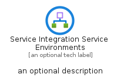
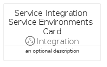
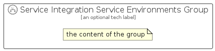

# ServiceIntegrationServiceEnvironments


```text
azure/Item/Integration/ServiceIntegrationServiceEnvironments
```

```text
include('azure/Item/Integration/ServiceIntegrationServiceEnvironments')
```


| Illustration | ServiceIntegrationServiceEnvironments | ServiceIntegrationServiceEnvironmentsCard | ServiceIntegrationServiceEnvironmentsGroup |
| :---: | :---: | :---: | :---: |
|  |  |  |  |


## Sprites
The item provides the following sriptes:

- `<$ServiceIntegrationServiceEnvironmentsXs>`
- `<$ServiceIntegrationServiceEnvironmentsSm>`
- `<$ServiceIntegrationServiceEnvironmentsMd>`
- `<$ServiceIntegrationServiceEnvironmentsLg>`


## ServiceIntegrationServiceEnvironments

### Load remotely
```plantuml
@startuml
' configures the library
!global $LIB_BASE_LOCATION="https://raw.githubusercontent.com/tmorin/plantuml-libs/master/distribution"

' loads the library's bootstrap
!include $LIB_BASE_LOCATION/bootstrap.puml

' loads the package bootstrap
include('azure/bootstrap')

' loads the Item which embeds the element ServiceIntegrationServiceEnvironments
include('azure/Item/Integration/ServiceIntegrationServiceEnvironments')

' renders the element
ServiceIntegrationServiceEnvironments('ServiceIntegrationServiceEnvironments', 'Service Integration Service Environments', 'an optional tech label', 'an optional description')
@enduml
```

### Load locally
```plantuml
@startuml
' configures the library
!global $INCLUSION_MODE="local"
!global $LIB_BASE_LOCATION="../../.."

' loads the library's bootstrap
!include $LIB_BASE_LOCATION/bootstrap.puml

' loads the package bootstrap
include('azure/bootstrap')

' loads the Item which embeds the element ServiceIntegrationServiceEnvironments
include('azure/Item/Integration/ServiceIntegrationServiceEnvironments')

' renders the element
ServiceIntegrationServiceEnvironments('ServiceIntegrationServiceEnvironments', 'Service Integration Service Environments', 'an optional tech label', 'an optional description')
@enduml
```

## ServiceIntegrationServiceEnvironmentsCard

### Load remotely
```plantuml
@startuml
' configures the library
!global $LIB_BASE_LOCATION="https://raw.githubusercontent.com/tmorin/plantuml-libs/master/distribution"

' loads the library's bootstrap
!include $LIB_BASE_LOCATION/bootstrap.puml

' loads the package bootstrap
include('azure/bootstrap')

' loads the Item which embeds the element ServiceIntegrationServiceEnvironmentsCard
include('azure/Item/Integration/ServiceIntegrationServiceEnvironments')

' renders the element
ServiceIntegrationServiceEnvironmentsCard('ServiceIntegrationServiceEnvironmentsCard', 'Service Integration Service Environments Card', 'an optional description')
@enduml
```

### Load locally
```plantuml
@startuml
' configures the library
!global $INCLUSION_MODE="local"
!global $LIB_BASE_LOCATION="../../.."

' loads the library's bootstrap
!include $LIB_BASE_LOCATION/bootstrap.puml

' loads the package bootstrap
include('azure/bootstrap')

' loads the Item which embeds the element ServiceIntegrationServiceEnvironmentsCard
include('azure/Item/Integration/ServiceIntegrationServiceEnvironments')

' renders the element
ServiceIntegrationServiceEnvironmentsCard('ServiceIntegrationServiceEnvironmentsCard', 'Service Integration Service Environments Card', 'an optional description')
@enduml
```

## ServiceIntegrationServiceEnvironmentsGroup

### Load remotely
```plantuml
@startuml
' configures the library
!global $LIB_BASE_LOCATION="https://raw.githubusercontent.com/tmorin/plantuml-libs/master/distribution"

' loads the library's bootstrap
!include $LIB_BASE_LOCATION/bootstrap.puml

' loads the package bootstrap
include('azure/bootstrap')

' loads the Item which embeds the element ServiceIntegrationServiceEnvironmentsGroup
include('azure/Item/Integration/ServiceIntegrationServiceEnvironments')

' renders the element
ServiceIntegrationServiceEnvironmentsGroup('ServiceIntegrationServiceEnvironmentsGroup', 'Service Integration Service Environments Group', 'an optional tech label') {
    note as note
        the content of the group
    end note
}
@enduml
```

### Load locally
```plantuml
@startuml
' configures the library
!global $INCLUSION_MODE="local"
!global $LIB_BASE_LOCATION="../../.."

' loads the library's bootstrap
!include $LIB_BASE_LOCATION/bootstrap.puml

' loads the package bootstrap
include('azure/bootstrap')

' loads the Item which embeds the element ServiceIntegrationServiceEnvironmentsGroup
include('azure/Item/Integration/ServiceIntegrationServiceEnvironments')

' renders the element
ServiceIntegrationServiceEnvironmentsGroup('ServiceIntegrationServiceEnvironmentsGroup', 'Service Integration Service Environments Group', 'an optional tech label') {
    note as note
        the content of the group
    end note
}
@enduml
```

