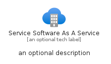
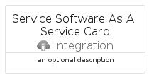
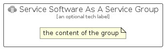

# ServiceSoftwareAsAService


```text
azure/Item/Integration/ServiceSoftwareAsAService
```

```text
include('azure/Item/Integration/ServiceSoftwareAsAService')
```


| Illustration | ServiceSoftwareAsAService | ServiceSoftwareAsAServiceCard | ServiceSoftwareAsAServiceGroup |
| :---: | :---: | :---: | :---: |
|  |  |  |  |


## Sprites
The item provides the following sriptes:

- `<$ServiceSoftwareAsAServiceXs>`
- `<$ServiceSoftwareAsAServiceSm>`
- `<$ServiceSoftwareAsAServiceMd>`
- `<$ServiceSoftwareAsAServiceLg>`


## ServiceSoftwareAsAService

### Load remotely
```plantuml
@startuml
' configures the library
!global $LIB_BASE_LOCATION="https://raw.githubusercontent.com/tmorin/plantuml-libs/master/distribution"

' loads the library's bootstrap
!include $LIB_BASE_LOCATION/bootstrap.puml

' loads the package bootstrap
include('azure/bootstrap')

' loads the Item which embeds the element ServiceSoftwareAsAService
include('azure/Item/Integration/ServiceSoftwareAsAService')

' renders the element
ServiceSoftwareAsAService('ServiceSoftwareAsAService', 'Service Software As A Service', 'an optional tech label', 'an optional description')
@enduml
```

### Load locally
```plantuml
@startuml
' configures the library
!global $INCLUSION_MODE="local"
!global $LIB_BASE_LOCATION="../../.."

' loads the library's bootstrap
!include $LIB_BASE_LOCATION/bootstrap.puml

' loads the package bootstrap
include('azure/bootstrap')

' loads the Item which embeds the element ServiceSoftwareAsAService
include('azure/Item/Integration/ServiceSoftwareAsAService')

' renders the element
ServiceSoftwareAsAService('ServiceSoftwareAsAService', 'Service Software As A Service', 'an optional tech label', 'an optional description')
@enduml
```

## ServiceSoftwareAsAServiceCard

### Load remotely
```plantuml
@startuml
' configures the library
!global $LIB_BASE_LOCATION="https://raw.githubusercontent.com/tmorin/plantuml-libs/master/distribution"

' loads the library's bootstrap
!include $LIB_BASE_LOCATION/bootstrap.puml

' loads the package bootstrap
include('azure/bootstrap')

' loads the Item which embeds the element ServiceSoftwareAsAServiceCard
include('azure/Item/Integration/ServiceSoftwareAsAService')

' renders the element
ServiceSoftwareAsAServiceCard('ServiceSoftwareAsAServiceCard', 'Service Software As A Service Card', 'an optional description')
@enduml
```

### Load locally
```plantuml
@startuml
' configures the library
!global $INCLUSION_MODE="local"
!global $LIB_BASE_LOCATION="../../.."

' loads the library's bootstrap
!include $LIB_BASE_LOCATION/bootstrap.puml

' loads the package bootstrap
include('azure/bootstrap')

' loads the Item which embeds the element ServiceSoftwareAsAServiceCard
include('azure/Item/Integration/ServiceSoftwareAsAService')

' renders the element
ServiceSoftwareAsAServiceCard('ServiceSoftwareAsAServiceCard', 'Service Software As A Service Card', 'an optional description')
@enduml
```

## ServiceSoftwareAsAServiceGroup

### Load remotely
```plantuml
@startuml
' configures the library
!global $LIB_BASE_LOCATION="https://raw.githubusercontent.com/tmorin/plantuml-libs/master/distribution"

' loads the library's bootstrap
!include $LIB_BASE_LOCATION/bootstrap.puml

' loads the package bootstrap
include('azure/bootstrap')

' loads the Item which embeds the element ServiceSoftwareAsAServiceGroup
include('azure/Item/Integration/ServiceSoftwareAsAService')

' renders the element
ServiceSoftwareAsAServiceGroup('ServiceSoftwareAsAServiceGroup', 'Service Software As A Service Group', 'an optional tech label') {
    note as note
        the content of the group
    end note
}
@enduml
```

### Load locally
```plantuml
@startuml
' configures the library
!global $INCLUSION_MODE="local"
!global $LIB_BASE_LOCATION="../../.."

' loads the library's bootstrap
!include $LIB_BASE_LOCATION/bootstrap.puml

' loads the package bootstrap
include('azure/bootstrap')

' loads the Item which embeds the element ServiceSoftwareAsAServiceGroup
include('azure/Item/Integration/ServiceSoftwareAsAService')

' renders the element
ServiceSoftwareAsAServiceGroup('ServiceSoftwareAsAServiceGroup', 'Service Software As A Service Group', 'an optional tech label') {
    note as note
        the content of the group
    end note
}
@enduml
```

