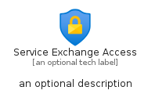
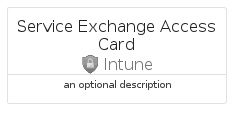
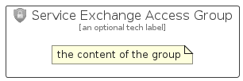

# ServiceExchangeAccess


```text
azure/Item/Intune/ServiceExchangeAccess
```

```text
include('azure/Item/Intune/ServiceExchangeAccess')
```


| Illustration | ServiceExchangeAccess | ServiceExchangeAccessCard | ServiceExchangeAccessGroup |
| :---: | :---: | :---: | :---: |
|  |  |  |  |


## Sprites
The item provides the following sriptes:

- `<$ServiceExchangeAccessXs>`
- `<$ServiceExchangeAccessSm>`
- `<$ServiceExchangeAccessMd>`
- `<$ServiceExchangeAccessLg>`


## ServiceExchangeAccess

### Load remotely
```plantuml
@startuml
' configures the library
!global $LIB_BASE_LOCATION="https://raw.githubusercontent.com/tmorin/plantuml-libs/master/distribution"

' loads the library's bootstrap
!include $LIB_BASE_LOCATION/bootstrap.puml

' loads the package bootstrap
include('azure/bootstrap')

' loads the Item which embeds the element ServiceExchangeAccess
include('azure/Item/Intune/ServiceExchangeAccess')

' renders the element
ServiceExchangeAccess('ServiceExchangeAccess', 'Service Exchange Access', 'an optional tech label', 'an optional description')
@enduml
```

### Load locally
```plantuml
@startuml
' configures the library
!global $INCLUSION_MODE="local"
!global $LIB_BASE_LOCATION="../../.."

' loads the library's bootstrap
!include $LIB_BASE_LOCATION/bootstrap.puml

' loads the package bootstrap
include('azure/bootstrap')

' loads the Item which embeds the element ServiceExchangeAccess
include('azure/Item/Intune/ServiceExchangeAccess')

' renders the element
ServiceExchangeAccess('ServiceExchangeAccess', 'Service Exchange Access', 'an optional tech label', 'an optional description')
@enduml
```

## ServiceExchangeAccessCard

### Load remotely
```plantuml
@startuml
' configures the library
!global $LIB_BASE_LOCATION="https://raw.githubusercontent.com/tmorin/plantuml-libs/master/distribution"

' loads the library's bootstrap
!include $LIB_BASE_LOCATION/bootstrap.puml

' loads the package bootstrap
include('azure/bootstrap')

' loads the Item which embeds the element ServiceExchangeAccessCard
include('azure/Item/Intune/ServiceExchangeAccess')

' renders the element
ServiceExchangeAccessCard('ServiceExchangeAccessCard', 'Service Exchange Access Card', 'an optional description')
@enduml
```

### Load locally
```plantuml
@startuml
' configures the library
!global $INCLUSION_MODE="local"
!global $LIB_BASE_LOCATION="../../.."

' loads the library's bootstrap
!include $LIB_BASE_LOCATION/bootstrap.puml

' loads the package bootstrap
include('azure/bootstrap')

' loads the Item which embeds the element ServiceExchangeAccessCard
include('azure/Item/Intune/ServiceExchangeAccess')

' renders the element
ServiceExchangeAccessCard('ServiceExchangeAccessCard', 'Service Exchange Access Card', 'an optional description')
@enduml
```

## ServiceExchangeAccessGroup

### Load remotely
```plantuml
@startuml
' configures the library
!global $LIB_BASE_LOCATION="https://raw.githubusercontent.com/tmorin/plantuml-libs/master/distribution"

' loads the library's bootstrap
!include $LIB_BASE_LOCATION/bootstrap.puml

' loads the package bootstrap
include('azure/bootstrap')

' loads the Item which embeds the element ServiceExchangeAccessGroup
include('azure/Item/Intune/ServiceExchangeAccess')

' renders the element
ServiceExchangeAccessGroup('ServiceExchangeAccessGroup', 'Service Exchange Access Group', 'an optional tech label') {
    note as note
        the content of the group
    end note
}
@enduml
```

### Load locally
```plantuml
@startuml
' configures the library
!global $INCLUSION_MODE="local"
!global $LIB_BASE_LOCATION="../../.."

' loads the library's bootstrap
!include $LIB_BASE_LOCATION/bootstrap.puml

' loads the package bootstrap
include('azure/bootstrap')

' loads the Item which embeds the element ServiceExchangeAccessGroup
include('azure/Item/Intune/ServiceExchangeAccess')

' renders the element
ServiceExchangeAccessGroup('ServiceExchangeAccessGroup', 'Service Exchange Access Group', 'an optional tech label') {
    note as note
        the content of the group
    end note
}
@enduml
```

