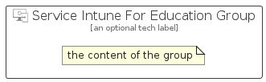

# ServiceIntuneForEducation


```text
azure/Item/Intune/ServiceIntuneForEducation
```

```text
include('azure/Item/Intune/ServiceIntuneForEducation')
```


| Illustration | ServiceIntuneForEducation | ServiceIntuneForEducationCard | ServiceIntuneForEducationGroup |
| :---: | :---: | :---: | :---: |
|  |  |  |  |


## Sprites
The item provides the following sriptes:

- `<$ServiceIntuneForEducationXs>`
- `<$ServiceIntuneForEducationSm>`
- `<$ServiceIntuneForEducationMd>`
- `<$ServiceIntuneForEducationLg>`


## ServiceIntuneForEducation

### Load remotely
```plantuml
@startuml
' configures the library
!global $LIB_BASE_LOCATION="https://raw.githubusercontent.com/tmorin/plantuml-libs/master/distribution"

' loads the library's bootstrap
!include $LIB_BASE_LOCATION/bootstrap.puml

' loads the package bootstrap
include('azure/bootstrap')

' loads the Item which embeds the element ServiceIntuneForEducation
include('azure/Item/Intune/ServiceIntuneForEducation')

' renders the element
ServiceIntuneForEducation('ServiceIntuneForEducation', 'Service Intune For Education', 'an optional tech label', 'an optional description')
@enduml
```

### Load locally
```plantuml
@startuml
' configures the library
!global $INCLUSION_MODE="local"
!global $LIB_BASE_LOCATION="../../.."

' loads the library's bootstrap
!include $LIB_BASE_LOCATION/bootstrap.puml

' loads the package bootstrap
include('azure/bootstrap')

' loads the Item which embeds the element ServiceIntuneForEducation
include('azure/Item/Intune/ServiceIntuneForEducation')

' renders the element
ServiceIntuneForEducation('ServiceIntuneForEducation', 'Service Intune For Education', 'an optional tech label', 'an optional description')
@enduml
```

## ServiceIntuneForEducationCard

### Load remotely
```plantuml
@startuml
' configures the library
!global $LIB_BASE_LOCATION="https://raw.githubusercontent.com/tmorin/plantuml-libs/master/distribution"

' loads the library's bootstrap
!include $LIB_BASE_LOCATION/bootstrap.puml

' loads the package bootstrap
include('azure/bootstrap')

' loads the Item which embeds the element ServiceIntuneForEducationCard
include('azure/Item/Intune/ServiceIntuneForEducation')

' renders the element
ServiceIntuneForEducationCard('ServiceIntuneForEducationCard', 'Service Intune For Education Card', 'an optional description')
@enduml
```

### Load locally
```plantuml
@startuml
' configures the library
!global $INCLUSION_MODE="local"
!global $LIB_BASE_LOCATION="../../.."

' loads the library's bootstrap
!include $LIB_BASE_LOCATION/bootstrap.puml

' loads the package bootstrap
include('azure/bootstrap')

' loads the Item which embeds the element ServiceIntuneForEducationCard
include('azure/Item/Intune/ServiceIntuneForEducation')

' renders the element
ServiceIntuneForEducationCard('ServiceIntuneForEducationCard', 'Service Intune For Education Card', 'an optional description')
@enduml
```

## ServiceIntuneForEducationGroup

### Load remotely
```plantuml
@startuml
' configures the library
!global $LIB_BASE_LOCATION="https://raw.githubusercontent.com/tmorin/plantuml-libs/master/distribution"

' loads the library's bootstrap
!include $LIB_BASE_LOCATION/bootstrap.puml

' loads the package bootstrap
include('azure/bootstrap')

' loads the Item which embeds the element ServiceIntuneForEducationGroup
include('azure/Item/Intune/ServiceIntuneForEducation')

' renders the element
ServiceIntuneForEducationGroup('ServiceIntuneForEducationGroup', 'Service Intune For Education Group', 'an optional tech label') {
    note as note
        the content of the group
    end note
}
@enduml
```

### Load locally
```plantuml
@startuml
' configures the library
!global $INCLUSION_MODE="local"
!global $LIB_BASE_LOCATION="../../.."

' loads the library's bootstrap
!include $LIB_BASE_LOCATION/bootstrap.puml

' loads the package bootstrap
include('azure/bootstrap')

' loads the Item which embeds the element ServiceIntuneForEducationGroup
include('azure/Item/Intune/ServiceIntuneForEducation')

' renders the element
ServiceIntuneForEducationGroup('ServiceIntuneForEducationGroup', 'Service Intune For Education Group', 'an optional tech label') {
    note as note
        the content of the group
    end note
}
@enduml
```

