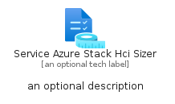
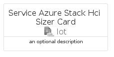
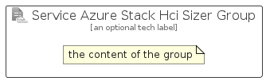

# ServiceAzureStackHciSizer


```text
azure/Item/Iot/ServiceAzureStackHciSizer
```

```text
include('azure/Item/Iot/ServiceAzureStackHciSizer')
```


| Illustration | ServiceAzureStackHciSizer | ServiceAzureStackHciSizerCard | ServiceAzureStackHciSizerGroup |
| :---: | :---: | :---: | :---: |
|  |  |  |  |


## Sprites
The item provides the following sriptes:

- `<$ServiceAzureStackHciSizerXs>`
- `<$ServiceAzureStackHciSizerSm>`
- `<$ServiceAzureStackHciSizerMd>`
- `<$ServiceAzureStackHciSizerLg>`


## ServiceAzureStackHciSizer

### Load remotely
```plantuml
@startuml
' configures the library
!global $LIB_BASE_LOCATION="https://raw.githubusercontent.com/tmorin/plantuml-libs/master/distribution"

' loads the library's bootstrap
!include $LIB_BASE_LOCATION/bootstrap.puml

' loads the package bootstrap
include('azure/bootstrap')

' loads the Item which embeds the element ServiceAzureStackHciSizer
include('azure/Item/Iot/ServiceAzureStackHciSizer')

' renders the element
ServiceAzureStackHciSizer('ServiceAzureStackHciSizer', 'Service Azure Stack Hci Sizer', 'an optional tech label', 'an optional description')
@enduml
```

### Load locally
```plantuml
@startuml
' configures the library
!global $INCLUSION_MODE="local"
!global $LIB_BASE_LOCATION="../../.."

' loads the library's bootstrap
!include $LIB_BASE_LOCATION/bootstrap.puml

' loads the package bootstrap
include('azure/bootstrap')

' loads the Item which embeds the element ServiceAzureStackHciSizer
include('azure/Item/Iot/ServiceAzureStackHciSizer')

' renders the element
ServiceAzureStackHciSizer('ServiceAzureStackHciSizer', 'Service Azure Stack Hci Sizer', 'an optional tech label', 'an optional description')
@enduml
```

## ServiceAzureStackHciSizerCard

### Load remotely
```plantuml
@startuml
' configures the library
!global $LIB_BASE_LOCATION="https://raw.githubusercontent.com/tmorin/plantuml-libs/master/distribution"

' loads the library's bootstrap
!include $LIB_BASE_LOCATION/bootstrap.puml

' loads the package bootstrap
include('azure/bootstrap')

' loads the Item which embeds the element ServiceAzureStackHciSizerCard
include('azure/Item/Iot/ServiceAzureStackHciSizer')

' renders the element
ServiceAzureStackHciSizerCard('ServiceAzureStackHciSizerCard', 'Service Azure Stack Hci Sizer Card', 'an optional description')
@enduml
```

### Load locally
```plantuml
@startuml
' configures the library
!global $INCLUSION_MODE="local"
!global $LIB_BASE_LOCATION="../../.."

' loads the library's bootstrap
!include $LIB_BASE_LOCATION/bootstrap.puml

' loads the package bootstrap
include('azure/bootstrap')

' loads the Item which embeds the element ServiceAzureStackHciSizerCard
include('azure/Item/Iot/ServiceAzureStackHciSizer')

' renders the element
ServiceAzureStackHciSizerCard('ServiceAzureStackHciSizerCard', 'Service Azure Stack Hci Sizer Card', 'an optional description')
@enduml
```

## ServiceAzureStackHciSizerGroup

### Load remotely
```plantuml
@startuml
' configures the library
!global $LIB_BASE_LOCATION="https://raw.githubusercontent.com/tmorin/plantuml-libs/master/distribution"

' loads the library's bootstrap
!include $LIB_BASE_LOCATION/bootstrap.puml

' loads the package bootstrap
include('azure/bootstrap')

' loads the Item which embeds the element ServiceAzureStackHciSizerGroup
include('azure/Item/Iot/ServiceAzureStackHciSizer')

' renders the element
ServiceAzureStackHciSizerGroup('ServiceAzureStackHciSizerGroup', 'Service Azure Stack Hci Sizer Group', 'an optional tech label') {
    note as note
        the content of the group
    end note
}
@enduml
```

### Load locally
```plantuml
@startuml
' configures the library
!global $INCLUSION_MODE="local"
!global $LIB_BASE_LOCATION="../../.."

' loads the library's bootstrap
!include $LIB_BASE_LOCATION/bootstrap.puml

' loads the package bootstrap
include('azure/bootstrap')

' loads the Item which embeds the element ServiceAzureStackHciSizerGroup
include('azure/Item/Iot/ServiceAzureStackHciSizer')

' renders the element
ServiceAzureStackHciSizerGroup('ServiceAzureStackHciSizerGroup', 'Service Azure Stack Hci Sizer Group', 'an optional tech label') {
    note as note
        the content of the group
    end note
}
@enduml
```

