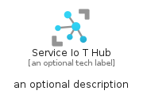
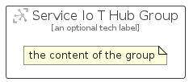

# ServiceIoTHub


```text
azure/Item/Iot/ServiceIoTHub
```

```text
include('azure/Item/Iot/ServiceIoTHub')
```


| Illustration | ServiceIoTHub | ServiceIoTHubCard | ServiceIoTHubGroup |
| :---: | :---: | :---: | :---: |
|  |  |  |  |


## Sprites
The item provides the following sriptes:

- `<$ServiceIoTHubXs>`
- `<$ServiceIoTHubSm>`
- `<$ServiceIoTHubMd>`
- `<$ServiceIoTHubLg>`


## ServiceIoTHub

### Load remotely
```plantuml
@startuml
' configures the library
!global $LIB_BASE_LOCATION="https://raw.githubusercontent.com/tmorin/plantuml-libs/master/distribution"

' loads the library's bootstrap
!include $LIB_BASE_LOCATION/bootstrap.puml

' loads the package bootstrap
include('azure/bootstrap')

' loads the Item which embeds the element ServiceIoTHub
include('azure/Item/Iot/ServiceIoTHub')

' renders the element
ServiceIoTHub('ServiceIoTHub', 'Service Io T Hub', 'an optional tech label', 'an optional description')
@enduml
```

### Load locally
```plantuml
@startuml
' configures the library
!global $INCLUSION_MODE="local"
!global $LIB_BASE_LOCATION="../../.."

' loads the library's bootstrap
!include $LIB_BASE_LOCATION/bootstrap.puml

' loads the package bootstrap
include('azure/bootstrap')

' loads the Item which embeds the element ServiceIoTHub
include('azure/Item/Iot/ServiceIoTHub')

' renders the element
ServiceIoTHub('ServiceIoTHub', 'Service Io T Hub', 'an optional tech label', 'an optional description')
@enduml
```

## ServiceIoTHubCard

### Load remotely
```plantuml
@startuml
' configures the library
!global $LIB_BASE_LOCATION="https://raw.githubusercontent.com/tmorin/plantuml-libs/master/distribution"

' loads the library's bootstrap
!include $LIB_BASE_LOCATION/bootstrap.puml

' loads the package bootstrap
include('azure/bootstrap')

' loads the Item which embeds the element ServiceIoTHubCard
include('azure/Item/Iot/ServiceIoTHub')

' renders the element
ServiceIoTHubCard('ServiceIoTHubCard', 'Service Io T Hub Card', 'an optional description')
@enduml
```

### Load locally
```plantuml
@startuml
' configures the library
!global $INCLUSION_MODE="local"
!global $LIB_BASE_LOCATION="../../.."

' loads the library's bootstrap
!include $LIB_BASE_LOCATION/bootstrap.puml

' loads the package bootstrap
include('azure/bootstrap')

' loads the Item which embeds the element ServiceIoTHubCard
include('azure/Item/Iot/ServiceIoTHub')

' renders the element
ServiceIoTHubCard('ServiceIoTHubCard', 'Service Io T Hub Card', 'an optional description')
@enduml
```

## ServiceIoTHubGroup

### Load remotely
```plantuml
@startuml
' configures the library
!global $LIB_BASE_LOCATION="https://raw.githubusercontent.com/tmorin/plantuml-libs/master/distribution"

' loads the library's bootstrap
!include $LIB_BASE_LOCATION/bootstrap.puml

' loads the package bootstrap
include('azure/bootstrap')

' loads the Item which embeds the element ServiceIoTHubGroup
include('azure/Item/Iot/ServiceIoTHub')

' renders the element
ServiceIoTHubGroup('ServiceIoTHubGroup', 'Service Io T Hub Group', 'an optional tech label') {
    note as note
        the content of the group
    end note
}
@enduml
```

### Load locally
```plantuml
@startuml
' configures the library
!global $INCLUSION_MODE="local"
!global $LIB_BASE_LOCATION="../../.."

' loads the library's bootstrap
!include $LIB_BASE_LOCATION/bootstrap.puml

' loads the package bootstrap
include('azure/bootstrap')

' loads the Item which embeds the element ServiceIoTHubGroup
include('azure/Item/Iot/ServiceIoTHub')

' renders the element
ServiceIoTHubGroup('ServiceIoTHubGroup', 'Service Io T Hub Group', 'an optional tech label') {
    note as note
        the content of the group
    end note
}
@enduml
```

