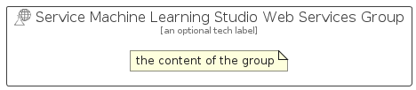

# ServiceMachineLearningStudioWebServices


```text
azure/Item/Iot/ServiceMachineLearningStudioWebServices
```

```text
include('azure/Item/Iot/ServiceMachineLearningStudioWebServices')
```


| Illustration | ServiceMachineLearningStudioWebServices | ServiceMachineLearningStudioWebServicesCard | ServiceMachineLearningStudioWebServicesGroup |
| :---: | :---: | :---: | :---: |
|  |  |  |  |


## Sprites
The item provides the following sriptes:

- `<$ServiceMachineLearningStudioWebServicesXs>`
- `<$ServiceMachineLearningStudioWebServicesSm>`
- `<$ServiceMachineLearningStudioWebServicesMd>`
- `<$ServiceMachineLearningStudioWebServicesLg>`


## ServiceMachineLearningStudioWebServices

### Load remotely
```plantuml
@startuml
' configures the library
!global $LIB_BASE_LOCATION="https://raw.githubusercontent.com/tmorin/plantuml-libs/master/distribution"

' loads the library's bootstrap
!include $LIB_BASE_LOCATION/bootstrap.puml

' loads the package bootstrap
include('azure/bootstrap')

' loads the Item which embeds the element ServiceMachineLearningStudioWebServices
include('azure/Item/Iot/ServiceMachineLearningStudioWebServices')

' renders the element
ServiceMachineLearningStudioWebServices('ServiceMachineLearningStudioWebServices', 'Service Machine Learning Studio Web Services', 'an optional tech label', 'an optional description')
@enduml
```

### Load locally
```plantuml
@startuml
' configures the library
!global $INCLUSION_MODE="local"
!global $LIB_BASE_LOCATION="../../.."

' loads the library's bootstrap
!include $LIB_BASE_LOCATION/bootstrap.puml

' loads the package bootstrap
include('azure/bootstrap')

' loads the Item which embeds the element ServiceMachineLearningStudioWebServices
include('azure/Item/Iot/ServiceMachineLearningStudioWebServices')

' renders the element
ServiceMachineLearningStudioWebServices('ServiceMachineLearningStudioWebServices', 'Service Machine Learning Studio Web Services', 'an optional tech label', 'an optional description')
@enduml
```

## ServiceMachineLearningStudioWebServicesCard

### Load remotely
```plantuml
@startuml
' configures the library
!global $LIB_BASE_LOCATION="https://raw.githubusercontent.com/tmorin/plantuml-libs/master/distribution"

' loads the library's bootstrap
!include $LIB_BASE_LOCATION/bootstrap.puml

' loads the package bootstrap
include('azure/bootstrap')

' loads the Item which embeds the element ServiceMachineLearningStudioWebServicesCard
include('azure/Item/Iot/ServiceMachineLearningStudioWebServices')

' renders the element
ServiceMachineLearningStudioWebServicesCard('ServiceMachineLearningStudioWebServicesCard', 'Service Machine Learning Studio Web Services Card', 'an optional description')
@enduml
```

### Load locally
```plantuml
@startuml
' configures the library
!global $INCLUSION_MODE="local"
!global $LIB_BASE_LOCATION="../../.."

' loads the library's bootstrap
!include $LIB_BASE_LOCATION/bootstrap.puml

' loads the package bootstrap
include('azure/bootstrap')

' loads the Item which embeds the element ServiceMachineLearningStudioWebServicesCard
include('azure/Item/Iot/ServiceMachineLearningStudioWebServices')

' renders the element
ServiceMachineLearningStudioWebServicesCard('ServiceMachineLearningStudioWebServicesCard', 'Service Machine Learning Studio Web Services Card', 'an optional description')
@enduml
```

## ServiceMachineLearningStudioWebServicesGroup

### Load remotely
```plantuml
@startuml
' configures the library
!global $LIB_BASE_LOCATION="https://raw.githubusercontent.com/tmorin/plantuml-libs/master/distribution"

' loads the library's bootstrap
!include $LIB_BASE_LOCATION/bootstrap.puml

' loads the package bootstrap
include('azure/bootstrap')

' loads the Item which embeds the element ServiceMachineLearningStudioWebServicesGroup
include('azure/Item/Iot/ServiceMachineLearningStudioWebServices')

' renders the element
ServiceMachineLearningStudioWebServicesGroup('ServiceMachineLearningStudioWebServicesGroup', 'Service Machine Learning Studio Web Services Group', 'an optional tech label') {
    note as note
        the content of the group
    end note
}
@enduml
```

### Load locally
```plantuml
@startuml
' configures the library
!global $INCLUSION_MODE="local"
!global $LIB_BASE_LOCATION="../../.."

' loads the library's bootstrap
!include $LIB_BASE_LOCATION/bootstrap.puml

' loads the package bootstrap
include('azure/bootstrap')

' loads the Item which embeds the element ServiceMachineLearningStudioWebServicesGroup
include('azure/Item/Iot/ServiceMachineLearningStudioWebServices')

' renders the element
ServiceMachineLearningStudioWebServicesGroup('ServiceMachineLearningStudioWebServicesGroup', 'Service Machine Learning Studio Web Services Group', 'an optional tech label') {
    note as note
        the content of the group
    end note
}
@enduml
```

