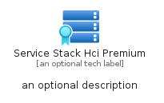
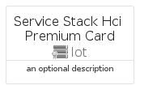
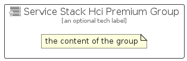

# ServiceStackHciPremium


```text
azure/Item/Iot/ServiceStackHciPremium
```

```text
include('azure/Item/Iot/ServiceStackHciPremium')
```


| Illustration | ServiceStackHciPremium | ServiceStackHciPremiumCard | ServiceStackHciPremiumGroup |
| :---: | :---: | :---: | :---: |
|  |  |  |  |


## Sprites
The item provides the following sriptes:

- `<$ServiceStackHciPremiumXs>`
- `<$ServiceStackHciPremiumSm>`
- `<$ServiceStackHciPremiumMd>`
- `<$ServiceStackHciPremiumLg>`


## ServiceStackHciPremium

### Load remotely
```plantuml
@startuml
' configures the library
!global $LIB_BASE_LOCATION="https://raw.githubusercontent.com/tmorin/plantuml-libs/master/distribution"

' loads the library's bootstrap
!include $LIB_BASE_LOCATION/bootstrap.puml

' loads the package bootstrap
include('azure/bootstrap')

' loads the Item which embeds the element ServiceStackHciPremium
include('azure/Item/Iot/ServiceStackHciPremium')

' renders the element
ServiceStackHciPremium('ServiceStackHciPremium', 'Service Stack Hci Premium', 'an optional tech label', 'an optional description')
@enduml
```

### Load locally
```plantuml
@startuml
' configures the library
!global $INCLUSION_MODE="local"
!global $LIB_BASE_LOCATION="../../.."

' loads the library's bootstrap
!include $LIB_BASE_LOCATION/bootstrap.puml

' loads the package bootstrap
include('azure/bootstrap')

' loads the Item which embeds the element ServiceStackHciPremium
include('azure/Item/Iot/ServiceStackHciPremium')

' renders the element
ServiceStackHciPremium('ServiceStackHciPremium', 'Service Stack Hci Premium', 'an optional tech label', 'an optional description')
@enduml
```

## ServiceStackHciPremiumCard

### Load remotely
```plantuml
@startuml
' configures the library
!global $LIB_BASE_LOCATION="https://raw.githubusercontent.com/tmorin/plantuml-libs/master/distribution"

' loads the library's bootstrap
!include $LIB_BASE_LOCATION/bootstrap.puml

' loads the package bootstrap
include('azure/bootstrap')

' loads the Item which embeds the element ServiceStackHciPremiumCard
include('azure/Item/Iot/ServiceStackHciPremium')

' renders the element
ServiceStackHciPremiumCard('ServiceStackHciPremiumCard', 'Service Stack Hci Premium Card', 'an optional description')
@enduml
```

### Load locally
```plantuml
@startuml
' configures the library
!global $INCLUSION_MODE="local"
!global $LIB_BASE_LOCATION="../../.."

' loads the library's bootstrap
!include $LIB_BASE_LOCATION/bootstrap.puml

' loads the package bootstrap
include('azure/bootstrap')

' loads the Item which embeds the element ServiceStackHciPremiumCard
include('azure/Item/Iot/ServiceStackHciPremium')

' renders the element
ServiceStackHciPremiumCard('ServiceStackHciPremiumCard', 'Service Stack Hci Premium Card', 'an optional description')
@enduml
```

## ServiceStackHciPremiumGroup

### Load remotely
```plantuml
@startuml
' configures the library
!global $LIB_BASE_LOCATION="https://raw.githubusercontent.com/tmorin/plantuml-libs/master/distribution"

' loads the library's bootstrap
!include $LIB_BASE_LOCATION/bootstrap.puml

' loads the package bootstrap
include('azure/bootstrap')

' loads the Item which embeds the element ServiceStackHciPremiumGroup
include('azure/Item/Iot/ServiceStackHciPremium')

' renders the element
ServiceStackHciPremiumGroup('ServiceStackHciPremiumGroup', 'Service Stack Hci Premium Group', 'an optional tech label') {
    note as note
        the content of the group
    end note
}
@enduml
```

### Load locally
```plantuml
@startuml
' configures the library
!global $INCLUSION_MODE="local"
!global $LIB_BASE_LOCATION="../../.."

' loads the library's bootstrap
!include $LIB_BASE_LOCATION/bootstrap.puml

' loads the package bootstrap
include('azure/bootstrap')

' loads the Item which embeds the element ServiceStackHciPremiumGroup
include('azure/Item/Iot/ServiceStackHciPremium')

' renders the element
ServiceStackHciPremiumGroup('ServiceStackHciPremiumGroup', 'Service Stack Hci Premium Group', 'an optional tech label') {
    note as note
        the content of the group
    end note
}
@enduml
```

