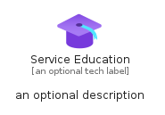
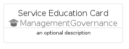
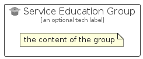

# ServiceEducation


```text
azure/Item/ManagementGovernance/ServiceEducation
```

```text
include('azure/Item/ManagementGovernance/ServiceEducation')
```


| Illustration | ServiceEducation | ServiceEducationCard | ServiceEducationGroup |
| :---: | :---: | :---: | :---: |
|  |  |  |  |


## Sprites
The item provides the following sriptes:

- `<$ServiceEducationXs>`
- `<$ServiceEducationSm>`
- `<$ServiceEducationMd>`
- `<$ServiceEducationLg>`


## ServiceEducation

### Load remotely
```plantuml
@startuml
' configures the library
!global $LIB_BASE_LOCATION="https://raw.githubusercontent.com/tmorin/plantuml-libs/master/distribution"

' loads the library's bootstrap
!include $LIB_BASE_LOCATION/bootstrap.puml

' loads the package bootstrap
include('azure/bootstrap')

' loads the Item which embeds the element ServiceEducation
include('azure/Item/ManagementGovernance/ServiceEducation')

' renders the element
ServiceEducation('ServiceEducation', 'Service Education', 'an optional tech label', 'an optional description')
@enduml
```

### Load locally
```plantuml
@startuml
' configures the library
!global $INCLUSION_MODE="local"
!global $LIB_BASE_LOCATION="../../.."

' loads the library's bootstrap
!include $LIB_BASE_LOCATION/bootstrap.puml

' loads the package bootstrap
include('azure/bootstrap')

' loads the Item which embeds the element ServiceEducation
include('azure/Item/ManagementGovernance/ServiceEducation')

' renders the element
ServiceEducation('ServiceEducation', 'Service Education', 'an optional tech label', 'an optional description')
@enduml
```

## ServiceEducationCard

### Load remotely
```plantuml
@startuml
' configures the library
!global $LIB_BASE_LOCATION="https://raw.githubusercontent.com/tmorin/plantuml-libs/master/distribution"

' loads the library's bootstrap
!include $LIB_BASE_LOCATION/bootstrap.puml

' loads the package bootstrap
include('azure/bootstrap')

' loads the Item which embeds the element ServiceEducationCard
include('azure/Item/ManagementGovernance/ServiceEducation')

' renders the element
ServiceEducationCard('ServiceEducationCard', 'Service Education Card', 'an optional description')
@enduml
```

### Load locally
```plantuml
@startuml
' configures the library
!global $INCLUSION_MODE="local"
!global $LIB_BASE_LOCATION="../../.."

' loads the library's bootstrap
!include $LIB_BASE_LOCATION/bootstrap.puml

' loads the package bootstrap
include('azure/bootstrap')

' loads the Item which embeds the element ServiceEducationCard
include('azure/Item/ManagementGovernance/ServiceEducation')

' renders the element
ServiceEducationCard('ServiceEducationCard', 'Service Education Card', 'an optional description')
@enduml
```

## ServiceEducationGroup

### Load remotely
```plantuml
@startuml
' configures the library
!global $LIB_BASE_LOCATION="https://raw.githubusercontent.com/tmorin/plantuml-libs/master/distribution"

' loads the library's bootstrap
!include $LIB_BASE_LOCATION/bootstrap.puml

' loads the package bootstrap
include('azure/bootstrap')

' loads the Item which embeds the element ServiceEducationGroup
include('azure/Item/ManagementGovernance/ServiceEducation')

' renders the element
ServiceEducationGroup('ServiceEducationGroup', 'Service Education Group', 'an optional tech label') {
    note as note
        the content of the group
    end note
}
@enduml
```

### Load locally
```plantuml
@startuml
' configures the library
!global $INCLUSION_MODE="local"
!global $LIB_BASE_LOCATION="../../.."

' loads the library's bootstrap
!include $LIB_BASE_LOCATION/bootstrap.puml

' loads the package bootstrap
include('azure/bootstrap')

' loads the Item which embeds the element ServiceEducationGroup
include('azure/Item/ManagementGovernance/ServiceEducation')

' renders the element
ServiceEducationGroup('ServiceEducationGroup', 'Service Education Group', 'an optional tech label') {
    note as note
        the content of the group
    end note
}
@enduml
```

