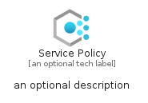
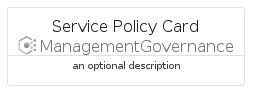
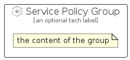

# ServicePolicy


```text
azure/Item/ManagementGovernance/ServicePolicy
```

```text
include('azure/Item/ManagementGovernance/ServicePolicy')
```


| Illustration | ServicePolicy | ServicePolicyCard | ServicePolicyGroup |
| :---: | :---: | :---: | :---: |
|  |  |  |  |


## Sprites
The item provides the following sriptes:

- `<$ServicePolicyXs>`
- `<$ServicePolicySm>`
- `<$ServicePolicyMd>`
- `<$ServicePolicyLg>`


## ServicePolicy

### Load remotely
```plantuml
@startuml
' configures the library
!global $LIB_BASE_LOCATION="https://raw.githubusercontent.com/tmorin/plantuml-libs/master/distribution"

' loads the library's bootstrap
!include $LIB_BASE_LOCATION/bootstrap.puml

' loads the package bootstrap
include('azure/bootstrap')

' loads the Item which embeds the element ServicePolicy
include('azure/Item/ManagementGovernance/ServicePolicy')

' renders the element
ServicePolicy('ServicePolicy', 'Service Policy', 'an optional tech label', 'an optional description')
@enduml
```

### Load locally
```plantuml
@startuml
' configures the library
!global $INCLUSION_MODE="local"
!global $LIB_BASE_LOCATION="../../.."

' loads the library's bootstrap
!include $LIB_BASE_LOCATION/bootstrap.puml

' loads the package bootstrap
include('azure/bootstrap')

' loads the Item which embeds the element ServicePolicy
include('azure/Item/ManagementGovernance/ServicePolicy')

' renders the element
ServicePolicy('ServicePolicy', 'Service Policy', 'an optional tech label', 'an optional description')
@enduml
```

## ServicePolicyCard

### Load remotely
```plantuml
@startuml
' configures the library
!global $LIB_BASE_LOCATION="https://raw.githubusercontent.com/tmorin/plantuml-libs/master/distribution"

' loads the library's bootstrap
!include $LIB_BASE_LOCATION/bootstrap.puml

' loads the package bootstrap
include('azure/bootstrap')

' loads the Item which embeds the element ServicePolicyCard
include('azure/Item/ManagementGovernance/ServicePolicy')

' renders the element
ServicePolicyCard('ServicePolicyCard', 'Service Policy Card', 'an optional description')
@enduml
```

### Load locally
```plantuml
@startuml
' configures the library
!global $INCLUSION_MODE="local"
!global $LIB_BASE_LOCATION="../../.."

' loads the library's bootstrap
!include $LIB_BASE_LOCATION/bootstrap.puml

' loads the package bootstrap
include('azure/bootstrap')

' loads the Item which embeds the element ServicePolicyCard
include('azure/Item/ManagementGovernance/ServicePolicy')

' renders the element
ServicePolicyCard('ServicePolicyCard', 'Service Policy Card', 'an optional description')
@enduml
```

## ServicePolicyGroup

### Load remotely
```plantuml
@startuml
' configures the library
!global $LIB_BASE_LOCATION="https://raw.githubusercontent.com/tmorin/plantuml-libs/master/distribution"

' loads the library's bootstrap
!include $LIB_BASE_LOCATION/bootstrap.puml

' loads the package bootstrap
include('azure/bootstrap')

' loads the Item which embeds the element ServicePolicyGroup
include('azure/Item/ManagementGovernance/ServicePolicy')

' renders the element
ServicePolicyGroup('ServicePolicyGroup', 'Service Policy Group', 'an optional tech label') {
    note as note
        the content of the group
    end note
}
@enduml
```

### Load locally
```plantuml
@startuml
' configures the library
!global $INCLUSION_MODE="local"
!global $LIB_BASE_LOCATION="../../.."

' loads the library's bootstrap
!include $LIB_BASE_LOCATION/bootstrap.puml

' loads the package bootstrap
include('azure/bootstrap')

' loads the Item which embeds the element ServicePolicyGroup
include('azure/Item/ManagementGovernance/ServicePolicy')

' renders the element
ServicePolicyGroup('ServicePolicyGroup', 'Service Policy Group', 'an optional tech label') {
    note as note
        the content of the group
    end note
}
@enduml
```

