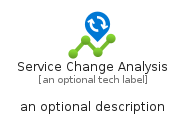
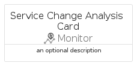
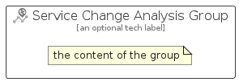

# ServiceChangeAnalysis


```text
azure/Item/Monitor/ServiceChangeAnalysis
```

```text
include('azure/Item/Monitor/ServiceChangeAnalysis')
```


| Illustration | ServiceChangeAnalysis | ServiceChangeAnalysisCard | ServiceChangeAnalysisGroup |
| :---: | :---: | :---: | :---: |
|  |  |  |  |


## Sprites
The item provides the following sriptes:

- `<$ServiceChangeAnalysisXs>`
- `<$ServiceChangeAnalysisSm>`
- `<$ServiceChangeAnalysisMd>`
- `<$ServiceChangeAnalysisLg>`


## ServiceChangeAnalysis

### Load remotely
```plantuml
@startuml
' configures the library
!global $LIB_BASE_LOCATION="https://raw.githubusercontent.com/tmorin/plantuml-libs/master/distribution"

' loads the library's bootstrap
!include $LIB_BASE_LOCATION/bootstrap.puml

' loads the package bootstrap
include('azure/bootstrap')

' loads the Item which embeds the element ServiceChangeAnalysis
include('azure/Item/Monitor/ServiceChangeAnalysis')

' renders the element
ServiceChangeAnalysis('ServiceChangeAnalysis', 'Service Change Analysis', 'an optional tech label', 'an optional description')
@enduml
```

### Load locally
```plantuml
@startuml
' configures the library
!global $INCLUSION_MODE="local"
!global $LIB_BASE_LOCATION="../../.."

' loads the library's bootstrap
!include $LIB_BASE_LOCATION/bootstrap.puml

' loads the package bootstrap
include('azure/bootstrap')

' loads the Item which embeds the element ServiceChangeAnalysis
include('azure/Item/Monitor/ServiceChangeAnalysis')

' renders the element
ServiceChangeAnalysis('ServiceChangeAnalysis', 'Service Change Analysis', 'an optional tech label', 'an optional description')
@enduml
```

## ServiceChangeAnalysisCard

### Load remotely
```plantuml
@startuml
' configures the library
!global $LIB_BASE_LOCATION="https://raw.githubusercontent.com/tmorin/plantuml-libs/master/distribution"

' loads the library's bootstrap
!include $LIB_BASE_LOCATION/bootstrap.puml

' loads the package bootstrap
include('azure/bootstrap')

' loads the Item which embeds the element ServiceChangeAnalysisCard
include('azure/Item/Monitor/ServiceChangeAnalysis')

' renders the element
ServiceChangeAnalysisCard('ServiceChangeAnalysisCard', 'Service Change Analysis Card', 'an optional description')
@enduml
```

### Load locally
```plantuml
@startuml
' configures the library
!global $INCLUSION_MODE="local"
!global $LIB_BASE_LOCATION="../../.."

' loads the library's bootstrap
!include $LIB_BASE_LOCATION/bootstrap.puml

' loads the package bootstrap
include('azure/bootstrap')

' loads the Item which embeds the element ServiceChangeAnalysisCard
include('azure/Item/Monitor/ServiceChangeAnalysis')

' renders the element
ServiceChangeAnalysisCard('ServiceChangeAnalysisCard', 'Service Change Analysis Card', 'an optional description')
@enduml
```

## ServiceChangeAnalysisGroup

### Load remotely
```plantuml
@startuml
' configures the library
!global $LIB_BASE_LOCATION="https://raw.githubusercontent.com/tmorin/plantuml-libs/master/distribution"

' loads the library's bootstrap
!include $LIB_BASE_LOCATION/bootstrap.puml

' loads the package bootstrap
include('azure/bootstrap')

' loads the Item which embeds the element ServiceChangeAnalysisGroup
include('azure/Item/Monitor/ServiceChangeAnalysis')

' renders the element
ServiceChangeAnalysisGroup('ServiceChangeAnalysisGroup', 'Service Change Analysis Group', 'an optional tech label') {
    note as note
        the content of the group
    end note
}
@enduml
```

### Load locally
```plantuml
@startuml
' configures the library
!global $INCLUSION_MODE="local"
!global $LIB_BASE_LOCATION="../../.."

' loads the library's bootstrap
!include $LIB_BASE_LOCATION/bootstrap.puml

' loads the package bootstrap
include('azure/bootstrap')

' loads the Item which embeds the element ServiceChangeAnalysisGroup
include('azure/Item/Monitor/ServiceChangeAnalysis')

' renders the element
ServiceChangeAnalysisGroup('ServiceChangeAnalysisGroup', 'Service Change Analysis Group', 'an optional tech label') {
    note as note
        the content of the group
    end note
}
@enduml
```

