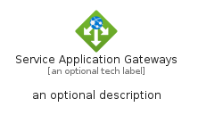
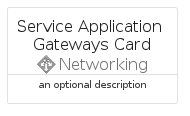
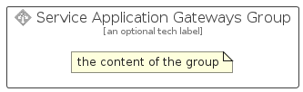

# ServiceApplicationGateways


```text
azure/Item/Networking/ServiceApplicationGateways
```

```text
include('azure/Item/Networking/ServiceApplicationGateways')
```


| Illustration | ServiceApplicationGateways | ServiceApplicationGatewaysCard | ServiceApplicationGatewaysGroup |
| :---: | :---: | :---: | :---: |
|  |  |  |  |


## Sprites
The item provides the following sriptes:

- `<$ServiceApplicationGatewaysXs>`
- `<$ServiceApplicationGatewaysSm>`
- `<$ServiceApplicationGatewaysMd>`
- `<$ServiceApplicationGatewaysLg>`


## ServiceApplicationGateways

### Load remotely
```plantuml
@startuml
' configures the library
!global $LIB_BASE_LOCATION="https://raw.githubusercontent.com/tmorin/plantuml-libs/master/distribution"

' loads the library's bootstrap
!include $LIB_BASE_LOCATION/bootstrap.puml

' loads the package bootstrap
include('azure/bootstrap')

' loads the Item which embeds the element ServiceApplicationGateways
include('azure/Item/Networking/ServiceApplicationGateways')

' renders the element
ServiceApplicationGateways('ServiceApplicationGateways', 'Service Application Gateways', 'an optional tech label', 'an optional description')
@enduml
```

### Load locally
```plantuml
@startuml
' configures the library
!global $INCLUSION_MODE="local"
!global $LIB_BASE_LOCATION="../../.."

' loads the library's bootstrap
!include $LIB_BASE_LOCATION/bootstrap.puml

' loads the package bootstrap
include('azure/bootstrap')

' loads the Item which embeds the element ServiceApplicationGateways
include('azure/Item/Networking/ServiceApplicationGateways')

' renders the element
ServiceApplicationGateways('ServiceApplicationGateways', 'Service Application Gateways', 'an optional tech label', 'an optional description')
@enduml
```

## ServiceApplicationGatewaysCard

### Load remotely
```plantuml
@startuml
' configures the library
!global $LIB_BASE_LOCATION="https://raw.githubusercontent.com/tmorin/plantuml-libs/master/distribution"

' loads the library's bootstrap
!include $LIB_BASE_LOCATION/bootstrap.puml

' loads the package bootstrap
include('azure/bootstrap')

' loads the Item which embeds the element ServiceApplicationGatewaysCard
include('azure/Item/Networking/ServiceApplicationGateways')

' renders the element
ServiceApplicationGatewaysCard('ServiceApplicationGatewaysCard', 'Service Application Gateways Card', 'an optional description')
@enduml
```

### Load locally
```plantuml
@startuml
' configures the library
!global $INCLUSION_MODE="local"
!global $LIB_BASE_LOCATION="../../.."

' loads the library's bootstrap
!include $LIB_BASE_LOCATION/bootstrap.puml

' loads the package bootstrap
include('azure/bootstrap')

' loads the Item which embeds the element ServiceApplicationGatewaysCard
include('azure/Item/Networking/ServiceApplicationGateways')

' renders the element
ServiceApplicationGatewaysCard('ServiceApplicationGatewaysCard', 'Service Application Gateways Card', 'an optional description')
@enduml
```

## ServiceApplicationGatewaysGroup

### Load remotely
```plantuml
@startuml
' configures the library
!global $LIB_BASE_LOCATION="https://raw.githubusercontent.com/tmorin/plantuml-libs/master/distribution"

' loads the library's bootstrap
!include $LIB_BASE_LOCATION/bootstrap.puml

' loads the package bootstrap
include('azure/bootstrap')

' loads the Item which embeds the element ServiceApplicationGatewaysGroup
include('azure/Item/Networking/ServiceApplicationGateways')

' renders the element
ServiceApplicationGatewaysGroup('ServiceApplicationGatewaysGroup', 'Service Application Gateways Group', 'an optional tech label') {
    note as note
        the content of the group
    end note
}
@enduml
```

### Load locally
```plantuml
@startuml
' configures the library
!global $INCLUSION_MODE="local"
!global $LIB_BASE_LOCATION="../../.."

' loads the library's bootstrap
!include $LIB_BASE_LOCATION/bootstrap.puml

' loads the package bootstrap
include('azure/bootstrap')

' loads the Item which embeds the element ServiceApplicationGatewaysGroup
include('azure/Item/Networking/ServiceApplicationGateways')

' renders the element
ServiceApplicationGatewaysGroup('ServiceApplicationGatewaysGroup', 'Service Application Gateways Group', 'an optional tech label') {
    note as note
        the content of the group
    end note
}
@enduml
```

