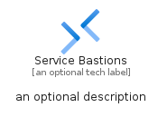
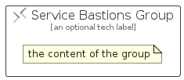

# ServiceBastions


```text
azure/Item/Networking/ServiceBastions
```

```text
include('azure/Item/Networking/ServiceBastions')
```


| Illustration | ServiceBastions | ServiceBastionsCard | ServiceBastionsGroup |
| :---: | :---: | :---: | :---: |
|  |  |  |  |


## Sprites
The item provides the following sriptes:

- `<$ServiceBastionsXs>`
- `<$ServiceBastionsSm>`
- `<$ServiceBastionsMd>`
- `<$ServiceBastionsLg>`


## ServiceBastions

### Load remotely
```plantuml
@startuml
' configures the library
!global $LIB_BASE_LOCATION="https://raw.githubusercontent.com/tmorin/plantuml-libs/master/distribution"

' loads the library's bootstrap
!include $LIB_BASE_LOCATION/bootstrap.puml

' loads the package bootstrap
include('azure/bootstrap')

' loads the Item which embeds the element ServiceBastions
include('azure/Item/Networking/ServiceBastions')

' renders the element
ServiceBastions('ServiceBastions', 'Service Bastions', 'an optional tech label', 'an optional description')
@enduml
```

### Load locally
```plantuml
@startuml
' configures the library
!global $INCLUSION_MODE="local"
!global $LIB_BASE_LOCATION="../../.."

' loads the library's bootstrap
!include $LIB_BASE_LOCATION/bootstrap.puml

' loads the package bootstrap
include('azure/bootstrap')

' loads the Item which embeds the element ServiceBastions
include('azure/Item/Networking/ServiceBastions')

' renders the element
ServiceBastions('ServiceBastions', 'Service Bastions', 'an optional tech label', 'an optional description')
@enduml
```

## ServiceBastionsCard

### Load remotely
```plantuml
@startuml
' configures the library
!global $LIB_BASE_LOCATION="https://raw.githubusercontent.com/tmorin/plantuml-libs/master/distribution"

' loads the library's bootstrap
!include $LIB_BASE_LOCATION/bootstrap.puml

' loads the package bootstrap
include('azure/bootstrap')

' loads the Item which embeds the element ServiceBastionsCard
include('azure/Item/Networking/ServiceBastions')

' renders the element
ServiceBastionsCard('ServiceBastionsCard', 'Service Bastions Card', 'an optional description')
@enduml
```

### Load locally
```plantuml
@startuml
' configures the library
!global $INCLUSION_MODE="local"
!global $LIB_BASE_LOCATION="../../.."

' loads the library's bootstrap
!include $LIB_BASE_LOCATION/bootstrap.puml

' loads the package bootstrap
include('azure/bootstrap')

' loads the Item which embeds the element ServiceBastionsCard
include('azure/Item/Networking/ServiceBastions')

' renders the element
ServiceBastionsCard('ServiceBastionsCard', 'Service Bastions Card', 'an optional description')
@enduml
```

## ServiceBastionsGroup

### Load remotely
```plantuml
@startuml
' configures the library
!global $LIB_BASE_LOCATION="https://raw.githubusercontent.com/tmorin/plantuml-libs/master/distribution"

' loads the library's bootstrap
!include $LIB_BASE_LOCATION/bootstrap.puml

' loads the package bootstrap
include('azure/bootstrap')

' loads the Item which embeds the element ServiceBastionsGroup
include('azure/Item/Networking/ServiceBastions')

' renders the element
ServiceBastionsGroup('ServiceBastionsGroup', 'Service Bastions Group', 'an optional tech label') {
    note as note
        the content of the group
    end note
}
@enduml
```

### Load locally
```plantuml
@startuml
' configures the library
!global $INCLUSION_MODE="local"
!global $LIB_BASE_LOCATION="../../.."

' loads the library's bootstrap
!include $LIB_BASE_LOCATION/bootstrap.puml

' loads the package bootstrap
include('azure/bootstrap')

' loads the Item which embeds the element ServiceBastionsGroup
include('azure/Item/Networking/ServiceBastions')

' renders the element
ServiceBastionsGroup('ServiceBastionsGroup', 'Service Bastions Group', 'an optional tech label') {
    note as note
        the content of the group
    end note
}
@enduml
```

