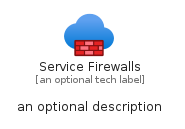
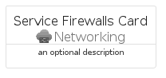
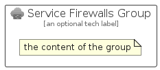

# ServiceFirewalls


```text
azure/Item/Networking/ServiceFirewalls
```

```text
include('azure/Item/Networking/ServiceFirewalls')
```


| Illustration | ServiceFirewalls | ServiceFirewallsCard | ServiceFirewallsGroup |
| :---: | :---: | :---: | :---: |
|  |  |  |  |


## Sprites
The item provides the following sriptes:

- `<$ServiceFirewallsXs>`
- `<$ServiceFirewallsSm>`
- `<$ServiceFirewallsMd>`
- `<$ServiceFirewallsLg>`


## ServiceFirewalls

### Load remotely
```plantuml
@startuml
' configures the library
!global $LIB_BASE_LOCATION="https://raw.githubusercontent.com/tmorin/plantuml-libs/master/distribution"

' loads the library's bootstrap
!include $LIB_BASE_LOCATION/bootstrap.puml

' loads the package bootstrap
include('azure/bootstrap')

' loads the Item which embeds the element ServiceFirewalls
include('azure/Item/Networking/ServiceFirewalls')

' renders the element
ServiceFirewalls('ServiceFirewalls', 'Service Firewalls', 'an optional tech label', 'an optional description')
@enduml
```

### Load locally
```plantuml
@startuml
' configures the library
!global $INCLUSION_MODE="local"
!global $LIB_BASE_LOCATION="../../.."

' loads the library's bootstrap
!include $LIB_BASE_LOCATION/bootstrap.puml

' loads the package bootstrap
include('azure/bootstrap')

' loads the Item which embeds the element ServiceFirewalls
include('azure/Item/Networking/ServiceFirewalls')

' renders the element
ServiceFirewalls('ServiceFirewalls', 'Service Firewalls', 'an optional tech label', 'an optional description')
@enduml
```

## ServiceFirewallsCard

### Load remotely
```plantuml
@startuml
' configures the library
!global $LIB_BASE_LOCATION="https://raw.githubusercontent.com/tmorin/plantuml-libs/master/distribution"

' loads the library's bootstrap
!include $LIB_BASE_LOCATION/bootstrap.puml

' loads the package bootstrap
include('azure/bootstrap')

' loads the Item which embeds the element ServiceFirewallsCard
include('azure/Item/Networking/ServiceFirewalls')

' renders the element
ServiceFirewallsCard('ServiceFirewallsCard', 'Service Firewalls Card', 'an optional description')
@enduml
```

### Load locally
```plantuml
@startuml
' configures the library
!global $INCLUSION_MODE="local"
!global $LIB_BASE_LOCATION="../../.."

' loads the library's bootstrap
!include $LIB_BASE_LOCATION/bootstrap.puml

' loads the package bootstrap
include('azure/bootstrap')

' loads the Item which embeds the element ServiceFirewallsCard
include('azure/Item/Networking/ServiceFirewalls')

' renders the element
ServiceFirewallsCard('ServiceFirewallsCard', 'Service Firewalls Card', 'an optional description')
@enduml
```

## ServiceFirewallsGroup

### Load remotely
```plantuml
@startuml
' configures the library
!global $LIB_BASE_LOCATION="https://raw.githubusercontent.com/tmorin/plantuml-libs/master/distribution"

' loads the library's bootstrap
!include $LIB_BASE_LOCATION/bootstrap.puml

' loads the package bootstrap
include('azure/bootstrap')

' loads the Item which embeds the element ServiceFirewallsGroup
include('azure/Item/Networking/ServiceFirewalls')

' renders the element
ServiceFirewallsGroup('ServiceFirewallsGroup', 'Service Firewalls Group', 'an optional tech label') {
    note as note
        the content of the group
    end note
}
@enduml
```

### Load locally
```plantuml
@startuml
' configures the library
!global $INCLUSION_MODE="local"
!global $LIB_BASE_LOCATION="../../.."

' loads the library's bootstrap
!include $LIB_BASE_LOCATION/bootstrap.puml

' loads the package bootstrap
include('azure/bootstrap')

' loads the Item which embeds the element ServiceFirewallsGroup
include('azure/Item/Networking/ServiceFirewalls')

' renders the element
ServiceFirewallsGroup('ServiceFirewallsGroup', 'Service Firewalls Group', 'an optional tech label') {
    note as note
        the content of the group
    end note
}
@enduml
```

