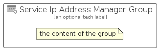

# ServiceIpAddressManager


```text
azure/Item/Networking/ServiceIpAddressManager
```

```text
include('azure/Item/Networking/ServiceIpAddressManager')
```


| Illustration | ServiceIpAddressManager | ServiceIpAddressManagerCard | ServiceIpAddressManagerGroup |
| :---: | :---: | :---: | :---: |
|  |  |  |  |


## Sprites
The item provides the following sriptes:

- `<$ServiceIpAddressManagerXs>`
- `<$ServiceIpAddressManagerSm>`
- `<$ServiceIpAddressManagerMd>`
- `<$ServiceIpAddressManagerLg>`


## ServiceIpAddressManager

### Load remotely
```plantuml
@startuml
' configures the library
!global $LIB_BASE_LOCATION="https://raw.githubusercontent.com/tmorin/plantuml-libs/master/distribution"

' loads the library's bootstrap
!include $LIB_BASE_LOCATION/bootstrap.puml

' loads the package bootstrap
include('azure/bootstrap')

' loads the Item which embeds the element ServiceIpAddressManager
include('azure/Item/Networking/ServiceIpAddressManager')

' renders the element
ServiceIpAddressManager('ServiceIpAddressManager', 'Service Ip Address Manager', 'an optional tech label', 'an optional description')
@enduml
```

### Load locally
```plantuml
@startuml
' configures the library
!global $INCLUSION_MODE="local"
!global $LIB_BASE_LOCATION="../../.."

' loads the library's bootstrap
!include $LIB_BASE_LOCATION/bootstrap.puml

' loads the package bootstrap
include('azure/bootstrap')

' loads the Item which embeds the element ServiceIpAddressManager
include('azure/Item/Networking/ServiceIpAddressManager')

' renders the element
ServiceIpAddressManager('ServiceIpAddressManager', 'Service Ip Address Manager', 'an optional tech label', 'an optional description')
@enduml
```

## ServiceIpAddressManagerCard

### Load remotely
```plantuml
@startuml
' configures the library
!global $LIB_BASE_LOCATION="https://raw.githubusercontent.com/tmorin/plantuml-libs/master/distribution"

' loads the library's bootstrap
!include $LIB_BASE_LOCATION/bootstrap.puml

' loads the package bootstrap
include('azure/bootstrap')

' loads the Item which embeds the element ServiceIpAddressManagerCard
include('azure/Item/Networking/ServiceIpAddressManager')

' renders the element
ServiceIpAddressManagerCard('ServiceIpAddressManagerCard', 'Service Ip Address Manager Card', 'an optional description')
@enduml
```

### Load locally
```plantuml
@startuml
' configures the library
!global $INCLUSION_MODE="local"
!global $LIB_BASE_LOCATION="../../.."

' loads the library's bootstrap
!include $LIB_BASE_LOCATION/bootstrap.puml

' loads the package bootstrap
include('azure/bootstrap')

' loads the Item which embeds the element ServiceIpAddressManagerCard
include('azure/Item/Networking/ServiceIpAddressManager')

' renders the element
ServiceIpAddressManagerCard('ServiceIpAddressManagerCard', 'Service Ip Address Manager Card', 'an optional description')
@enduml
```

## ServiceIpAddressManagerGroup

### Load remotely
```plantuml
@startuml
' configures the library
!global $LIB_BASE_LOCATION="https://raw.githubusercontent.com/tmorin/plantuml-libs/master/distribution"

' loads the library's bootstrap
!include $LIB_BASE_LOCATION/bootstrap.puml

' loads the package bootstrap
include('azure/bootstrap')

' loads the Item which embeds the element ServiceIpAddressManagerGroup
include('azure/Item/Networking/ServiceIpAddressManager')

' renders the element
ServiceIpAddressManagerGroup('ServiceIpAddressManagerGroup', 'Service Ip Address Manager Group', 'an optional tech label') {
    note as note
        the content of the group
    end note
}
@enduml
```

### Load locally
```plantuml
@startuml
' configures the library
!global $INCLUSION_MODE="local"
!global $LIB_BASE_LOCATION="../../.."

' loads the library's bootstrap
!include $LIB_BASE_LOCATION/bootstrap.puml

' loads the package bootstrap
include('azure/bootstrap')

' loads the Item which embeds the element ServiceIpAddressManagerGroup
include('azure/Item/Networking/ServiceIpAddressManager')

' renders the element
ServiceIpAddressManagerGroup('ServiceIpAddressManagerGroup', 'Service Ip Address Manager Group', 'an optional tech label') {
    note as note
        the content of the group
    end note
}
@enduml
```

