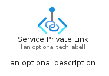
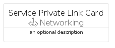
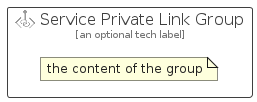

# ServicePrivateLink


```text
azure/Item/Networking/ServicePrivateLink
```

```text
include('azure/Item/Networking/ServicePrivateLink')
```


| Illustration | ServicePrivateLink | ServicePrivateLinkCard | ServicePrivateLinkGroup |
| :---: | :---: | :---: | :---: |
|  |  |  |  |


## Sprites
The item provides the following sriptes:

- `<$ServicePrivateLinkXs>`
- `<$ServicePrivateLinkSm>`
- `<$ServicePrivateLinkMd>`
- `<$ServicePrivateLinkLg>`


## ServicePrivateLink

### Load remotely
```plantuml
@startuml
' configures the library
!global $LIB_BASE_LOCATION="https://raw.githubusercontent.com/tmorin/plantuml-libs/master/distribution"

' loads the library's bootstrap
!include $LIB_BASE_LOCATION/bootstrap.puml

' loads the package bootstrap
include('azure/bootstrap')

' loads the Item which embeds the element ServicePrivateLink
include('azure/Item/Networking/ServicePrivateLink')

' renders the element
ServicePrivateLink('ServicePrivateLink', 'Service Private Link', 'an optional tech label', 'an optional description')
@enduml
```

### Load locally
```plantuml
@startuml
' configures the library
!global $INCLUSION_MODE="local"
!global $LIB_BASE_LOCATION="../../.."

' loads the library's bootstrap
!include $LIB_BASE_LOCATION/bootstrap.puml

' loads the package bootstrap
include('azure/bootstrap')

' loads the Item which embeds the element ServicePrivateLink
include('azure/Item/Networking/ServicePrivateLink')

' renders the element
ServicePrivateLink('ServicePrivateLink', 'Service Private Link', 'an optional tech label', 'an optional description')
@enduml
```

## ServicePrivateLinkCard

### Load remotely
```plantuml
@startuml
' configures the library
!global $LIB_BASE_LOCATION="https://raw.githubusercontent.com/tmorin/plantuml-libs/master/distribution"

' loads the library's bootstrap
!include $LIB_BASE_LOCATION/bootstrap.puml

' loads the package bootstrap
include('azure/bootstrap')

' loads the Item which embeds the element ServicePrivateLinkCard
include('azure/Item/Networking/ServicePrivateLink')

' renders the element
ServicePrivateLinkCard('ServicePrivateLinkCard', 'Service Private Link Card', 'an optional description')
@enduml
```

### Load locally
```plantuml
@startuml
' configures the library
!global $INCLUSION_MODE="local"
!global $LIB_BASE_LOCATION="../../.."

' loads the library's bootstrap
!include $LIB_BASE_LOCATION/bootstrap.puml

' loads the package bootstrap
include('azure/bootstrap')

' loads the Item which embeds the element ServicePrivateLinkCard
include('azure/Item/Networking/ServicePrivateLink')

' renders the element
ServicePrivateLinkCard('ServicePrivateLinkCard', 'Service Private Link Card', 'an optional description')
@enduml
```

## ServicePrivateLinkGroup

### Load remotely
```plantuml
@startuml
' configures the library
!global $LIB_BASE_LOCATION="https://raw.githubusercontent.com/tmorin/plantuml-libs/master/distribution"

' loads the library's bootstrap
!include $LIB_BASE_LOCATION/bootstrap.puml

' loads the package bootstrap
include('azure/bootstrap')

' loads the Item which embeds the element ServicePrivateLinkGroup
include('azure/Item/Networking/ServicePrivateLink')

' renders the element
ServicePrivateLinkGroup('ServicePrivateLinkGroup', 'Service Private Link Group', 'an optional tech label') {
    note as note
        the content of the group
    end note
}
@enduml
```

### Load locally
```plantuml
@startuml
' configures the library
!global $INCLUSION_MODE="local"
!global $LIB_BASE_LOCATION="../../.."

' loads the library's bootstrap
!include $LIB_BASE_LOCATION/bootstrap.puml

' loads the package bootstrap
include('azure/bootstrap')

' loads the Item which embeds the element ServicePrivateLinkGroup
include('azure/Item/Networking/ServicePrivateLink')

' renders the element
ServicePrivateLinkGroup('ServicePrivateLinkGroup', 'Service Private Link Group', 'an optional tech label') {
    note as note
        the content of the group
    end note
}
@enduml
```

