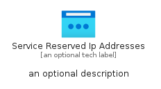
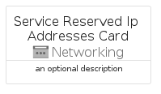
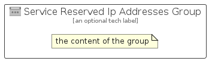

# ServiceReservedIpAddresses


```text
azure/Item/Networking/ServiceReservedIpAddresses
```

```text
include('azure/Item/Networking/ServiceReservedIpAddresses')
```


| Illustration | ServiceReservedIpAddresses | ServiceReservedIpAddressesCard | ServiceReservedIpAddressesGroup |
| :---: | :---: | :---: | :---: |
|  |  |  |  |


## Sprites
The item provides the following sriptes:

- `<$ServiceReservedIpAddressesXs>`
- `<$ServiceReservedIpAddressesSm>`
- `<$ServiceReservedIpAddressesMd>`
- `<$ServiceReservedIpAddressesLg>`


## ServiceReservedIpAddresses

### Load remotely
```plantuml
@startuml
' configures the library
!global $LIB_BASE_LOCATION="https://raw.githubusercontent.com/tmorin/plantuml-libs/master/distribution"

' loads the library's bootstrap
!include $LIB_BASE_LOCATION/bootstrap.puml

' loads the package bootstrap
include('azure/bootstrap')

' loads the Item which embeds the element ServiceReservedIpAddresses
include('azure/Item/Networking/ServiceReservedIpAddresses')

' renders the element
ServiceReservedIpAddresses('ServiceReservedIpAddresses', 'Service Reserved Ip Addresses', 'an optional tech label', 'an optional description')
@enduml
```

### Load locally
```plantuml
@startuml
' configures the library
!global $INCLUSION_MODE="local"
!global $LIB_BASE_LOCATION="../../.."

' loads the library's bootstrap
!include $LIB_BASE_LOCATION/bootstrap.puml

' loads the package bootstrap
include('azure/bootstrap')

' loads the Item which embeds the element ServiceReservedIpAddresses
include('azure/Item/Networking/ServiceReservedIpAddresses')

' renders the element
ServiceReservedIpAddresses('ServiceReservedIpAddresses', 'Service Reserved Ip Addresses', 'an optional tech label', 'an optional description')
@enduml
```

## ServiceReservedIpAddressesCard

### Load remotely
```plantuml
@startuml
' configures the library
!global $LIB_BASE_LOCATION="https://raw.githubusercontent.com/tmorin/plantuml-libs/master/distribution"

' loads the library's bootstrap
!include $LIB_BASE_LOCATION/bootstrap.puml

' loads the package bootstrap
include('azure/bootstrap')

' loads the Item which embeds the element ServiceReservedIpAddressesCard
include('azure/Item/Networking/ServiceReservedIpAddresses')

' renders the element
ServiceReservedIpAddressesCard('ServiceReservedIpAddressesCard', 'Service Reserved Ip Addresses Card', 'an optional description')
@enduml
```

### Load locally
```plantuml
@startuml
' configures the library
!global $INCLUSION_MODE="local"
!global $LIB_BASE_LOCATION="../../.."

' loads the library's bootstrap
!include $LIB_BASE_LOCATION/bootstrap.puml

' loads the package bootstrap
include('azure/bootstrap')

' loads the Item which embeds the element ServiceReservedIpAddressesCard
include('azure/Item/Networking/ServiceReservedIpAddresses')

' renders the element
ServiceReservedIpAddressesCard('ServiceReservedIpAddressesCard', 'Service Reserved Ip Addresses Card', 'an optional description')
@enduml
```

## ServiceReservedIpAddressesGroup

### Load remotely
```plantuml
@startuml
' configures the library
!global $LIB_BASE_LOCATION="https://raw.githubusercontent.com/tmorin/plantuml-libs/master/distribution"

' loads the library's bootstrap
!include $LIB_BASE_LOCATION/bootstrap.puml

' loads the package bootstrap
include('azure/bootstrap')

' loads the Item which embeds the element ServiceReservedIpAddressesGroup
include('azure/Item/Networking/ServiceReservedIpAddresses')

' renders the element
ServiceReservedIpAddressesGroup('ServiceReservedIpAddressesGroup', 'Service Reserved Ip Addresses Group', 'an optional tech label') {
    note as note
        the content of the group
    end note
}
@enduml
```

### Load locally
```plantuml
@startuml
' configures the library
!global $INCLUSION_MODE="local"
!global $LIB_BASE_LOCATION="../../.."

' loads the library's bootstrap
!include $LIB_BASE_LOCATION/bootstrap.puml

' loads the package bootstrap
include('azure/bootstrap')

' loads the Item which embeds the element ServiceReservedIpAddressesGroup
include('azure/Item/Networking/ServiceReservedIpAddresses')

' renders the element
ServiceReservedIpAddressesGroup('ServiceReservedIpAddressesGroup', 'Service Reserved Ip Addresses Group', 'an optional tech label') {
    note as note
        the content of the group
    end note
}
@enduml
```

