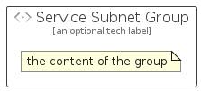

# ServiceSubnet


```text
azure/Item/Networking/ServiceSubnet
```

```text
include('azure/Item/Networking/ServiceSubnet')
```


| Illustration | ServiceSubnet | ServiceSubnetCard | ServiceSubnetGroup |
| :---: | :---: | :---: | :---: |
|  |  |  |  |


## Sprites
The item provides the following sriptes:

- `<$ServiceSubnetXs>`
- `<$ServiceSubnetSm>`
- `<$ServiceSubnetMd>`
- `<$ServiceSubnetLg>`


## ServiceSubnet

### Load remotely
```plantuml
@startuml
' configures the library
!global $LIB_BASE_LOCATION="https://raw.githubusercontent.com/tmorin/plantuml-libs/master/distribution"

' loads the library's bootstrap
!include $LIB_BASE_LOCATION/bootstrap.puml

' loads the package bootstrap
include('azure/bootstrap')

' loads the Item which embeds the element ServiceSubnet
include('azure/Item/Networking/ServiceSubnet')

' renders the element
ServiceSubnet('ServiceSubnet', 'Service Subnet', 'an optional tech label', 'an optional description')
@enduml
```

### Load locally
```plantuml
@startuml
' configures the library
!global $INCLUSION_MODE="local"
!global $LIB_BASE_LOCATION="../../.."

' loads the library's bootstrap
!include $LIB_BASE_LOCATION/bootstrap.puml

' loads the package bootstrap
include('azure/bootstrap')

' loads the Item which embeds the element ServiceSubnet
include('azure/Item/Networking/ServiceSubnet')

' renders the element
ServiceSubnet('ServiceSubnet', 'Service Subnet', 'an optional tech label', 'an optional description')
@enduml
```

## ServiceSubnetCard

### Load remotely
```plantuml
@startuml
' configures the library
!global $LIB_BASE_LOCATION="https://raw.githubusercontent.com/tmorin/plantuml-libs/master/distribution"

' loads the library's bootstrap
!include $LIB_BASE_LOCATION/bootstrap.puml

' loads the package bootstrap
include('azure/bootstrap')

' loads the Item which embeds the element ServiceSubnetCard
include('azure/Item/Networking/ServiceSubnet')

' renders the element
ServiceSubnetCard('ServiceSubnetCard', 'Service Subnet Card', 'an optional description')
@enduml
```

### Load locally
```plantuml
@startuml
' configures the library
!global $INCLUSION_MODE="local"
!global $LIB_BASE_LOCATION="../../.."

' loads the library's bootstrap
!include $LIB_BASE_LOCATION/bootstrap.puml

' loads the package bootstrap
include('azure/bootstrap')

' loads the Item which embeds the element ServiceSubnetCard
include('azure/Item/Networking/ServiceSubnet')

' renders the element
ServiceSubnetCard('ServiceSubnetCard', 'Service Subnet Card', 'an optional description')
@enduml
```

## ServiceSubnetGroup

### Load remotely
```plantuml
@startuml
' configures the library
!global $LIB_BASE_LOCATION="https://raw.githubusercontent.com/tmorin/plantuml-libs/master/distribution"

' loads the library's bootstrap
!include $LIB_BASE_LOCATION/bootstrap.puml

' loads the package bootstrap
include('azure/bootstrap')

' loads the Item which embeds the element ServiceSubnetGroup
include('azure/Item/Networking/ServiceSubnet')

' renders the element
ServiceSubnetGroup('ServiceSubnetGroup', 'Service Subnet Group', 'an optional tech label') {
    note as note
        the content of the group
    end note
}
@enduml
```

### Load locally
```plantuml
@startuml
' configures the library
!global $INCLUSION_MODE="local"
!global $LIB_BASE_LOCATION="../../.."

' loads the library's bootstrap
!include $LIB_BASE_LOCATION/bootstrap.puml

' loads the package bootstrap
include('azure/bootstrap')

' loads the Item which embeds the element ServiceSubnetGroup
include('azure/Item/Networking/ServiceSubnet')

' renders the element
ServiceSubnetGroup('ServiceSubnetGroup', 'Service Subnet Group', 'an optional tech label') {
    note as note
        the content of the group
    end note
}
@enduml
```

