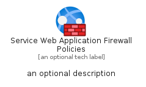
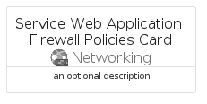
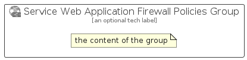

# ServiceWebApplicationFirewallPolicies


```text
azure/Item/Networking/ServiceWebApplicationFirewallPolicies
```

```text
include('azure/Item/Networking/ServiceWebApplicationFirewallPolicies')
```


| Illustration | ServiceWebApplicationFirewallPolicies | ServiceWebApplicationFirewallPoliciesCard | ServiceWebApplicationFirewallPoliciesGroup |
| :---: | :---: | :---: | :---: |
|  |  |  |  |


## Sprites
The item provides the following sriptes:

- `<$ServiceWebApplicationFirewallPoliciesXs>`
- `<$ServiceWebApplicationFirewallPoliciesSm>`
- `<$ServiceWebApplicationFirewallPoliciesMd>`
- `<$ServiceWebApplicationFirewallPoliciesLg>`


## ServiceWebApplicationFirewallPolicies

### Load remotely
```plantuml
@startuml
' configures the library
!global $LIB_BASE_LOCATION="https://raw.githubusercontent.com/tmorin/plantuml-libs/master/distribution"

' loads the library's bootstrap
!include $LIB_BASE_LOCATION/bootstrap.puml

' loads the package bootstrap
include('azure/bootstrap')

' loads the Item which embeds the element ServiceWebApplicationFirewallPolicies
include('azure/Item/Networking/ServiceWebApplicationFirewallPolicies')

' renders the element
ServiceWebApplicationFirewallPolicies('ServiceWebApplicationFirewallPolicies', 'Service Web Application Firewall Policies', 'an optional tech label', 'an optional description')
@enduml
```

### Load locally
```plantuml
@startuml
' configures the library
!global $INCLUSION_MODE="local"
!global $LIB_BASE_LOCATION="../../.."

' loads the library's bootstrap
!include $LIB_BASE_LOCATION/bootstrap.puml

' loads the package bootstrap
include('azure/bootstrap')

' loads the Item which embeds the element ServiceWebApplicationFirewallPolicies
include('azure/Item/Networking/ServiceWebApplicationFirewallPolicies')

' renders the element
ServiceWebApplicationFirewallPolicies('ServiceWebApplicationFirewallPolicies', 'Service Web Application Firewall Policies', 'an optional tech label', 'an optional description')
@enduml
```

## ServiceWebApplicationFirewallPoliciesCard

### Load remotely
```plantuml
@startuml
' configures the library
!global $LIB_BASE_LOCATION="https://raw.githubusercontent.com/tmorin/plantuml-libs/master/distribution"

' loads the library's bootstrap
!include $LIB_BASE_LOCATION/bootstrap.puml

' loads the package bootstrap
include('azure/bootstrap')

' loads the Item which embeds the element ServiceWebApplicationFirewallPoliciesCard
include('azure/Item/Networking/ServiceWebApplicationFirewallPolicies')

' renders the element
ServiceWebApplicationFirewallPoliciesCard('ServiceWebApplicationFirewallPoliciesCard', 'Service Web Application Firewall Policies Card', 'an optional description')
@enduml
```

### Load locally
```plantuml
@startuml
' configures the library
!global $INCLUSION_MODE="local"
!global $LIB_BASE_LOCATION="../../.."

' loads the library's bootstrap
!include $LIB_BASE_LOCATION/bootstrap.puml

' loads the package bootstrap
include('azure/bootstrap')

' loads the Item which embeds the element ServiceWebApplicationFirewallPoliciesCard
include('azure/Item/Networking/ServiceWebApplicationFirewallPolicies')

' renders the element
ServiceWebApplicationFirewallPoliciesCard('ServiceWebApplicationFirewallPoliciesCard', 'Service Web Application Firewall Policies Card', 'an optional description')
@enduml
```

## ServiceWebApplicationFirewallPoliciesGroup

### Load remotely
```plantuml
@startuml
' configures the library
!global $LIB_BASE_LOCATION="https://raw.githubusercontent.com/tmorin/plantuml-libs/master/distribution"

' loads the library's bootstrap
!include $LIB_BASE_LOCATION/bootstrap.puml

' loads the package bootstrap
include('azure/bootstrap')

' loads the Item which embeds the element ServiceWebApplicationFirewallPoliciesGroup
include('azure/Item/Networking/ServiceWebApplicationFirewallPolicies')

' renders the element
ServiceWebApplicationFirewallPoliciesGroup('ServiceWebApplicationFirewallPoliciesGroup', 'Service Web Application Firewall Policies Group', 'an optional tech label') {
    note as note
        the content of the group
    end note
}
@enduml
```

### Load locally
```plantuml
@startuml
' configures the library
!global $INCLUSION_MODE="local"
!global $LIB_BASE_LOCATION="../../.."

' loads the library's bootstrap
!include $LIB_BASE_LOCATION/bootstrap.puml

' loads the package bootstrap
include('azure/bootstrap')

' loads the Item which embeds the element ServiceWebApplicationFirewallPoliciesGroup
include('azure/Item/Networking/ServiceWebApplicationFirewallPolicies')

' renders the element
ServiceWebApplicationFirewallPoliciesGroup('ServiceWebApplicationFirewallPoliciesGroup', 'Service Web Application Firewall Policies Group', 'an optional tech label') {
    note as note
        the content of the group
    end note
}
@enduml
```

