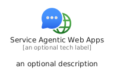
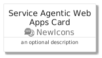
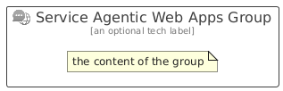

# ServiceAgenticWebApps


```text
azure/Item/NewIcons/ServiceAgenticWebApps
```

```text
include('azure/Item/NewIcons/ServiceAgenticWebApps')
```


| Illustration | ServiceAgenticWebApps | ServiceAgenticWebAppsCard | ServiceAgenticWebAppsGroup |
| :---: | :---: | :---: | :---: |
|  |  |  |  |


## Sprites
The item provides the following sriptes:

- `<$ServiceAgenticWebAppsXs>`
- `<$ServiceAgenticWebAppsSm>`
- `<$ServiceAgenticWebAppsMd>`
- `<$ServiceAgenticWebAppsLg>`


## ServiceAgenticWebApps

### Load remotely
```plantuml
@startuml
' configures the library
!global $LIB_BASE_LOCATION="https://raw.githubusercontent.com/tmorin/plantuml-libs/master/distribution"

' loads the library's bootstrap
!include $LIB_BASE_LOCATION/bootstrap.puml

' loads the package bootstrap
include('azure/bootstrap')

' loads the Item which embeds the element ServiceAgenticWebApps
include('azure/Item/NewIcons/ServiceAgenticWebApps')

' renders the element
ServiceAgenticWebApps('ServiceAgenticWebApps', 'Service Agentic Web Apps', 'an optional tech label', 'an optional description')
@enduml
```

### Load locally
```plantuml
@startuml
' configures the library
!global $INCLUSION_MODE="local"
!global $LIB_BASE_LOCATION="../../.."

' loads the library's bootstrap
!include $LIB_BASE_LOCATION/bootstrap.puml

' loads the package bootstrap
include('azure/bootstrap')

' loads the Item which embeds the element ServiceAgenticWebApps
include('azure/Item/NewIcons/ServiceAgenticWebApps')

' renders the element
ServiceAgenticWebApps('ServiceAgenticWebApps', 'Service Agentic Web Apps', 'an optional tech label', 'an optional description')
@enduml
```

## ServiceAgenticWebAppsCard

### Load remotely
```plantuml
@startuml
' configures the library
!global $LIB_BASE_LOCATION="https://raw.githubusercontent.com/tmorin/plantuml-libs/master/distribution"

' loads the library's bootstrap
!include $LIB_BASE_LOCATION/bootstrap.puml

' loads the package bootstrap
include('azure/bootstrap')

' loads the Item which embeds the element ServiceAgenticWebAppsCard
include('azure/Item/NewIcons/ServiceAgenticWebApps')

' renders the element
ServiceAgenticWebAppsCard('ServiceAgenticWebAppsCard', 'Service Agentic Web Apps Card', 'an optional description')
@enduml
```

### Load locally
```plantuml
@startuml
' configures the library
!global $INCLUSION_MODE="local"
!global $LIB_BASE_LOCATION="../../.."

' loads the library's bootstrap
!include $LIB_BASE_LOCATION/bootstrap.puml

' loads the package bootstrap
include('azure/bootstrap')

' loads the Item which embeds the element ServiceAgenticWebAppsCard
include('azure/Item/NewIcons/ServiceAgenticWebApps')

' renders the element
ServiceAgenticWebAppsCard('ServiceAgenticWebAppsCard', 'Service Agentic Web Apps Card', 'an optional description')
@enduml
```

## ServiceAgenticWebAppsGroup

### Load remotely
```plantuml
@startuml
' configures the library
!global $LIB_BASE_LOCATION="https://raw.githubusercontent.com/tmorin/plantuml-libs/master/distribution"

' loads the library's bootstrap
!include $LIB_BASE_LOCATION/bootstrap.puml

' loads the package bootstrap
include('azure/bootstrap')

' loads the Item which embeds the element ServiceAgenticWebAppsGroup
include('azure/Item/NewIcons/ServiceAgenticWebApps')

' renders the element
ServiceAgenticWebAppsGroup('ServiceAgenticWebAppsGroup', 'Service Agentic Web Apps Group', 'an optional tech label') {
    note as note
        the content of the group
    end note
}
@enduml
```

### Load locally
```plantuml
@startuml
' configures the library
!global $INCLUSION_MODE="local"
!global $LIB_BASE_LOCATION="../../.."

' loads the library's bootstrap
!include $LIB_BASE_LOCATION/bootstrap.puml

' loads the package bootstrap
include('azure/bootstrap')

' loads the Item which embeds the element ServiceAgenticWebAppsGroup
include('azure/Item/NewIcons/ServiceAgenticWebApps')

' renders the element
ServiceAgenticWebAppsGroup('ServiceAgenticWebAppsGroup', 'Service Agentic Web Apps Group', 'an optional tech label') {
    note as note
        the content of the group
    end note
}
@enduml
```

