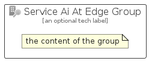

# ServiceAiAtEdge


```text
azure/Item/NewIcons/ServiceAiAtEdge
```

```text
include('azure/Item/NewIcons/ServiceAiAtEdge')
```


| Illustration | ServiceAiAtEdge | ServiceAiAtEdgeCard | ServiceAiAtEdgeGroup |
| :---: | :---: | :---: | :---: |
|  |  |  |  |


## Sprites
The item provides the following sriptes:

- `<$ServiceAiAtEdgeXs>`
- `<$ServiceAiAtEdgeSm>`
- `<$ServiceAiAtEdgeMd>`
- `<$ServiceAiAtEdgeLg>`


## ServiceAiAtEdge

### Load remotely
```plantuml
@startuml
' configures the library
!global $LIB_BASE_LOCATION="https://raw.githubusercontent.com/tmorin/plantuml-libs/master/distribution"

' loads the library's bootstrap
!include $LIB_BASE_LOCATION/bootstrap.puml

' loads the package bootstrap
include('azure/bootstrap')

' loads the Item which embeds the element ServiceAiAtEdge
include('azure/Item/NewIcons/ServiceAiAtEdge')

' renders the element
ServiceAiAtEdge('ServiceAiAtEdge', 'Service Ai At Edge', 'an optional tech label', 'an optional description')
@enduml
```

### Load locally
```plantuml
@startuml
' configures the library
!global $INCLUSION_MODE="local"
!global $LIB_BASE_LOCATION="../../.."

' loads the library's bootstrap
!include $LIB_BASE_LOCATION/bootstrap.puml

' loads the package bootstrap
include('azure/bootstrap')

' loads the Item which embeds the element ServiceAiAtEdge
include('azure/Item/NewIcons/ServiceAiAtEdge')

' renders the element
ServiceAiAtEdge('ServiceAiAtEdge', 'Service Ai At Edge', 'an optional tech label', 'an optional description')
@enduml
```

## ServiceAiAtEdgeCard

### Load remotely
```plantuml
@startuml
' configures the library
!global $LIB_BASE_LOCATION="https://raw.githubusercontent.com/tmorin/plantuml-libs/master/distribution"

' loads the library's bootstrap
!include $LIB_BASE_LOCATION/bootstrap.puml

' loads the package bootstrap
include('azure/bootstrap')

' loads the Item which embeds the element ServiceAiAtEdgeCard
include('azure/Item/NewIcons/ServiceAiAtEdge')

' renders the element
ServiceAiAtEdgeCard('ServiceAiAtEdgeCard', 'Service Ai At Edge Card', 'an optional description')
@enduml
```

### Load locally
```plantuml
@startuml
' configures the library
!global $INCLUSION_MODE="local"
!global $LIB_BASE_LOCATION="../../.."

' loads the library's bootstrap
!include $LIB_BASE_LOCATION/bootstrap.puml

' loads the package bootstrap
include('azure/bootstrap')

' loads the Item which embeds the element ServiceAiAtEdgeCard
include('azure/Item/NewIcons/ServiceAiAtEdge')

' renders the element
ServiceAiAtEdgeCard('ServiceAiAtEdgeCard', 'Service Ai At Edge Card', 'an optional description')
@enduml
```

## ServiceAiAtEdgeGroup

### Load remotely
```plantuml
@startuml
' configures the library
!global $LIB_BASE_LOCATION="https://raw.githubusercontent.com/tmorin/plantuml-libs/master/distribution"

' loads the library's bootstrap
!include $LIB_BASE_LOCATION/bootstrap.puml

' loads the package bootstrap
include('azure/bootstrap')

' loads the Item which embeds the element ServiceAiAtEdgeGroup
include('azure/Item/NewIcons/ServiceAiAtEdge')

' renders the element
ServiceAiAtEdgeGroup('ServiceAiAtEdgeGroup', 'Service Ai At Edge Group', 'an optional tech label') {
    note as note
        the content of the group
    end note
}
@enduml
```

### Load locally
```plantuml
@startuml
' configures the library
!global $INCLUSION_MODE="local"
!global $LIB_BASE_LOCATION="../../.."

' loads the library's bootstrap
!include $LIB_BASE_LOCATION/bootstrap.puml

' loads the package bootstrap
include('azure/bootstrap')

' loads the Item which embeds the element ServiceAiAtEdgeGroup
include('azure/Item/NewIcons/ServiceAiAtEdge')

' renders the element
ServiceAiAtEdgeGroup('ServiceAiAtEdgeGroup', 'Service Ai At Edge Group', 'an optional tech label') {
    note as note
        the content of the group
    end note
}
@enduml
```

