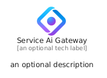
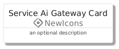
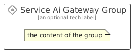

# ServiceAiGateway


```text
azure/Item/NewIcons/ServiceAiGateway
```

```text
include('azure/Item/NewIcons/ServiceAiGateway')
```


| Illustration | ServiceAiGateway | ServiceAiGatewayCard | ServiceAiGatewayGroup |
| :---: | :---: | :---: | :---: |
|  |  |  |  |


## Sprites
The item provides the following sriptes:

- `<$ServiceAiGatewayXs>`
- `<$ServiceAiGatewaySm>`
- `<$ServiceAiGatewayMd>`
- `<$ServiceAiGatewayLg>`


## ServiceAiGateway

### Load remotely
```plantuml
@startuml
' configures the library
!global $LIB_BASE_LOCATION="https://raw.githubusercontent.com/tmorin/plantuml-libs/master/distribution"

' loads the library's bootstrap
!include $LIB_BASE_LOCATION/bootstrap.puml

' loads the package bootstrap
include('azure/bootstrap')

' loads the Item which embeds the element ServiceAiGateway
include('azure/Item/NewIcons/ServiceAiGateway')

' renders the element
ServiceAiGateway('ServiceAiGateway', 'Service Ai Gateway', 'an optional tech label', 'an optional description')
@enduml
```

### Load locally
```plantuml
@startuml
' configures the library
!global $INCLUSION_MODE="local"
!global $LIB_BASE_LOCATION="../../.."

' loads the library's bootstrap
!include $LIB_BASE_LOCATION/bootstrap.puml

' loads the package bootstrap
include('azure/bootstrap')

' loads the Item which embeds the element ServiceAiGateway
include('azure/Item/NewIcons/ServiceAiGateway')

' renders the element
ServiceAiGateway('ServiceAiGateway', 'Service Ai Gateway', 'an optional tech label', 'an optional description')
@enduml
```

## ServiceAiGatewayCard

### Load remotely
```plantuml
@startuml
' configures the library
!global $LIB_BASE_LOCATION="https://raw.githubusercontent.com/tmorin/plantuml-libs/master/distribution"

' loads the library's bootstrap
!include $LIB_BASE_LOCATION/bootstrap.puml

' loads the package bootstrap
include('azure/bootstrap')

' loads the Item which embeds the element ServiceAiGatewayCard
include('azure/Item/NewIcons/ServiceAiGateway')

' renders the element
ServiceAiGatewayCard('ServiceAiGatewayCard', 'Service Ai Gateway Card', 'an optional description')
@enduml
```

### Load locally
```plantuml
@startuml
' configures the library
!global $INCLUSION_MODE="local"
!global $LIB_BASE_LOCATION="../../.."

' loads the library's bootstrap
!include $LIB_BASE_LOCATION/bootstrap.puml

' loads the package bootstrap
include('azure/bootstrap')

' loads the Item which embeds the element ServiceAiGatewayCard
include('azure/Item/NewIcons/ServiceAiGateway')

' renders the element
ServiceAiGatewayCard('ServiceAiGatewayCard', 'Service Ai Gateway Card', 'an optional description')
@enduml
```

## ServiceAiGatewayGroup

### Load remotely
```plantuml
@startuml
' configures the library
!global $LIB_BASE_LOCATION="https://raw.githubusercontent.com/tmorin/plantuml-libs/master/distribution"

' loads the library's bootstrap
!include $LIB_BASE_LOCATION/bootstrap.puml

' loads the package bootstrap
include('azure/bootstrap')

' loads the Item which embeds the element ServiceAiGatewayGroup
include('azure/Item/NewIcons/ServiceAiGateway')

' renders the element
ServiceAiGatewayGroup('ServiceAiGatewayGroup', 'Service Ai Gateway Group', 'an optional tech label') {
    note as note
        the content of the group
    end note
}
@enduml
```

### Load locally
```plantuml
@startuml
' configures the library
!global $INCLUSION_MODE="local"
!global $LIB_BASE_LOCATION="../../.."

' loads the library's bootstrap
!include $LIB_BASE_LOCATION/bootstrap.puml

' loads the package bootstrap
include('azure/bootstrap')

' loads the Item which embeds the element ServiceAiGatewayGroup
include('azure/Item/NewIcons/ServiceAiGateway')

' renders the element
ServiceAiGatewayGroup('ServiceAiGatewayGroup', 'Service Ai Gateway Group', 'an optional tech label') {
    note as note
        the content of the group
    end note
}
@enduml
```

