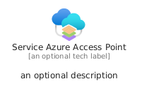
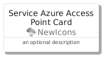
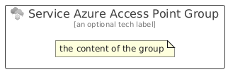

# ServiceAzureAccessPoint


```text
azure/Item/NewIcons/ServiceAzureAccessPoint
```

```text
include('azure/Item/NewIcons/ServiceAzureAccessPoint')
```


| Illustration | ServiceAzureAccessPoint | ServiceAzureAccessPointCard | ServiceAzureAccessPointGroup |
| :---: | :---: | :---: | :---: |
|  |  |  |  |


## Sprites
The item provides the following sriptes:

- `<$ServiceAzureAccessPointXs>`
- `<$ServiceAzureAccessPointSm>`
- `<$ServiceAzureAccessPointMd>`
- `<$ServiceAzureAccessPointLg>`


## ServiceAzureAccessPoint

### Load remotely
```plantuml
@startuml
' configures the library
!global $LIB_BASE_LOCATION="https://raw.githubusercontent.com/tmorin/plantuml-libs/master/distribution"

' loads the library's bootstrap
!include $LIB_BASE_LOCATION/bootstrap.puml

' loads the package bootstrap
include('azure/bootstrap')

' loads the Item which embeds the element ServiceAzureAccessPoint
include('azure/Item/NewIcons/ServiceAzureAccessPoint')

' renders the element
ServiceAzureAccessPoint('ServiceAzureAccessPoint', 'Service Azure Access Point', 'an optional tech label', 'an optional description')
@enduml
```

### Load locally
```plantuml
@startuml
' configures the library
!global $INCLUSION_MODE="local"
!global $LIB_BASE_LOCATION="../../.."

' loads the library's bootstrap
!include $LIB_BASE_LOCATION/bootstrap.puml

' loads the package bootstrap
include('azure/bootstrap')

' loads the Item which embeds the element ServiceAzureAccessPoint
include('azure/Item/NewIcons/ServiceAzureAccessPoint')

' renders the element
ServiceAzureAccessPoint('ServiceAzureAccessPoint', 'Service Azure Access Point', 'an optional tech label', 'an optional description')
@enduml
```

## ServiceAzureAccessPointCard

### Load remotely
```plantuml
@startuml
' configures the library
!global $LIB_BASE_LOCATION="https://raw.githubusercontent.com/tmorin/plantuml-libs/master/distribution"

' loads the library's bootstrap
!include $LIB_BASE_LOCATION/bootstrap.puml

' loads the package bootstrap
include('azure/bootstrap')

' loads the Item which embeds the element ServiceAzureAccessPointCard
include('azure/Item/NewIcons/ServiceAzureAccessPoint')

' renders the element
ServiceAzureAccessPointCard('ServiceAzureAccessPointCard', 'Service Azure Access Point Card', 'an optional description')
@enduml
```

### Load locally
```plantuml
@startuml
' configures the library
!global $INCLUSION_MODE="local"
!global $LIB_BASE_LOCATION="../../.."

' loads the library's bootstrap
!include $LIB_BASE_LOCATION/bootstrap.puml

' loads the package bootstrap
include('azure/bootstrap')

' loads the Item which embeds the element ServiceAzureAccessPointCard
include('azure/Item/NewIcons/ServiceAzureAccessPoint')

' renders the element
ServiceAzureAccessPointCard('ServiceAzureAccessPointCard', 'Service Azure Access Point Card', 'an optional description')
@enduml
```

## ServiceAzureAccessPointGroup

### Load remotely
```plantuml
@startuml
' configures the library
!global $LIB_BASE_LOCATION="https://raw.githubusercontent.com/tmorin/plantuml-libs/master/distribution"

' loads the library's bootstrap
!include $LIB_BASE_LOCATION/bootstrap.puml

' loads the package bootstrap
include('azure/bootstrap')

' loads the Item which embeds the element ServiceAzureAccessPointGroup
include('azure/Item/NewIcons/ServiceAzureAccessPoint')

' renders the element
ServiceAzureAccessPointGroup('ServiceAzureAccessPointGroup', 'Service Azure Access Point Group', 'an optional tech label') {
    note as note
        the content of the group
    end note
}
@enduml
```

### Load locally
```plantuml
@startuml
' configures the library
!global $INCLUSION_MODE="local"
!global $LIB_BASE_LOCATION="../../.."

' loads the library's bootstrap
!include $LIB_BASE_LOCATION/bootstrap.puml

' loads the package bootstrap
include('azure/bootstrap')

' loads the Item which embeds the element ServiceAzureAccessPointGroup
include('azure/Item/NewIcons/ServiceAzureAccessPoint')

' renders the element
ServiceAzureAccessPointGroup('ServiceAzureAccessPointGroup', 'Service Azure Access Point Group', 'an optional tech label') {
    note as note
        the content of the group
    end note
}
@enduml
```

