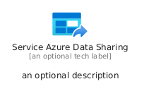
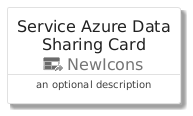
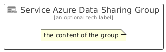

# ServiceAzureDataSharing


```text
azure/Item/NewIcons/ServiceAzureDataSharing
```

```text
include('azure/Item/NewIcons/ServiceAzureDataSharing')
```


| Illustration | ServiceAzureDataSharing | ServiceAzureDataSharingCard | ServiceAzureDataSharingGroup |
| :---: | :---: | :---: | :---: |
|  |  |  |  |


## Sprites
The item provides the following sriptes:

- `<$ServiceAzureDataSharingXs>`
- `<$ServiceAzureDataSharingSm>`
- `<$ServiceAzureDataSharingMd>`
- `<$ServiceAzureDataSharingLg>`


## ServiceAzureDataSharing

### Load remotely
```plantuml
@startuml
' configures the library
!global $LIB_BASE_LOCATION="https://raw.githubusercontent.com/tmorin/plantuml-libs/master/distribution"

' loads the library's bootstrap
!include $LIB_BASE_LOCATION/bootstrap.puml

' loads the package bootstrap
include('azure/bootstrap')

' loads the Item which embeds the element ServiceAzureDataSharing
include('azure/Item/NewIcons/ServiceAzureDataSharing')

' renders the element
ServiceAzureDataSharing('ServiceAzureDataSharing', 'Service Azure Data Sharing', 'an optional tech label', 'an optional description')
@enduml
```

### Load locally
```plantuml
@startuml
' configures the library
!global $INCLUSION_MODE="local"
!global $LIB_BASE_LOCATION="../../.."

' loads the library's bootstrap
!include $LIB_BASE_LOCATION/bootstrap.puml

' loads the package bootstrap
include('azure/bootstrap')

' loads the Item which embeds the element ServiceAzureDataSharing
include('azure/Item/NewIcons/ServiceAzureDataSharing')

' renders the element
ServiceAzureDataSharing('ServiceAzureDataSharing', 'Service Azure Data Sharing', 'an optional tech label', 'an optional description')
@enduml
```

## ServiceAzureDataSharingCard

### Load remotely
```plantuml
@startuml
' configures the library
!global $LIB_BASE_LOCATION="https://raw.githubusercontent.com/tmorin/plantuml-libs/master/distribution"

' loads the library's bootstrap
!include $LIB_BASE_LOCATION/bootstrap.puml

' loads the package bootstrap
include('azure/bootstrap')

' loads the Item which embeds the element ServiceAzureDataSharingCard
include('azure/Item/NewIcons/ServiceAzureDataSharing')

' renders the element
ServiceAzureDataSharingCard('ServiceAzureDataSharingCard', 'Service Azure Data Sharing Card', 'an optional description')
@enduml
```

### Load locally
```plantuml
@startuml
' configures the library
!global $INCLUSION_MODE="local"
!global $LIB_BASE_LOCATION="../../.."

' loads the library's bootstrap
!include $LIB_BASE_LOCATION/bootstrap.puml

' loads the package bootstrap
include('azure/bootstrap')

' loads the Item which embeds the element ServiceAzureDataSharingCard
include('azure/Item/NewIcons/ServiceAzureDataSharing')

' renders the element
ServiceAzureDataSharingCard('ServiceAzureDataSharingCard', 'Service Azure Data Sharing Card', 'an optional description')
@enduml
```

## ServiceAzureDataSharingGroup

### Load remotely
```plantuml
@startuml
' configures the library
!global $LIB_BASE_LOCATION="https://raw.githubusercontent.com/tmorin/plantuml-libs/master/distribution"

' loads the library's bootstrap
!include $LIB_BASE_LOCATION/bootstrap.puml

' loads the package bootstrap
include('azure/bootstrap')

' loads the Item which embeds the element ServiceAzureDataSharingGroup
include('azure/Item/NewIcons/ServiceAzureDataSharing')

' renders the element
ServiceAzureDataSharingGroup('ServiceAzureDataSharingGroup', 'Service Azure Data Sharing Group', 'an optional tech label') {
    note as note
        the content of the group
    end note
}
@enduml
```

### Load locally
```plantuml
@startuml
' configures the library
!global $INCLUSION_MODE="local"
!global $LIB_BASE_LOCATION="../../.."

' loads the library's bootstrap
!include $LIB_BASE_LOCATION/bootstrap.puml

' loads the package bootstrap
include('azure/bootstrap')

' loads the Item which embeds the element ServiceAzureDataSharingGroup
include('azure/Item/NewIcons/ServiceAzureDataSharing')

' renders the element
ServiceAzureDataSharingGroup('ServiceAzureDataSharingGroup', 'Service Azure Data Sharing Group', 'an optional tech label') {
    note as note
        the content of the group
    end note
}
@enduml
```

