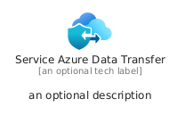
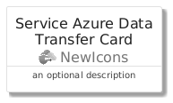
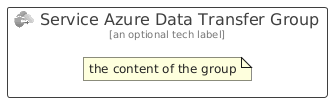

# ServiceAzureDataTransfer


```text
azure/Item/NewIcons/ServiceAzureDataTransfer
```

```text
include('azure/Item/NewIcons/ServiceAzureDataTransfer')
```


| Illustration | ServiceAzureDataTransfer | ServiceAzureDataTransferCard | ServiceAzureDataTransferGroup |
| :---: | :---: | :---: | :---: |
|  |  |  |  |


## Sprites
The item provides the following sriptes:

- `<$ServiceAzureDataTransferXs>`
- `<$ServiceAzureDataTransferSm>`
- `<$ServiceAzureDataTransferMd>`
- `<$ServiceAzureDataTransferLg>`


## ServiceAzureDataTransfer

### Load remotely
```plantuml
@startuml
' configures the library
!global $LIB_BASE_LOCATION="https://raw.githubusercontent.com/tmorin/plantuml-libs/master/distribution"

' loads the library's bootstrap
!include $LIB_BASE_LOCATION/bootstrap.puml

' loads the package bootstrap
include('azure/bootstrap')

' loads the Item which embeds the element ServiceAzureDataTransfer
include('azure/Item/NewIcons/ServiceAzureDataTransfer')

' renders the element
ServiceAzureDataTransfer('ServiceAzureDataTransfer', 'Service Azure Data Transfer', 'an optional tech label', 'an optional description')
@enduml
```

### Load locally
```plantuml
@startuml
' configures the library
!global $INCLUSION_MODE="local"
!global $LIB_BASE_LOCATION="../../.."

' loads the library's bootstrap
!include $LIB_BASE_LOCATION/bootstrap.puml

' loads the package bootstrap
include('azure/bootstrap')

' loads the Item which embeds the element ServiceAzureDataTransfer
include('azure/Item/NewIcons/ServiceAzureDataTransfer')

' renders the element
ServiceAzureDataTransfer('ServiceAzureDataTransfer', 'Service Azure Data Transfer', 'an optional tech label', 'an optional description')
@enduml
```

## ServiceAzureDataTransferCard

### Load remotely
```plantuml
@startuml
' configures the library
!global $LIB_BASE_LOCATION="https://raw.githubusercontent.com/tmorin/plantuml-libs/master/distribution"

' loads the library's bootstrap
!include $LIB_BASE_LOCATION/bootstrap.puml

' loads the package bootstrap
include('azure/bootstrap')

' loads the Item which embeds the element ServiceAzureDataTransferCard
include('azure/Item/NewIcons/ServiceAzureDataTransfer')

' renders the element
ServiceAzureDataTransferCard('ServiceAzureDataTransferCard', 'Service Azure Data Transfer Card', 'an optional description')
@enduml
```

### Load locally
```plantuml
@startuml
' configures the library
!global $INCLUSION_MODE="local"
!global $LIB_BASE_LOCATION="../../.."

' loads the library's bootstrap
!include $LIB_BASE_LOCATION/bootstrap.puml

' loads the package bootstrap
include('azure/bootstrap')

' loads the Item which embeds the element ServiceAzureDataTransferCard
include('azure/Item/NewIcons/ServiceAzureDataTransfer')

' renders the element
ServiceAzureDataTransferCard('ServiceAzureDataTransferCard', 'Service Azure Data Transfer Card', 'an optional description')
@enduml
```

## ServiceAzureDataTransferGroup

### Load remotely
```plantuml
@startuml
' configures the library
!global $LIB_BASE_LOCATION="https://raw.githubusercontent.com/tmorin/plantuml-libs/master/distribution"

' loads the library's bootstrap
!include $LIB_BASE_LOCATION/bootstrap.puml

' loads the package bootstrap
include('azure/bootstrap')

' loads the Item which embeds the element ServiceAzureDataTransferGroup
include('azure/Item/NewIcons/ServiceAzureDataTransfer')

' renders the element
ServiceAzureDataTransferGroup('ServiceAzureDataTransferGroup', 'Service Azure Data Transfer Group', 'an optional tech label') {
    note as note
        the content of the group
    end note
}
@enduml
```

### Load locally
```plantuml
@startuml
' configures the library
!global $INCLUSION_MODE="local"
!global $LIB_BASE_LOCATION="../../.."

' loads the library's bootstrap
!include $LIB_BASE_LOCATION/bootstrap.puml

' loads the package bootstrap
include('azure/bootstrap')

' loads the Item which embeds the element ServiceAzureDataTransferGroup
include('azure/Item/NewIcons/ServiceAzureDataTransfer')

' renders the element
ServiceAzureDataTransferGroup('ServiceAzureDataTransferGroup', 'Service Azure Data Transfer Group', 'an optional tech label') {
    note as note
        the content of the group
    end note
}
@enduml
```

