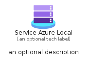
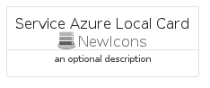
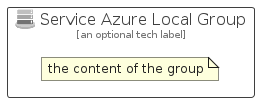

# ServiceAzureLocal


```text
azure/Item/NewIcons/ServiceAzureLocal
```

```text
include('azure/Item/NewIcons/ServiceAzureLocal')
```


| Illustration | ServiceAzureLocal | ServiceAzureLocalCard | ServiceAzureLocalGroup |
| :---: | :---: | :---: | :---: |
|  |  |  |  |


## Sprites
The item provides the following sriptes:

- `<$ServiceAzureLocalXs>`
- `<$ServiceAzureLocalSm>`
- `<$ServiceAzureLocalMd>`
- `<$ServiceAzureLocalLg>`


## ServiceAzureLocal

### Load remotely
```plantuml
@startuml
' configures the library
!global $LIB_BASE_LOCATION="https://raw.githubusercontent.com/tmorin/plantuml-libs/master/distribution"

' loads the library's bootstrap
!include $LIB_BASE_LOCATION/bootstrap.puml

' loads the package bootstrap
include('azure/bootstrap')

' loads the Item which embeds the element ServiceAzureLocal
include('azure/Item/NewIcons/ServiceAzureLocal')

' renders the element
ServiceAzureLocal('ServiceAzureLocal', 'Service Azure Local', 'an optional tech label', 'an optional description')
@enduml
```

### Load locally
```plantuml
@startuml
' configures the library
!global $INCLUSION_MODE="local"
!global $LIB_BASE_LOCATION="../../.."

' loads the library's bootstrap
!include $LIB_BASE_LOCATION/bootstrap.puml

' loads the package bootstrap
include('azure/bootstrap')

' loads the Item which embeds the element ServiceAzureLocal
include('azure/Item/NewIcons/ServiceAzureLocal')

' renders the element
ServiceAzureLocal('ServiceAzureLocal', 'Service Azure Local', 'an optional tech label', 'an optional description')
@enduml
```

## ServiceAzureLocalCard

### Load remotely
```plantuml
@startuml
' configures the library
!global $LIB_BASE_LOCATION="https://raw.githubusercontent.com/tmorin/plantuml-libs/master/distribution"

' loads the library's bootstrap
!include $LIB_BASE_LOCATION/bootstrap.puml

' loads the package bootstrap
include('azure/bootstrap')

' loads the Item which embeds the element ServiceAzureLocalCard
include('azure/Item/NewIcons/ServiceAzureLocal')

' renders the element
ServiceAzureLocalCard('ServiceAzureLocalCard', 'Service Azure Local Card', 'an optional description')
@enduml
```

### Load locally
```plantuml
@startuml
' configures the library
!global $INCLUSION_MODE="local"
!global $LIB_BASE_LOCATION="../../.."

' loads the library's bootstrap
!include $LIB_BASE_LOCATION/bootstrap.puml

' loads the package bootstrap
include('azure/bootstrap')

' loads the Item which embeds the element ServiceAzureLocalCard
include('azure/Item/NewIcons/ServiceAzureLocal')

' renders the element
ServiceAzureLocalCard('ServiceAzureLocalCard', 'Service Azure Local Card', 'an optional description')
@enduml
```

## ServiceAzureLocalGroup

### Load remotely
```plantuml
@startuml
' configures the library
!global $LIB_BASE_LOCATION="https://raw.githubusercontent.com/tmorin/plantuml-libs/master/distribution"

' loads the library's bootstrap
!include $LIB_BASE_LOCATION/bootstrap.puml

' loads the package bootstrap
include('azure/bootstrap')

' loads the Item which embeds the element ServiceAzureLocalGroup
include('azure/Item/NewIcons/ServiceAzureLocal')

' renders the element
ServiceAzureLocalGroup('ServiceAzureLocalGroup', 'Service Azure Local Group', 'an optional tech label') {
    note as note
        the content of the group
    end note
}
@enduml
```

### Load locally
```plantuml
@startuml
' configures the library
!global $INCLUSION_MODE="local"
!global $LIB_BASE_LOCATION="../../.."

' loads the library's bootstrap
!include $LIB_BASE_LOCATION/bootstrap.puml

' loads the package bootstrap
include('azure/bootstrap')

' loads the Item which embeds the element ServiceAzureLocalGroup
include('azure/Item/NewIcons/ServiceAzureLocal')

' renders the element
ServiceAzureLocalGroup('ServiceAzureLocalGroup', 'Service Azure Local Group', 'an optional tech label') {
    note as note
        the content of the group
    end note
}
@enduml
```

