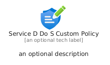
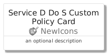
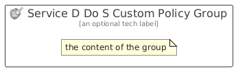

# ServiceDDoSCustomPolicy


```text
azure/Item/NewIcons/ServiceDDoSCustomPolicy
```

```text
include('azure/Item/NewIcons/ServiceDDoSCustomPolicy')
```


| Illustration | ServiceDDoSCustomPolicy | ServiceDDoSCustomPolicyCard | ServiceDDoSCustomPolicyGroup |
| :---: | :---: | :---: | :---: |
|  |  |  |  |


## Sprites
The item provides the following sriptes:

- `<$ServiceDDoSCustomPolicyXs>`
- `<$ServiceDDoSCustomPolicySm>`
- `<$ServiceDDoSCustomPolicyMd>`
- `<$ServiceDDoSCustomPolicyLg>`


## ServiceDDoSCustomPolicy

### Load remotely
```plantuml
@startuml
' configures the library
!global $LIB_BASE_LOCATION="https://raw.githubusercontent.com/tmorin/plantuml-libs/master/distribution"

' loads the library's bootstrap
!include $LIB_BASE_LOCATION/bootstrap.puml

' loads the package bootstrap
include('azure/bootstrap')

' loads the Item which embeds the element ServiceDDoSCustomPolicy
include('azure/Item/NewIcons/ServiceDDoSCustomPolicy')

' renders the element
ServiceDDoSCustomPolicy('ServiceDDoSCustomPolicy', 'Service D Do S Custom Policy', 'an optional tech label', 'an optional description')
@enduml
```

### Load locally
```plantuml
@startuml
' configures the library
!global $INCLUSION_MODE="local"
!global $LIB_BASE_LOCATION="../../.."

' loads the library's bootstrap
!include $LIB_BASE_LOCATION/bootstrap.puml

' loads the package bootstrap
include('azure/bootstrap')

' loads the Item which embeds the element ServiceDDoSCustomPolicy
include('azure/Item/NewIcons/ServiceDDoSCustomPolicy')

' renders the element
ServiceDDoSCustomPolicy('ServiceDDoSCustomPolicy', 'Service D Do S Custom Policy', 'an optional tech label', 'an optional description')
@enduml
```

## ServiceDDoSCustomPolicyCard

### Load remotely
```plantuml
@startuml
' configures the library
!global $LIB_BASE_LOCATION="https://raw.githubusercontent.com/tmorin/plantuml-libs/master/distribution"

' loads the library's bootstrap
!include $LIB_BASE_LOCATION/bootstrap.puml

' loads the package bootstrap
include('azure/bootstrap')

' loads the Item which embeds the element ServiceDDoSCustomPolicyCard
include('azure/Item/NewIcons/ServiceDDoSCustomPolicy')

' renders the element
ServiceDDoSCustomPolicyCard('ServiceDDoSCustomPolicyCard', 'Service D Do S Custom Policy Card', 'an optional description')
@enduml
```

### Load locally
```plantuml
@startuml
' configures the library
!global $INCLUSION_MODE="local"
!global $LIB_BASE_LOCATION="../../.."

' loads the library's bootstrap
!include $LIB_BASE_LOCATION/bootstrap.puml

' loads the package bootstrap
include('azure/bootstrap')

' loads the Item which embeds the element ServiceDDoSCustomPolicyCard
include('azure/Item/NewIcons/ServiceDDoSCustomPolicy')

' renders the element
ServiceDDoSCustomPolicyCard('ServiceDDoSCustomPolicyCard', 'Service D Do S Custom Policy Card', 'an optional description')
@enduml
```

## ServiceDDoSCustomPolicyGroup

### Load remotely
```plantuml
@startuml
' configures the library
!global $LIB_BASE_LOCATION="https://raw.githubusercontent.com/tmorin/plantuml-libs/master/distribution"

' loads the library's bootstrap
!include $LIB_BASE_LOCATION/bootstrap.puml

' loads the package bootstrap
include('azure/bootstrap')

' loads the Item which embeds the element ServiceDDoSCustomPolicyGroup
include('azure/Item/NewIcons/ServiceDDoSCustomPolicy')

' renders the element
ServiceDDoSCustomPolicyGroup('ServiceDDoSCustomPolicyGroup', 'Service D Do S Custom Policy Group', 'an optional tech label') {
    note as note
        the content of the group
    end note
}
@enduml
```

### Load locally
```plantuml
@startuml
' configures the library
!global $INCLUSION_MODE="local"
!global $LIB_BASE_LOCATION="../../.."

' loads the library's bootstrap
!include $LIB_BASE_LOCATION/bootstrap.puml

' loads the package bootstrap
include('azure/bootstrap')

' loads the Item which embeds the element ServiceDDoSCustomPolicyGroup
include('azure/Item/NewIcons/ServiceDDoSCustomPolicy')

' renders the element
ServiceDDoSCustomPolicyGroup('ServiceDDoSCustomPolicyGroup', 'Service D Do S Custom Policy Group', 'an optional tech label') {
    note as note
        the content of the group
    end note
}
@enduml
```

