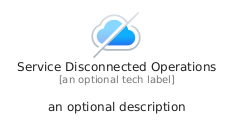
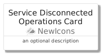
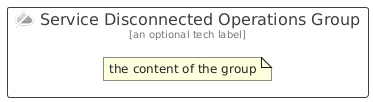

# ServiceDisconnectedOperations


```text
azure/Item/NewIcons/ServiceDisconnectedOperations
```

```text
include('azure/Item/NewIcons/ServiceDisconnectedOperations')
```


| Illustration | ServiceDisconnectedOperations | ServiceDisconnectedOperationsCard | ServiceDisconnectedOperationsGroup |
| :---: | :---: | :---: | :---: |
|  |  |  |  |


## Sprites
The item provides the following sriptes:

- `<$ServiceDisconnectedOperationsXs>`
- `<$ServiceDisconnectedOperationsSm>`
- `<$ServiceDisconnectedOperationsMd>`
- `<$ServiceDisconnectedOperationsLg>`


## ServiceDisconnectedOperations

### Load remotely
```plantuml
@startuml
' configures the library
!global $LIB_BASE_LOCATION="https://raw.githubusercontent.com/tmorin/plantuml-libs/master/distribution"

' loads the library's bootstrap
!include $LIB_BASE_LOCATION/bootstrap.puml

' loads the package bootstrap
include('azure/bootstrap')

' loads the Item which embeds the element ServiceDisconnectedOperations
include('azure/Item/NewIcons/ServiceDisconnectedOperations')

' renders the element
ServiceDisconnectedOperations('ServiceDisconnectedOperations', 'Service Disconnected Operations', 'an optional tech label', 'an optional description')
@enduml
```

### Load locally
```plantuml
@startuml
' configures the library
!global $INCLUSION_MODE="local"
!global $LIB_BASE_LOCATION="../../.."

' loads the library's bootstrap
!include $LIB_BASE_LOCATION/bootstrap.puml

' loads the package bootstrap
include('azure/bootstrap')

' loads the Item which embeds the element ServiceDisconnectedOperations
include('azure/Item/NewIcons/ServiceDisconnectedOperations')

' renders the element
ServiceDisconnectedOperations('ServiceDisconnectedOperations', 'Service Disconnected Operations', 'an optional tech label', 'an optional description')
@enduml
```

## ServiceDisconnectedOperationsCard

### Load remotely
```plantuml
@startuml
' configures the library
!global $LIB_BASE_LOCATION="https://raw.githubusercontent.com/tmorin/plantuml-libs/master/distribution"

' loads the library's bootstrap
!include $LIB_BASE_LOCATION/bootstrap.puml

' loads the package bootstrap
include('azure/bootstrap')

' loads the Item which embeds the element ServiceDisconnectedOperationsCard
include('azure/Item/NewIcons/ServiceDisconnectedOperations')

' renders the element
ServiceDisconnectedOperationsCard('ServiceDisconnectedOperationsCard', 'Service Disconnected Operations Card', 'an optional description')
@enduml
```

### Load locally
```plantuml
@startuml
' configures the library
!global $INCLUSION_MODE="local"
!global $LIB_BASE_LOCATION="../../.."

' loads the library's bootstrap
!include $LIB_BASE_LOCATION/bootstrap.puml

' loads the package bootstrap
include('azure/bootstrap')

' loads the Item which embeds the element ServiceDisconnectedOperationsCard
include('azure/Item/NewIcons/ServiceDisconnectedOperations')

' renders the element
ServiceDisconnectedOperationsCard('ServiceDisconnectedOperationsCard', 'Service Disconnected Operations Card', 'an optional description')
@enduml
```

## ServiceDisconnectedOperationsGroup

### Load remotely
```plantuml
@startuml
' configures the library
!global $LIB_BASE_LOCATION="https://raw.githubusercontent.com/tmorin/plantuml-libs/master/distribution"

' loads the library's bootstrap
!include $LIB_BASE_LOCATION/bootstrap.puml

' loads the package bootstrap
include('azure/bootstrap')

' loads the Item which embeds the element ServiceDisconnectedOperationsGroup
include('azure/Item/NewIcons/ServiceDisconnectedOperations')

' renders the element
ServiceDisconnectedOperationsGroup('ServiceDisconnectedOperationsGroup', 'Service Disconnected Operations Group', 'an optional tech label') {
    note as note
        the content of the group
    end note
}
@enduml
```

### Load locally
```plantuml
@startuml
' configures the library
!global $INCLUSION_MODE="local"
!global $LIB_BASE_LOCATION="../../.."

' loads the library's bootstrap
!include $LIB_BASE_LOCATION/bootstrap.puml

' loads the package bootstrap
include('azure/bootstrap')

' loads the Item which embeds the element ServiceDisconnectedOperationsGroup
include('azure/Item/NewIcons/ServiceDisconnectedOperations')

' renders the element
ServiceDisconnectedOperationsGroup('ServiceDisconnectedOperationsGroup', 'Service Disconnected Operations Group', 'an optional tech label') {
    note as note
        the content of the group
    end note
}
@enduml
```

