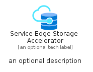
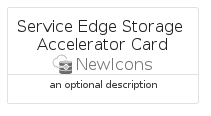
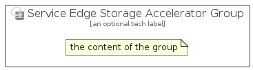

# ServiceEdgeStorageAccelerator


```text
azure/Item/NewIcons/ServiceEdgeStorageAccelerator
```

```text
include('azure/Item/NewIcons/ServiceEdgeStorageAccelerator')
```


| Illustration | ServiceEdgeStorageAccelerator | ServiceEdgeStorageAcceleratorCard | ServiceEdgeStorageAcceleratorGroup |
| :---: | :---: | :---: | :---: |
|  |  |  |  |


## Sprites
The item provides the following sriptes:

- `<$ServiceEdgeStorageAcceleratorXs>`
- `<$ServiceEdgeStorageAcceleratorSm>`
- `<$ServiceEdgeStorageAcceleratorMd>`
- `<$ServiceEdgeStorageAcceleratorLg>`


## ServiceEdgeStorageAccelerator

### Load remotely
```plantuml
@startuml
' configures the library
!global $LIB_BASE_LOCATION="https://raw.githubusercontent.com/tmorin/plantuml-libs/master/distribution"

' loads the library's bootstrap
!include $LIB_BASE_LOCATION/bootstrap.puml

' loads the package bootstrap
include('azure/bootstrap')

' loads the Item which embeds the element ServiceEdgeStorageAccelerator
include('azure/Item/NewIcons/ServiceEdgeStorageAccelerator')

' renders the element
ServiceEdgeStorageAccelerator('ServiceEdgeStorageAccelerator', 'Service Edge Storage Accelerator', 'an optional tech label', 'an optional description')
@enduml
```

### Load locally
```plantuml
@startuml
' configures the library
!global $INCLUSION_MODE="local"
!global $LIB_BASE_LOCATION="../../.."

' loads the library's bootstrap
!include $LIB_BASE_LOCATION/bootstrap.puml

' loads the package bootstrap
include('azure/bootstrap')

' loads the Item which embeds the element ServiceEdgeStorageAccelerator
include('azure/Item/NewIcons/ServiceEdgeStorageAccelerator')

' renders the element
ServiceEdgeStorageAccelerator('ServiceEdgeStorageAccelerator', 'Service Edge Storage Accelerator', 'an optional tech label', 'an optional description')
@enduml
```

## ServiceEdgeStorageAcceleratorCard

### Load remotely
```plantuml
@startuml
' configures the library
!global $LIB_BASE_LOCATION="https://raw.githubusercontent.com/tmorin/plantuml-libs/master/distribution"

' loads the library's bootstrap
!include $LIB_BASE_LOCATION/bootstrap.puml

' loads the package bootstrap
include('azure/bootstrap')

' loads the Item which embeds the element ServiceEdgeStorageAcceleratorCard
include('azure/Item/NewIcons/ServiceEdgeStorageAccelerator')

' renders the element
ServiceEdgeStorageAcceleratorCard('ServiceEdgeStorageAcceleratorCard', 'Service Edge Storage Accelerator Card', 'an optional description')
@enduml
```

### Load locally
```plantuml
@startuml
' configures the library
!global $INCLUSION_MODE="local"
!global $LIB_BASE_LOCATION="../../.."

' loads the library's bootstrap
!include $LIB_BASE_LOCATION/bootstrap.puml

' loads the package bootstrap
include('azure/bootstrap')

' loads the Item which embeds the element ServiceEdgeStorageAcceleratorCard
include('azure/Item/NewIcons/ServiceEdgeStorageAccelerator')

' renders the element
ServiceEdgeStorageAcceleratorCard('ServiceEdgeStorageAcceleratorCard', 'Service Edge Storage Accelerator Card', 'an optional description')
@enduml
```

## ServiceEdgeStorageAcceleratorGroup

### Load remotely
```plantuml
@startuml
' configures the library
!global $LIB_BASE_LOCATION="https://raw.githubusercontent.com/tmorin/plantuml-libs/master/distribution"

' loads the library's bootstrap
!include $LIB_BASE_LOCATION/bootstrap.puml

' loads the package bootstrap
include('azure/bootstrap')

' loads the Item which embeds the element ServiceEdgeStorageAcceleratorGroup
include('azure/Item/NewIcons/ServiceEdgeStorageAccelerator')

' renders the element
ServiceEdgeStorageAcceleratorGroup('ServiceEdgeStorageAcceleratorGroup', 'Service Edge Storage Accelerator Group', 'an optional tech label') {
    note as note
        the content of the group
    end note
}
@enduml
```

### Load locally
```plantuml
@startuml
' configures the library
!global $INCLUSION_MODE="local"
!global $LIB_BASE_LOCATION="../../.."

' loads the library's bootstrap
!include $LIB_BASE_LOCATION/bootstrap.puml

' loads the package bootstrap
include('azure/bootstrap')

' loads the Item which embeds the element ServiceEdgeStorageAcceleratorGroup
include('azure/Item/NewIcons/ServiceEdgeStorageAccelerator')

' renders the element
ServiceEdgeStorageAcceleratorGroup('ServiceEdgeStorageAcceleratorGroup', 'Service Edge Storage Accelerator Group', 'an optional tech label') {
    note as note
        the content of the group
    end note
}
@enduml
```

