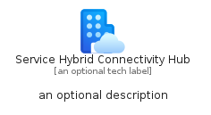
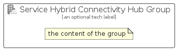

# ServiceHybridConnectivityHub


```text
azure/Item/NewIcons/ServiceHybridConnectivityHub
```

```text
include('azure/Item/NewIcons/ServiceHybridConnectivityHub')
```


| Illustration | ServiceHybridConnectivityHub | ServiceHybridConnectivityHubCard | ServiceHybridConnectivityHubGroup |
| :---: | :---: | :---: | :---: |
|  |  |  |  |


## Sprites
The item provides the following sriptes:

- `<$ServiceHybridConnectivityHubXs>`
- `<$ServiceHybridConnectivityHubSm>`
- `<$ServiceHybridConnectivityHubMd>`
- `<$ServiceHybridConnectivityHubLg>`


## ServiceHybridConnectivityHub

### Load remotely
```plantuml
@startuml
' configures the library
!global $LIB_BASE_LOCATION="https://raw.githubusercontent.com/tmorin/plantuml-libs/master/distribution"

' loads the library's bootstrap
!include $LIB_BASE_LOCATION/bootstrap.puml

' loads the package bootstrap
include('azure/bootstrap')

' loads the Item which embeds the element ServiceHybridConnectivityHub
include('azure/Item/NewIcons/ServiceHybridConnectivityHub')

' renders the element
ServiceHybridConnectivityHub('ServiceHybridConnectivityHub', 'Service Hybrid Connectivity Hub', 'an optional tech label', 'an optional description')
@enduml
```

### Load locally
```plantuml
@startuml
' configures the library
!global $INCLUSION_MODE="local"
!global $LIB_BASE_LOCATION="../../.."

' loads the library's bootstrap
!include $LIB_BASE_LOCATION/bootstrap.puml

' loads the package bootstrap
include('azure/bootstrap')

' loads the Item which embeds the element ServiceHybridConnectivityHub
include('azure/Item/NewIcons/ServiceHybridConnectivityHub')

' renders the element
ServiceHybridConnectivityHub('ServiceHybridConnectivityHub', 'Service Hybrid Connectivity Hub', 'an optional tech label', 'an optional description')
@enduml
```

## ServiceHybridConnectivityHubCard

### Load remotely
```plantuml
@startuml
' configures the library
!global $LIB_BASE_LOCATION="https://raw.githubusercontent.com/tmorin/plantuml-libs/master/distribution"

' loads the library's bootstrap
!include $LIB_BASE_LOCATION/bootstrap.puml

' loads the package bootstrap
include('azure/bootstrap')

' loads the Item which embeds the element ServiceHybridConnectivityHubCard
include('azure/Item/NewIcons/ServiceHybridConnectivityHub')

' renders the element
ServiceHybridConnectivityHubCard('ServiceHybridConnectivityHubCard', 'Service Hybrid Connectivity Hub Card', 'an optional description')
@enduml
```

### Load locally
```plantuml
@startuml
' configures the library
!global $INCLUSION_MODE="local"
!global $LIB_BASE_LOCATION="../../.."

' loads the library's bootstrap
!include $LIB_BASE_LOCATION/bootstrap.puml

' loads the package bootstrap
include('azure/bootstrap')

' loads the Item which embeds the element ServiceHybridConnectivityHubCard
include('azure/Item/NewIcons/ServiceHybridConnectivityHub')

' renders the element
ServiceHybridConnectivityHubCard('ServiceHybridConnectivityHubCard', 'Service Hybrid Connectivity Hub Card', 'an optional description')
@enduml
```

## ServiceHybridConnectivityHubGroup

### Load remotely
```plantuml
@startuml
' configures the library
!global $LIB_BASE_LOCATION="https://raw.githubusercontent.com/tmorin/plantuml-libs/master/distribution"

' loads the library's bootstrap
!include $LIB_BASE_LOCATION/bootstrap.puml

' loads the package bootstrap
include('azure/bootstrap')

' loads the Item which embeds the element ServiceHybridConnectivityHubGroup
include('azure/Item/NewIcons/ServiceHybridConnectivityHub')

' renders the element
ServiceHybridConnectivityHubGroup('ServiceHybridConnectivityHubGroup', 'Service Hybrid Connectivity Hub Group', 'an optional tech label') {
    note as note
        the content of the group
    end note
}
@enduml
```

### Load locally
```plantuml
@startuml
' configures the library
!global $INCLUSION_MODE="local"
!global $LIB_BASE_LOCATION="../../.."

' loads the library's bootstrap
!include $LIB_BASE_LOCATION/bootstrap.puml

' loads the package bootstrap
include('azure/bootstrap')

' loads the Item which embeds the element ServiceHybridConnectivityHubGroup
include('azure/Item/NewIcons/ServiceHybridConnectivityHub')

' renders the element
ServiceHybridConnectivityHubGroup('ServiceHybridConnectivityHubGroup', 'Service Hybrid Connectivity Hub Group', 'an optional tech label') {
    note as note
        the content of the group
    end note
}
@enduml
```

