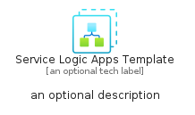
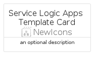
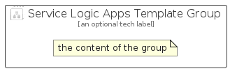

# ServiceLogicAppsTemplate


```text
azure/Item/NewIcons/ServiceLogicAppsTemplate
```

```text
include('azure/Item/NewIcons/ServiceLogicAppsTemplate')
```


| Illustration | ServiceLogicAppsTemplate | ServiceLogicAppsTemplateCard | ServiceLogicAppsTemplateGroup |
| :---: | :---: | :---: | :---: |
|  |  |  |  |


## Sprites
The item provides the following sriptes:

- `<$ServiceLogicAppsTemplateXs>`
- `<$ServiceLogicAppsTemplateSm>`
- `<$ServiceLogicAppsTemplateMd>`
- `<$ServiceLogicAppsTemplateLg>`


## ServiceLogicAppsTemplate

### Load remotely
```plantuml
@startuml
' configures the library
!global $LIB_BASE_LOCATION="https://raw.githubusercontent.com/tmorin/plantuml-libs/master/distribution"

' loads the library's bootstrap
!include $LIB_BASE_LOCATION/bootstrap.puml

' loads the package bootstrap
include('azure/bootstrap')

' loads the Item which embeds the element ServiceLogicAppsTemplate
include('azure/Item/NewIcons/ServiceLogicAppsTemplate')

' renders the element
ServiceLogicAppsTemplate('ServiceLogicAppsTemplate', 'Service Logic Apps Template', 'an optional tech label', 'an optional description')
@enduml
```

### Load locally
```plantuml
@startuml
' configures the library
!global $INCLUSION_MODE="local"
!global $LIB_BASE_LOCATION="../../.."

' loads the library's bootstrap
!include $LIB_BASE_LOCATION/bootstrap.puml

' loads the package bootstrap
include('azure/bootstrap')

' loads the Item which embeds the element ServiceLogicAppsTemplate
include('azure/Item/NewIcons/ServiceLogicAppsTemplate')

' renders the element
ServiceLogicAppsTemplate('ServiceLogicAppsTemplate', 'Service Logic Apps Template', 'an optional tech label', 'an optional description')
@enduml
```

## ServiceLogicAppsTemplateCard

### Load remotely
```plantuml
@startuml
' configures the library
!global $LIB_BASE_LOCATION="https://raw.githubusercontent.com/tmorin/plantuml-libs/master/distribution"

' loads the library's bootstrap
!include $LIB_BASE_LOCATION/bootstrap.puml

' loads the package bootstrap
include('azure/bootstrap')

' loads the Item which embeds the element ServiceLogicAppsTemplateCard
include('azure/Item/NewIcons/ServiceLogicAppsTemplate')

' renders the element
ServiceLogicAppsTemplateCard('ServiceLogicAppsTemplateCard', 'Service Logic Apps Template Card', 'an optional description')
@enduml
```

### Load locally
```plantuml
@startuml
' configures the library
!global $INCLUSION_MODE="local"
!global $LIB_BASE_LOCATION="../../.."

' loads the library's bootstrap
!include $LIB_BASE_LOCATION/bootstrap.puml

' loads the package bootstrap
include('azure/bootstrap')

' loads the Item which embeds the element ServiceLogicAppsTemplateCard
include('azure/Item/NewIcons/ServiceLogicAppsTemplate')

' renders the element
ServiceLogicAppsTemplateCard('ServiceLogicAppsTemplateCard', 'Service Logic Apps Template Card', 'an optional description')
@enduml
```

## ServiceLogicAppsTemplateGroup

### Load remotely
```plantuml
@startuml
' configures the library
!global $LIB_BASE_LOCATION="https://raw.githubusercontent.com/tmorin/plantuml-libs/master/distribution"

' loads the library's bootstrap
!include $LIB_BASE_LOCATION/bootstrap.puml

' loads the package bootstrap
include('azure/bootstrap')

' loads the Item which embeds the element ServiceLogicAppsTemplateGroup
include('azure/Item/NewIcons/ServiceLogicAppsTemplate')

' renders the element
ServiceLogicAppsTemplateGroup('ServiceLogicAppsTemplateGroup', 'Service Logic Apps Template Group', 'an optional tech label') {
    note as note
        the content of the group
    end note
}
@enduml
```

### Load locally
```plantuml
@startuml
' configures the library
!global $INCLUSION_MODE="local"
!global $LIB_BASE_LOCATION="../../.."

' loads the library's bootstrap
!include $LIB_BASE_LOCATION/bootstrap.puml

' loads the package bootstrap
include('azure/bootstrap')

' loads the Item which embeds the element ServiceLogicAppsTemplateGroup
include('azure/Item/NewIcons/ServiceLogicAppsTemplate')

' renders the element
ServiceLogicAppsTemplateGroup('ServiceLogicAppsTemplateGroup', 'Service Logic Apps Template Group', 'an optional tech label') {
    note as note
        the content of the group
    end note
}
@enduml
```

