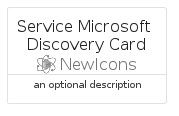
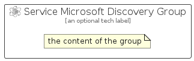

# ServiceMicrosoftDiscovery


```text
azure/Item/NewIcons/ServiceMicrosoftDiscovery
```

```text
include('azure/Item/NewIcons/ServiceMicrosoftDiscovery')
```


| Illustration | ServiceMicrosoftDiscovery | ServiceMicrosoftDiscoveryCard | ServiceMicrosoftDiscoveryGroup |
| :---: | :---: | :---: | :---: |
|  |  |  |  |


## Sprites
The item provides the following sriptes:

- `<$ServiceMicrosoftDiscoveryXs>`
- `<$ServiceMicrosoftDiscoverySm>`
- `<$ServiceMicrosoftDiscoveryMd>`
- `<$ServiceMicrosoftDiscoveryLg>`


## ServiceMicrosoftDiscovery

### Load remotely
```plantuml
@startuml
' configures the library
!global $LIB_BASE_LOCATION="https://raw.githubusercontent.com/tmorin/plantuml-libs/master/distribution"

' loads the library's bootstrap
!include $LIB_BASE_LOCATION/bootstrap.puml

' loads the package bootstrap
include('azure/bootstrap')

' loads the Item which embeds the element ServiceMicrosoftDiscovery
include('azure/Item/NewIcons/ServiceMicrosoftDiscovery')

' renders the element
ServiceMicrosoftDiscovery('ServiceMicrosoftDiscovery', 'Service Microsoft Discovery', 'an optional tech label', 'an optional description')
@enduml
```

### Load locally
```plantuml
@startuml
' configures the library
!global $INCLUSION_MODE="local"
!global $LIB_BASE_LOCATION="../../.."

' loads the library's bootstrap
!include $LIB_BASE_LOCATION/bootstrap.puml

' loads the package bootstrap
include('azure/bootstrap')

' loads the Item which embeds the element ServiceMicrosoftDiscovery
include('azure/Item/NewIcons/ServiceMicrosoftDiscovery')

' renders the element
ServiceMicrosoftDiscovery('ServiceMicrosoftDiscovery', 'Service Microsoft Discovery', 'an optional tech label', 'an optional description')
@enduml
```

## ServiceMicrosoftDiscoveryCard

### Load remotely
```plantuml
@startuml
' configures the library
!global $LIB_BASE_LOCATION="https://raw.githubusercontent.com/tmorin/plantuml-libs/master/distribution"

' loads the library's bootstrap
!include $LIB_BASE_LOCATION/bootstrap.puml

' loads the package bootstrap
include('azure/bootstrap')

' loads the Item which embeds the element ServiceMicrosoftDiscoveryCard
include('azure/Item/NewIcons/ServiceMicrosoftDiscovery')

' renders the element
ServiceMicrosoftDiscoveryCard('ServiceMicrosoftDiscoveryCard', 'Service Microsoft Discovery Card', 'an optional description')
@enduml
```

### Load locally
```plantuml
@startuml
' configures the library
!global $INCLUSION_MODE="local"
!global $LIB_BASE_LOCATION="../../.."

' loads the library's bootstrap
!include $LIB_BASE_LOCATION/bootstrap.puml

' loads the package bootstrap
include('azure/bootstrap')

' loads the Item which embeds the element ServiceMicrosoftDiscoveryCard
include('azure/Item/NewIcons/ServiceMicrosoftDiscovery')

' renders the element
ServiceMicrosoftDiscoveryCard('ServiceMicrosoftDiscoveryCard', 'Service Microsoft Discovery Card', 'an optional description')
@enduml
```

## ServiceMicrosoftDiscoveryGroup

### Load remotely
```plantuml
@startuml
' configures the library
!global $LIB_BASE_LOCATION="https://raw.githubusercontent.com/tmorin/plantuml-libs/master/distribution"

' loads the library's bootstrap
!include $LIB_BASE_LOCATION/bootstrap.puml

' loads the package bootstrap
include('azure/bootstrap')

' loads the Item which embeds the element ServiceMicrosoftDiscoveryGroup
include('azure/Item/NewIcons/ServiceMicrosoftDiscovery')

' renders the element
ServiceMicrosoftDiscoveryGroup('ServiceMicrosoftDiscoveryGroup', 'Service Microsoft Discovery Group', 'an optional tech label') {
    note as note
        the content of the group
    end note
}
@enduml
```

### Load locally
```plantuml
@startuml
' configures the library
!global $INCLUSION_MODE="local"
!global $LIB_BASE_LOCATION="../../.."

' loads the library's bootstrap
!include $LIB_BASE_LOCATION/bootstrap.puml

' loads the package bootstrap
include('azure/bootstrap')

' loads the Item which embeds the element ServiceMicrosoftDiscoveryGroup
include('azure/Item/NewIcons/ServiceMicrosoftDiscovery')

' renders the element
ServiceMicrosoftDiscoveryGroup('ServiceMicrosoftDiscoveryGroup', 'Service Microsoft Discovery Group', 'an optional tech label') {
    note as note
        the content of the group
    end note
}
@enduml
```

