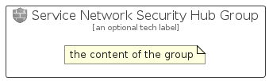

# ServiceNetworkSecurityHub


```text
azure/Item/NewIcons/ServiceNetworkSecurityHub
```

```text
include('azure/Item/NewIcons/ServiceNetworkSecurityHub')
```


| Illustration | ServiceNetworkSecurityHub | ServiceNetworkSecurityHubCard | ServiceNetworkSecurityHubGroup |
| :---: | :---: | :---: | :---: |
|  |  |  |  |


## Sprites
The item provides the following sriptes:

- `<$ServiceNetworkSecurityHubXs>`
- `<$ServiceNetworkSecurityHubSm>`
- `<$ServiceNetworkSecurityHubMd>`
- `<$ServiceNetworkSecurityHubLg>`


## ServiceNetworkSecurityHub

### Load remotely
```plantuml
@startuml
' configures the library
!global $LIB_BASE_LOCATION="https://raw.githubusercontent.com/tmorin/plantuml-libs/master/distribution"

' loads the library's bootstrap
!include $LIB_BASE_LOCATION/bootstrap.puml

' loads the package bootstrap
include('azure/bootstrap')

' loads the Item which embeds the element ServiceNetworkSecurityHub
include('azure/Item/NewIcons/ServiceNetworkSecurityHub')

' renders the element
ServiceNetworkSecurityHub('ServiceNetworkSecurityHub', 'Service Network Security Hub', 'an optional tech label', 'an optional description')
@enduml
```

### Load locally
```plantuml
@startuml
' configures the library
!global $INCLUSION_MODE="local"
!global $LIB_BASE_LOCATION="../../.."

' loads the library's bootstrap
!include $LIB_BASE_LOCATION/bootstrap.puml

' loads the package bootstrap
include('azure/bootstrap')

' loads the Item which embeds the element ServiceNetworkSecurityHub
include('azure/Item/NewIcons/ServiceNetworkSecurityHub')

' renders the element
ServiceNetworkSecurityHub('ServiceNetworkSecurityHub', 'Service Network Security Hub', 'an optional tech label', 'an optional description')
@enduml
```

## ServiceNetworkSecurityHubCard

### Load remotely
```plantuml
@startuml
' configures the library
!global $LIB_BASE_LOCATION="https://raw.githubusercontent.com/tmorin/plantuml-libs/master/distribution"

' loads the library's bootstrap
!include $LIB_BASE_LOCATION/bootstrap.puml

' loads the package bootstrap
include('azure/bootstrap')

' loads the Item which embeds the element ServiceNetworkSecurityHubCard
include('azure/Item/NewIcons/ServiceNetworkSecurityHub')

' renders the element
ServiceNetworkSecurityHubCard('ServiceNetworkSecurityHubCard', 'Service Network Security Hub Card', 'an optional description')
@enduml
```

### Load locally
```plantuml
@startuml
' configures the library
!global $INCLUSION_MODE="local"
!global $LIB_BASE_LOCATION="../../.."

' loads the library's bootstrap
!include $LIB_BASE_LOCATION/bootstrap.puml

' loads the package bootstrap
include('azure/bootstrap')

' loads the Item which embeds the element ServiceNetworkSecurityHubCard
include('azure/Item/NewIcons/ServiceNetworkSecurityHub')

' renders the element
ServiceNetworkSecurityHubCard('ServiceNetworkSecurityHubCard', 'Service Network Security Hub Card', 'an optional description')
@enduml
```

## ServiceNetworkSecurityHubGroup

### Load remotely
```plantuml
@startuml
' configures the library
!global $LIB_BASE_LOCATION="https://raw.githubusercontent.com/tmorin/plantuml-libs/master/distribution"

' loads the library's bootstrap
!include $LIB_BASE_LOCATION/bootstrap.puml

' loads the package bootstrap
include('azure/bootstrap')

' loads the Item which embeds the element ServiceNetworkSecurityHubGroup
include('azure/Item/NewIcons/ServiceNetworkSecurityHub')

' renders the element
ServiceNetworkSecurityHubGroup('ServiceNetworkSecurityHubGroup', 'Service Network Security Hub Group', 'an optional tech label') {
    note as note
        the content of the group
    end note
}
@enduml
```

### Load locally
```plantuml
@startuml
' configures the library
!global $INCLUSION_MODE="local"
!global $LIB_BASE_LOCATION="../../.."

' loads the library's bootstrap
!include $LIB_BASE_LOCATION/bootstrap.puml

' loads the package bootstrap
include('azure/bootstrap')

' loads the Item which embeds the element ServiceNetworkSecurityHubGroup
include('azure/Item/NewIcons/ServiceNetworkSecurityHub')

' renders the element
ServiceNetworkSecurityHubGroup('ServiceNetworkSecurityHubGroup', 'Service Network Security Hub Group', 'an optional tech label') {
    note as note
        the content of the group
    end note
}
@enduml
```

