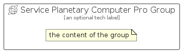

# ServicePlanetaryComputerPro


```text
azure/Item/NewIcons/ServicePlanetaryComputerPro
```

```text
include('azure/Item/NewIcons/ServicePlanetaryComputerPro')
```


| Illustration | ServicePlanetaryComputerPro | ServicePlanetaryComputerProCard | ServicePlanetaryComputerProGroup |
| :---: | :---: | :---: | :---: |
|  |  |  |  |


## Sprites
The item provides the following sriptes:

- `<$ServicePlanetaryComputerProXs>`
- `<$ServicePlanetaryComputerProSm>`
- `<$ServicePlanetaryComputerProMd>`
- `<$ServicePlanetaryComputerProLg>`


## ServicePlanetaryComputerPro

### Load remotely
```plantuml
@startuml
' configures the library
!global $LIB_BASE_LOCATION="https://raw.githubusercontent.com/tmorin/plantuml-libs/master/distribution"

' loads the library's bootstrap
!include $LIB_BASE_LOCATION/bootstrap.puml

' loads the package bootstrap
include('azure/bootstrap')

' loads the Item which embeds the element ServicePlanetaryComputerPro
include('azure/Item/NewIcons/ServicePlanetaryComputerPro')

' renders the element
ServicePlanetaryComputerPro('ServicePlanetaryComputerPro', 'Service Planetary Computer Pro', 'an optional tech label', 'an optional description')
@enduml
```

### Load locally
```plantuml
@startuml
' configures the library
!global $INCLUSION_MODE="local"
!global $LIB_BASE_LOCATION="../../.."

' loads the library's bootstrap
!include $LIB_BASE_LOCATION/bootstrap.puml

' loads the package bootstrap
include('azure/bootstrap')

' loads the Item which embeds the element ServicePlanetaryComputerPro
include('azure/Item/NewIcons/ServicePlanetaryComputerPro')

' renders the element
ServicePlanetaryComputerPro('ServicePlanetaryComputerPro', 'Service Planetary Computer Pro', 'an optional tech label', 'an optional description')
@enduml
```

## ServicePlanetaryComputerProCard

### Load remotely
```plantuml
@startuml
' configures the library
!global $LIB_BASE_LOCATION="https://raw.githubusercontent.com/tmorin/plantuml-libs/master/distribution"

' loads the library's bootstrap
!include $LIB_BASE_LOCATION/bootstrap.puml

' loads the package bootstrap
include('azure/bootstrap')

' loads the Item which embeds the element ServicePlanetaryComputerProCard
include('azure/Item/NewIcons/ServicePlanetaryComputerPro')

' renders the element
ServicePlanetaryComputerProCard('ServicePlanetaryComputerProCard', 'Service Planetary Computer Pro Card', 'an optional description')
@enduml
```

### Load locally
```plantuml
@startuml
' configures the library
!global $INCLUSION_MODE="local"
!global $LIB_BASE_LOCATION="../../.."

' loads the library's bootstrap
!include $LIB_BASE_LOCATION/bootstrap.puml

' loads the package bootstrap
include('azure/bootstrap')

' loads the Item which embeds the element ServicePlanetaryComputerProCard
include('azure/Item/NewIcons/ServicePlanetaryComputerPro')

' renders the element
ServicePlanetaryComputerProCard('ServicePlanetaryComputerProCard', 'Service Planetary Computer Pro Card', 'an optional description')
@enduml
```

## ServicePlanetaryComputerProGroup

### Load remotely
```plantuml
@startuml
' configures the library
!global $LIB_BASE_LOCATION="https://raw.githubusercontent.com/tmorin/plantuml-libs/master/distribution"

' loads the library's bootstrap
!include $LIB_BASE_LOCATION/bootstrap.puml

' loads the package bootstrap
include('azure/bootstrap')

' loads the Item which embeds the element ServicePlanetaryComputerProGroup
include('azure/Item/NewIcons/ServicePlanetaryComputerPro')

' renders the element
ServicePlanetaryComputerProGroup('ServicePlanetaryComputerProGroup', 'Service Planetary Computer Pro Group', 'an optional tech label') {
    note as note
        the content of the group
    end note
}
@enduml
```

### Load locally
```plantuml
@startuml
' configures the library
!global $INCLUSION_MODE="local"
!global $LIB_BASE_LOCATION="../../.."

' loads the library's bootstrap
!include $LIB_BASE_LOCATION/bootstrap.puml

' loads the package bootstrap
include('azure/bootstrap')

' loads the Item which embeds the element ServicePlanetaryComputerProGroup
include('azure/Item/NewIcons/ServicePlanetaryComputerPro')

' renders the element
ServicePlanetaryComputerProGroup('ServicePlanetaryComputerProGroup', 'Service Planetary Computer Pro Group', 'an optional tech label') {
    note as note
        the content of the group
    end note
}
@enduml
```

