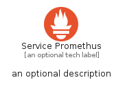
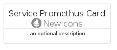
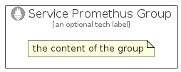

# ServicePromethus


```text
azure/Item/NewIcons/ServicePromethus
```

```text
include('azure/Item/NewIcons/ServicePromethus')
```


| Illustration | ServicePromethus | ServicePromethusCard | ServicePromethusGroup |
| :---: | :---: | :---: | :---: |
|  |  |  |  |


## Sprites
The item provides the following sriptes:

- `<$ServicePromethusXs>`
- `<$ServicePromethusSm>`
- `<$ServicePromethusMd>`
- `<$ServicePromethusLg>`


## ServicePromethus

### Load remotely
```plantuml
@startuml
' configures the library
!global $LIB_BASE_LOCATION="https://raw.githubusercontent.com/tmorin/plantuml-libs/master/distribution"

' loads the library's bootstrap
!include $LIB_BASE_LOCATION/bootstrap.puml

' loads the package bootstrap
include('azure/bootstrap')

' loads the Item which embeds the element ServicePromethus
include('azure/Item/NewIcons/ServicePromethus')

' renders the element
ServicePromethus('ServicePromethus', 'Service Promethus', 'an optional tech label', 'an optional description')
@enduml
```

### Load locally
```plantuml
@startuml
' configures the library
!global $INCLUSION_MODE="local"
!global $LIB_BASE_LOCATION="../../.."

' loads the library's bootstrap
!include $LIB_BASE_LOCATION/bootstrap.puml

' loads the package bootstrap
include('azure/bootstrap')

' loads the Item which embeds the element ServicePromethus
include('azure/Item/NewIcons/ServicePromethus')

' renders the element
ServicePromethus('ServicePromethus', 'Service Promethus', 'an optional tech label', 'an optional description')
@enduml
```

## ServicePromethusCard

### Load remotely
```plantuml
@startuml
' configures the library
!global $LIB_BASE_LOCATION="https://raw.githubusercontent.com/tmorin/plantuml-libs/master/distribution"

' loads the library's bootstrap
!include $LIB_BASE_LOCATION/bootstrap.puml

' loads the package bootstrap
include('azure/bootstrap')

' loads the Item which embeds the element ServicePromethusCard
include('azure/Item/NewIcons/ServicePromethus')

' renders the element
ServicePromethusCard('ServicePromethusCard', 'Service Promethus Card', 'an optional description')
@enduml
```

### Load locally
```plantuml
@startuml
' configures the library
!global $INCLUSION_MODE="local"
!global $LIB_BASE_LOCATION="../../.."

' loads the library's bootstrap
!include $LIB_BASE_LOCATION/bootstrap.puml

' loads the package bootstrap
include('azure/bootstrap')

' loads the Item which embeds the element ServicePromethusCard
include('azure/Item/NewIcons/ServicePromethus')

' renders the element
ServicePromethusCard('ServicePromethusCard', 'Service Promethus Card', 'an optional description')
@enduml
```

## ServicePromethusGroup

### Load remotely
```plantuml
@startuml
' configures the library
!global $LIB_BASE_LOCATION="https://raw.githubusercontent.com/tmorin/plantuml-libs/master/distribution"

' loads the library's bootstrap
!include $LIB_BASE_LOCATION/bootstrap.puml

' loads the package bootstrap
include('azure/bootstrap')

' loads the Item which embeds the element ServicePromethusGroup
include('azure/Item/NewIcons/ServicePromethus')

' renders the element
ServicePromethusGroup('ServicePromethusGroup', 'Service Promethus Group', 'an optional tech label') {
    note as note
        the content of the group
    end note
}
@enduml
```

### Load locally
```plantuml
@startuml
' configures the library
!global $INCLUSION_MODE="local"
!global $LIB_BASE_LOCATION="../../.."

' loads the library's bootstrap
!include $LIB_BASE_LOCATION/bootstrap.puml

' loads the package bootstrap
include('azure/bootstrap')

' loads the Item which embeds the element ServicePromethusGroup
include('azure/Item/NewIcons/ServicePromethus')

' renders the element
ServicePromethusGroup('ServicePromethusGroup', 'Service Promethus Group', 'an optional tech label') {
    note as note
        the content of the group
    end note
}
@enduml
```

