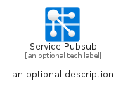
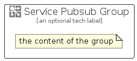

# ServicePubsub


```text
azure/Item/NewIcons/ServicePubsub
```

```text
include('azure/Item/NewIcons/ServicePubsub')
```


| Illustration | ServicePubsub | ServicePubsubCard | ServicePubsubGroup |
| :---: | :---: | :---: | :---: |
|  |  |  |  |


## Sprites
The item provides the following sriptes:

- `<$ServicePubsubXs>`
- `<$ServicePubsubSm>`
- `<$ServicePubsubMd>`
- `<$ServicePubsubLg>`


## ServicePubsub

### Load remotely
```plantuml
@startuml
' configures the library
!global $LIB_BASE_LOCATION="https://raw.githubusercontent.com/tmorin/plantuml-libs/master/distribution"

' loads the library's bootstrap
!include $LIB_BASE_LOCATION/bootstrap.puml

' loads the package bootstrap
include('azure/bootstrap')

' loads the Item which embeds the element ServicePubsub
include('azure/Item/NewIcons/ServicePubsub')

' renders the element
ServicePubsub('ServicePubsub', 'Service Pubsub', 'an optional tech label', 'an optional description')
@enduml
```

### Load locally
```plantuml
@startuml
' configures the library
!global $INCLUSION_MODE="local"
!global $LIB_BASE_LOCATION="../../.."

' loads the library's bootstrap
!include $LIB_BASE_LOCATION/bootstrap.puml

' loads the package bootstrap
include('azure/bootstrap')

' loads the Item which embeds the element ServicePubsub
include('azure/Item/NewIcons/ServicePubsub')

' renders the element
ServicePubsub('ServicePubsub', 'Service Pubsub', 'an optional tech label', 'an optional description')
@enduml
```

## ServicePubsubCard

### Load remotely
```plantuml
@startuml
' configures the library
!global $LIB_BASE_LOCATION="https://raw.githubusercontent.com/tmorin/plantuml-libs/master/distribution"

' loads the library's bootstrap
!include $LIB_BASE_LOCATION/bootstrap.puml

' loads the package bootstrap
include('azure/bootstrap')

' loads the Item which embeds the element ServicePubsubCard
include('azure/Item/NewIcons/ServicePubsub')

' renders the element
ServicePubsubCard('ServicePubsubCard', 'Service Pubsub Card', 'an optional description')
@enduml
```

### Load locally
```plantuml
@startuml
' configures the library
!global $INCLUSION_MODE="local"
!global $LIB_BASE_LOCATION="../../.."

' loads the library's bootstrap
!include $LIB_BASE_LOCATION/bootstrap.puml

' loads the package bootstrap
include('azure/bootstrap')

' loads the Item which embeds the element ServicePubsubCard
include('azure/Item/NewIcons/ServicePubsub')

' renders the element
ServicePubsubCard('ServicePubsubCard', 'Service Pubsub Card', 'an optional description')
@enduml
```

## ServicePubsubGroup

### Load remotely
```plantuml
@startuml
' configures the library
!global $LIB_BASE_LOCATION="https://raw.githubusercontent.com/tmorin/plantuml-libs/master/distribution"

' loads the library's bootstrap
!include $LIB_BASE_LOCATION/bootstrap.puml

' loads the package bootstrap
include('azure/bootstrap')

' loads the Item which embeds the element ServicePubsubGroup
include('azure/Item/NewIcons/ServicePubsub')

' renders the element
ServicePubsubGroup('ServicePubsubGroup', 'Service Pubsub Group', 'an optional tech label') {
    note as note
        the content of the group
    end note
}
@enduml
```

### Load locally
```plantuml
@startuml
' configures the library
!global $INCLUSION_MODE="local"
!global $LIB_BASE_LOCATION="../../.."

' loads the library's bootstrap
!include $LIB_BASE_LOCATION/bootstrap.puml

' loads the package bootstrap
include('azure/bootstrap')

' loads the Item which embeds the element ServicePubsubGroup
include('azure/Item/NewIcons/ServicePubsub')

' renders the element
ServicePubsubGroup('ServicePubsubGroup', 'Service Pubsub Group', 'an optional tech label') {
    note as note
        the content of the group
    end note
}
@enduml
```

