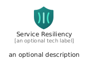
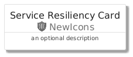
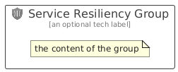

# ServiceResiliency


```text
azure/Item/NewIcons/ServiceResiliency
```

```text
include('azure/Item/NewIcons/ServiceResiliency')
```


| Illustration | ServiceResiliency | ServiceResiliencyCard | ServiceResiliencyGroup |
| :---: | :---: | :---: | :---: |
|  |  |  |  |


## Sprites
The item provides the following sriptes:

- `<$ServiceResiliencyXs>`
- `<$ServiceResiliencySm>`
- `<$ServiceResiliencyMd>`
- `<$ServiceResiliencyLg>`


## ServiceResiliency

### Load remotely
```plantuml
@startuml
' configures the library
!global $LIB_BASE_LOCATION="https://raw.githubusercontent.com/tmorin/plantuml-libs/master/distribution"

' loads the library's bootstrap
!include $LIB_BASE_LOCATION/bootstrap.puml

' loads the package bootstrap
include('azure/bootstrap')

' loads the Item which embeds the element ServiceResiliency
include('azure/Item/NewIcons/ServiceResiliency')

' renders the element
ServiceResiliency('ServiceResiliency', 'Service Resiliency', 'an optional tech label', 'an optional description')
@enduml
```

### Load locally
```plantuml
@startuml
' configures the library
!global $INCLUSION_MODE="local"
!global $LIB_BASE_LOCATION="../../.."

' loads the library's bootstrap
!include $LIB_BASE_LOCATION/bootstrap.puml

' loads the package bootstrap
include('azure/bootstrap')

' loads the Item which embeds the element ServiceResiliency
include('azure/Item/NewIcons/ServiceResiliency')

' renders the element
ServiceResiliency('ServiceResiliency', 'Service Resiliency', 'an optional tech label', 'an optional description')
@enduml
```

## ServiceResiliencyCard

### Load remotely
```plantuml
@startuml
' configures the library
!global $LIB_BASE_LOCATION="https://raw.githubusercontent.com/tmorin/plantuml-libs/master/distribution"

' loads the library's bootstrap
!include $LIB_BASE_LOCATION/bootstrap.puml

' loads the package bootstrap
include('azure/bootstrap')

' loads the Item which embeds the element ServiceResiliencyCard
include('azure/Item/NewIcons/ServiceResiliency')

' renders the element
ServiceResiliencyCard('ServiceResiliencyCard', 'Service Resiliency Card', 'an optional description')
@enduml
```

### Load locally
```plantuml
@startuml
' configures the library
!global $INCLUSION_MODE="local"
!global $LIB_BASE_LOCATION="../../.."

' loads the library's bootstrap
!include $LIB_BASE_LOCATION/bootstrap.puml

' loads the package bootstrap
include('azure/bootstrap')

' loads the Item which embeds the element ServiceResiliencyCard
include('azure/Item/NewIcons/ServiceResiliency')

' renders the element
ServiceResiliencyCard('ServiceResiliencyCard', 'Service Resiliency Card', 'an optional description')
@enduml
```

## ServiceResiliencyGroup

### Load remotely
```plantuml
@startuml
' configures the library
!global $LIB_BASE_LOCATION="https://raw.githubusercontent.com/tmorin/plantuml-libs/master/distribution"

' loads the library's bootstrap
!include $LIB_BASE_LOCATION/bootstrap.puml

' loads the package bootstrap
include('azure/bootstrap')

' loads the Item which embeds the element ServiceResiliencyGroup
include('azure/Item/NewIcons/ServiceResiliency')

' renders the element
ServiceResiliencyGroup('ServiceResiliencyGroup', 'Service Resiliency Group', 'an optional tech label') {
    note as note
        the content of the group
    end note
}
@enduml
```

### Load locally
```plantuml
@startuml
' configures the library
!global $INCLUSION_MODE="local"
!global $LIB_BASE_LOCATION="../../.."

' loads the library's bootstrap
!include $LIB_BASE_LOCATION/bootstrap.puml

' loads the package bootstrap
include('azure/bootstrap')

' loads the Item which embeds the element ServiceResiliencyGroup
include('azure/Item/NewIcons/ServiceResiliency')

' renders the element
ServiceResiliencyGroup('ServiceResiliencyGroup', 'Service Resiliency Group', 'an optional tech label') {
    note as note
        the content of the group
    end note
}
@enduml
```

