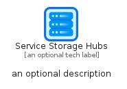
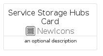
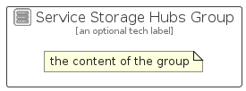

# ServiceStorageHubs


```text
azure/Item/NewIcons/ServiceStorageHubs
```

```text
include('azure/Item/NewIcons/ServiceStorageHubs')
```


| Illustration | ServiceStorageHubs | ServiceStorageHubsCard | ServiceStorageHubsGroup |
| :---: | :---: | :---: | :---: |
|  |  |  |  |


## Sprites
The item provides the following sriptes:

- `<$ServiceStorageHubsXs>`
- `<$ServiceStorageHubsSm>`
- `<$ServiceStorageHubsMd>`
- `<$ServiceStorageHubsLg>`


## ServiceStorageHubs

### Load remotely
```plantuml
@startuml
' configures the library
!global $LIB_BASE_LOCATION="https://raw.githubusercontent.com/tmorin/plantuml-libs/master/distribution"

' loads the library's bootstrap
!include $LIB_BASE_LOCATION/bootstrap.puml

' loads the package bootstrap
include('azure/bootstrap')

' loads the Item which embeds the element ServiceStorageHubs
include('azure/Item/NewIcons/ServiceStorageHubs')

' renders the element
ServiceStorageHubs('ServiceStorageHubs', 'Service Storage Hubs', 'an optional tech label', 'an optional description')
@enduml
```

### Load locally
```plantuml
@startuml
' configures the library
!global $INCLUSION_MODE="local"
!global $LIB_BASE_LOCATION="../../.."

' loads the library's bootstrap
!include $LIB_BASE_LOCATION/bootstrap.puml

' loads the package bootstrap
include('azure/bootstrap')

' loads the Item which embeds the element ServiceStorageHubs
include('azure/Item/NewIcons/ServiceStorageHubs')

' renders the element
ServiceStorageHubs('ServiceStorageHubs', 'Service Storage Hubs', 'an optional tech label', 'an optional description')
@enduml
```

## ServiceStorageHubsCard

### Load remotely
```plantuml
@startuml
' configures the library
!global $LIB_BASE_LOCATION="https://raw.githubusercontent.com/tmorin/plantuml-libs/master/distribution"

' loads the library's bootstrap
!include $LIB_BASE_LOCATION/bootstrap.puml

' loads the package bootstrap
include('azure/bootstrap')

' loads the Item which embeds the element ServiceStorageHubsCard
include('azure/Item/NewIcons/ServiceStorageHubs')

' renders the element
ServiceStorageHubsCard('ServiceStorageHubsCard', 'Service Storage Hubs Card', 'an optional description')
@enduml
```

### Load locally
```plantuml
@startuml
' configures the library
!global $INCLUSION_MODE="local"
!global $LIB_BASE_LOCATION="../../.."

' loads the library's bootstrap
!include $LIB_BASE_LOCATION/bootstrap.puml

' loads the package bootstrap
include('azure/bootstrap')

' loads the Item which embeds the element ServiceStorageHubsCard
include('azure/Item/NewIcons/ServiceStorageHubs')

' renders the element
ServiceStorageHubsCard('ServiceStorageHubsCard', 'Service Storage Hubs Card', 'an optional description')
@enduml
```

## ServiceStorageHubsGroup

### Load remotely
```plantuml
@startuml
' configures the library
!global $LIB_BASE_LOCATION="https://raw.githubusercontent.com/tmorin/plantuml-libs/master/distribution"

' loads the library's bootstrap
!include $LIB_BASE_LOCATION/bootstrap.puml

' loads the package bootstrap
include('azure/bootstrap')

' loads the Item which embeds the element ServiceStorageHubsGroup
include('azure/Item/NewIcons/ServiceStorageHubs')

' renders the element
ServiceStorageHubsGroup('ServiceStorageHubsGroup', 'Service Storage Hubs Group', 'an optional tech label') {
    note as note
        the content of the group
    end note
}
@enduml
```

### Load locally
```plantuml
@startuml
' configures the library
!global $INCLUSION_MODE="local"
!global $LIB_BASE_LOCATION="../../.."

' loads the library's bootstrap
!include $LIB_BASE_LOCATION/bootstrap.puml

' loads the package bootstrap
include('azure/bootstrap')

' loads the Item which embeds the element ServiceStorageHubsGroup
include('azure/Item/NewIcons/ServiceStorageHubs')

' renders the element
ServiceStorageHubsGroup('ServiceStorageHubsGroup', 'Service Storage Hubs Group', 'an optional tech label') {
    note as note
        the content of the group
    end note
}
@enduml
```

