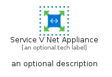
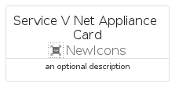
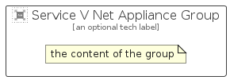

# ServiceVNetAppliance


```text
azure/Item/NewIcons/ServiceVNetAppliance
```

```text
include('azure/Item/NewIcons/ServiceVNetAppliance')
```


| Illustration | ServiceVNetAppliance | ServiceVNetApplianceCard | ServiceVNetApplianceGroup |
| :---: | :---: | :---: | :---: |
|  |  |  |  |


## Sprites
The item provides the following sriptes:

- `<$ServiceVNetApplianceXs>`
- `<$ServiceVNetApplianceSm>`
- `<$ServiceVNetApplianceMd>`
- `<$ServiceVNetApplianceLg>`


## ServiceVNetAppliance

### Load remotely
```plantuml
@startuml
' configures the library
!global $LIB_BASE_LOCATION="https://raw.githubusercontent.com/tmorin/plantuml-libs/master/distribution"

' loads the library's bootstrap
!include $LIB_BASE_LOCATION/bootstrap.puml

' loads the package bootstrap
include('azure/bootstrap')

' loads the Item which embeds the element ServiceVNetAppliance
include('azure/Item/NewIcons/ServiceVNetAppliance')

' renders the element
ServiceVNetAppliance('ServiceVNetAppliance', 'Service V Net Appliance', 'an optional tech label', 'an optional description')
@enduml
```

### Load locally
```plantuml
@startuml
' configures the library
!global $INCLUSION_MODE="local"
!global $LIB_BASE_LOCATION="../../.."

' loads the library's bootstrap
!include $LIB_BASE_LOCATION/bootstrap.puml

' loads the package bootstrap
include('azure/bootstrap')

' loads the Item which embeds the element ServiceVNetAppliance
include('azure/Item/NewIcons/ServiceVNetAppliance')

' renders the element
ServiceVNetAppliance('ServiceVNetAppliance', 'Service V Net Appliance', 'an optional tech label', 'an optional description')
@enduml
```

## ServiceVNetApplianceCard

### Load remotely
```plantuml
@startuml
' configures the library
!global $LIB_BASE_LOCATION="https://raw.githubusercontent.com/tmorin/plantuml-libs/master/distribution"

' loads the library's bootstrap
!include $LIB_BASE_LOCATION/bootstrap.puml

' loads the package bootstrap
include('azure/bootstrap')

' loads the Item which embeds the element ServiceVNetApplianceCard
include('azure/Item/NewIcons/ServiceVNetAppliance')

' renders the element
ServiceVNetApplianceCard('ServiceVNetApplianceCard', 'Service V Net Appliance Card', 'an optional description')
@enduml
```

### Load locally
```plantuml
@startuml
' configures the library
!global $INCLUSION_MODE="local"
!global $LIB_BASE_LOCATION="../../.."

' loads the library's bootstrap
!include $LIB_BASE_LOCATION/bootstrap.puml

' loads the package bootstrap
include('azure/bootstrap')

' loads the Item which embeds the element ServiceVNetApplianceCard
include('azure/Item/NewIcons/ServiceVNetAppliance')

' renders the element
ServiceVNetApplianceCard('ServiceVNetApplianceCard', 'Service V Net Appliance Card', 'an optional description')
@enduml
```

## ServiceVNetApplianceGroup

### Load remotely
```plantuml
@startuml
' configures the library
!global $LIB_BASE_LOCATION="https://raw.githubusercontent.com/tmorin/plantuml-libs/master/distribution"

' loads the library's bootstrap
!include $LIB_BASE_LOCATION/bootstrap.puml

' loads the package bootstrap
include('azure/bootstrap')

' loads the Item which embeds the element ServiceVNetApplianceGroup
include('azure/Item/NewIcons/ServiceVNetAppliance')

' renders the element
ServiceVNetApplianceGroup('ServiceVNetApplianceGroup', 'Service V Net Appliance Group', 'an optional tech label') {
    note as note
        the content of the group
    end note
}
@enduml
```

### Load locally
```plantuml
@startuml
' configures the library
!global $INCLUSION_MODE="local"
!global $LIB_BASE_LOCATION="../../.."

' loads the library's bootstrap
!include $LIB_BASE_LOCATION/bootstrap.puml

' loads the package bootstrap
include('azure/bootstrap')

' loads the Item which embeds the element ServiceVNetApplianceGroup
include('azure/Item/NewIcons/ServiceVNetAppliance')

' renders the element
ServiceVNetApplianceGroup('ServiceVNetApplianceGroup', 'Service V Net Appliance Group', 'an optional tech label') {
    note as note
        the content of the group
    end note
}
@enduml
```

